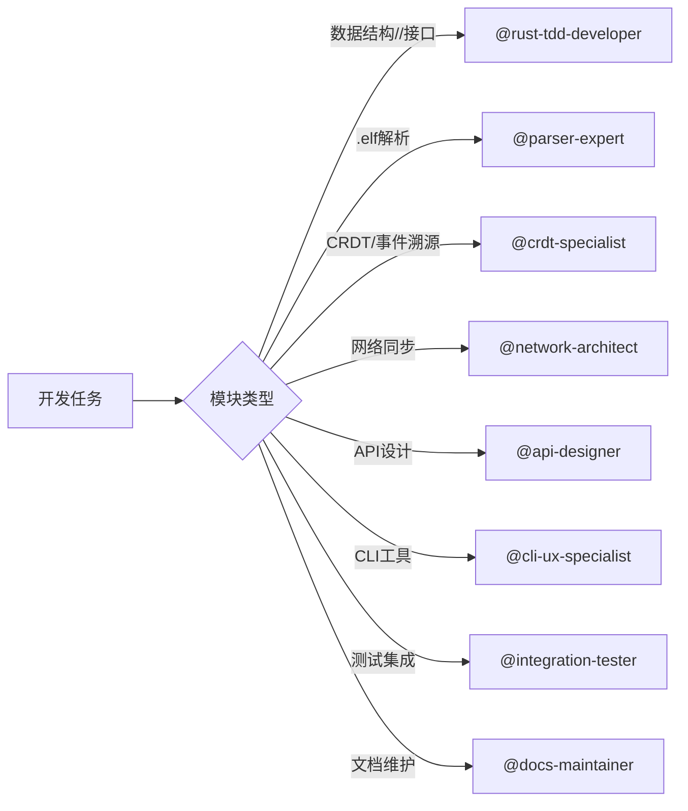

# ELFI 开发者指南

**专注于 Subagent 使用和开发规范的实用指南**

> 📋 **项目架构和模块职责**: 请查看 [plans/01-overview.md](plans/01-overview.md)  
> 🔧 **环境配置**: 请查看 [DEVELOPMENT.md](DEVELOPMENT.md)  
> 📖 **TDD工作流程**: 请查看 [plans/02-sop.md](plans/02-sop.md)

## 📋 Subagent 使用指南

ELFI 项目配置了专门的 subagent 来支持不同的开发任务，确保高质量的代码交付。

### 可用的 Subagent

| Subagent | 专业领域 | 主要职责 | 文档位置 |
|----------|----------|----------|----------|
| **rust-tdd-developer** | TDD开发 | 测试驱动开发、单元测试、代码质量保证 | [.claude/agents/rust-tdd-developer.md](.claude/agents/rust-tdd-developer.md) |
| **crdt-specialist** | CRDT专家 | 事件溯源、冲突解决、Automerge集成 | [.claude/agents/crdt-specialist.md](.claude/agents/crdt-specialist.md) |
| **parser-expert** | 解析器专家 | Tree-sitter语法、.elf解析、错误处理 | [.claude/agents/parser-expert.md](.claude/agents/parser-expert.md) |
| **network-architect** | 网络架构师 | Zenoh集成、分布式同步、P2P网络 | [.claude/agents/network-architect.md](.claude/agents/network-architect.md) |
| **api-designer** | API设计师 | 接口设计、内容创作API、关系管理 | [.claude/agents/api-designer.md](.claude/agents/api-designer.md) |
| **integration-tester** | 集成测试师 | 端到端测试、性能基准、故障模拟 | [.claude/agents/integration-tester.md](.claude/agents/integration-tester.md) |
| **cli-ux-specialist** | CLI专家 | 用户体验、命令行设计、配置管理 | [.claude/agents/cli-ux-specialist.md](.claude/agents/cli-ux-specialist.md) |
| **docs-maintainer** | 文档维护师 | 技术文档、API文档、用户指南 | [.claude/agents/docs-maintainer.md](.claude/agents/docs-maintainer.md) |

### 🎯 快速匹配：我应该使用哪个 Subagent？



### 开发阶段与 Subagent 配置

| 模块 | 主要 Subagent | 辅助 Subagent | 计划文档 |
|------|---------------|---------------|----------|
| **types** | `@rust-tdd-developer` | `@docs-maintainer` | [04-phase1-a-types.md](plans/04-phase1-a-types.md) |
| **parser** | `@parser-expert` | `@rust-tdd-developer` | [04-phase1-b-parser.md](plans/04-phase1-b-parser.md) |
| **core** | `@crdt-specialist` | `@rust-tdd-developer` | [04-phase1-c-core.md](plans/04-phase1-c-core.md) |
| **storage** | `@network-architect` | `@rust-tdd-developer` | [05-phase2-a-storage.md](plans/05-phase2-a-storage.md) |
| **weave** | `@api-designer` | `@rust-tdd-developer` | [06-phase3-a-weave.md](plans/06-phase3-a-weave.md) |
| **tangle** | `@api-designer` | `@rust-tdd-developer` | [06-phase3-b-tangle.md](plans/06-phase3-b-tangle.md) |
| **recipe** | `@api-designer` | `@docs-maintainer` | [06-phase3-c-recipe.md](plans/06-phase3-c-recipe.md) |
| **cli** | `@cli-ux-specialist` | `@rust-tdd-developer` | [07-phase4-a-cli.md](plans/07-phase4-a-cli.md) |
| **extension** | `@api-designer` | `@docs-maintainer` | [07-phase4-b-extension.md](plans/07-phase4-b-extension.md) |

### 💬 Subagent 调用示例

#### 开始新模块开发
```bash
# 第1步：阅读模块计划
@rust-tdd-developer 请阅读 plans/04-phase1-a-types.md，
按照TDD流程开发 types 模块。请先实现Interface定义，
然后编写测试，最后实现功能。

# 第2步：专业领域开发
@crdt-specialist 请基于 types 模块的Interface，
实现 core 模块的CRDT功能。参考 plans/04-phase1-c-core.md
中的CRDT设计要求。
```

#### 跨模块集成
```bash
# 集成测试阶段
@integration-tester 请基于三大核心用例（对话即文档、
自举开发、文档即App）设计端到端测试，验证 types、
parser、core 三个模块的协作。

# 文档同步
@docs-maintainer 请根据已完成的 core 模块实现，
更新 docs/src/implementations/02-core.md 文档。
```

#### 问题诊断
```bash
# 性能问题
@network-architect 当前 storage 模块的 Zenoh 同步
延迟超过100ms，请分析网络配置和优化同步策略。

# 接口设计
@api-designer 需要为 weave 模块设计关系管理API，
请确保与 core 模块的 CRDT 操作兼容。
```

## 🚨 开发边界和权限

### ✅ 自由修改区域
- **实现代码**: `{module}/src/*` 中标注"开发者实现区域"的代码
- **测试代码**: `{module}/tests/*` 和 `src/mock.rs` 中的测试实现
- **模块文档**: 各模块内的 API 文档和使用示例

### ⚠️ 需要讨论的变更
- **接口定义**: `interface.rs` 中的公共 API 变更
- **依赖管理**: 新增依赖或版本升级（必须使用 `cargo add`）
- **模块关系**: 跨模块的数据结构或依赖关系变更

### ❌ 禁止修改
- **架构设计**: 模块职责边界和整体目录结构
- **核心文档**: `CLAUDE.md`, `plans/*.md`, 开发流程规范
- **Workspace配置**: 根目录 `Cargo.toml` 和 CI/CD 配置

> 💡 **记住**: 遵循 TDD，Interface 优先，使用 `cargo add` 管理依赖！

## ⚡ 快速开发工作流

### 🚀 开始新任务的3步法

```bash
# 1️⃣ 确定 Subagent
# 查看上面的快速匹配图，选择合适的 subagent

# 2️⃣ 调用 Subagent
@rust-tdd-developer 请开发 types 模块，参考 plans/04-phase1-a-types.md

# 3️⃣ 跟踪进度
# Subagent 会自动遵循 TDD 流程和项目规范
```

### 🔄 常见开发场景

#### 场景1: 开始新模块
```bash
@{专业subagent} 请开发 {module} 模块。
参考计划文档 plans/{phase}-{module}.md 中的具体要求。
请遵循 TDD 流程：先写测试，再实现功能。
```

#### 场景2: 集成调试
```bash
@integration-tester 当前 {module-a} 和 {module-b} 
集成时出现 {error}，请分析问题并设计测试验证修复。
```

#### 场景3: 添加新依赖
```bash
@rust-tdd-developer 需要在 {module} 中使用 {dependency}。
请先检查是否已在 workspace 中定义，然后使用 cargo add 添加。
```

#### 场景4: 文档更新
```bash
@docs-maintainer 请根据 {module} 的最新实现，
更新 docs/src/implementations/{module}.md 文档。
```

## 🧪 测试最佳实践

### 单元测试要求
- 每个公共API必须有测试
- 覆盖率 > 80%
- 测试必须注释说明测试目标文件和函数
- 使用真实实现 + Mock依赖

### 测试文件模板
```rust
/// 测试目标: src/document.rs 的 Document::new 函数
/// 依赖模块: 无
#[test]
fn test_document_creation() {
    let doc = Document::new("test-doc".to_string());
    assert_eq!(doc.id, "test-doc");
}

/// 测试目标: src/interface.rs 的 TypeInterface trait
/// 依赖模块: storage::StorageInterface (使用Mock)
#[tokio::test]
async fn test_with_mock_dependency() {
    let mock_storage = MockStorage::new();
    let module = MyModule::new(Box::new(mock_storage));
    
    let result = module.some_function().await;
    assert!(result.is_ok());
}
```

### Mock实现规范
```rust
#[cfg(test)]
pub struct MockDependency {
    pub responses: HashMap<String, String>,
}

#[cfg(test)]
impl DependencyInterface for MockDependency {
    fn method(&self, input: &str) -> Result<String> {
        self.responses.get(input)
            .cloned()
            .ok_or_else(|| anyhow!("Mock not configured for {}", input))
    }
}
```

## 📚 文档维护

### 实现完成后的文档更新顺序
1. 模块内 `docs/README.md` - API文档和使用示例
2. `docs/src/designs/{module}.md` - 设计文档
3. `docs/src/implementations/{module}.md` - 实现文档  
4. `docs/src/03-cheatsheet.md` - 命令参考（如果有CLI命令）
5. 如有新的开发注意事项，更新`CLAUDE.md`

### 文档内容要求
- **设计文档**: 架构决策和设计原理
- **实现文档**: 具体实现细节和使用方法
- **API参考**: 所有公共接口的完整说明
- **使用示例**: 实际的代码示例

## 🔍 依赖审计

### 定期安全检查
```bash
# 安装cargo-audit
cargo install cargo-audit

# 检查安全漏洞
cargo audit

# 检查过时的依赖
cargo install cargo-outdated
cargo outdated
```

### 许可证检查
```bash
# 安装cargo-license
cargo install cargo-license

# 检查许可证兼容性
cargo license
```

支持的许可证类型:
- MIT
- Apache-2.0  
- BSD-3-Clause
- ISC

**禁止使用**:
- GPL系列许可证
- 未知许可证的crate

## 🚨 常见错误和解决方案

### 1. Interface不存在错误
```
error: failed to resolve: use of undeclared crate or module `other_module`
```
**解决**: 提醒对应模块开发者先实现Interface，不要自己实现替代方案。

### 2. 依赖版本冲突
```
error: failed to select a version for `package-name`
```
**解决**: 使用`cargo tree -d`分析冲突，通过`cargo update`解决。

### 3. Workspace配置错误
```
error: failed to load manifest for workspace member
```
**解决**: 确保所有workspace成员都有有效的Cargo.toml文件。

### 4. 测试依赖Mock缺失
```
error: Mock not configured for input
```
**解决**: 在测试中正确配置Mock响应数据。

## 📞 获取帮助

如遇到以下情况，请寻求团队讨论：
1. API设计不确定
2. 依赖选择困难
3. 模块边界不清晰
4. 性能问题需要架构调整
5. 测试策略需要优化

记住：遵循TDD，Interface优先，cargo add管理依赖！