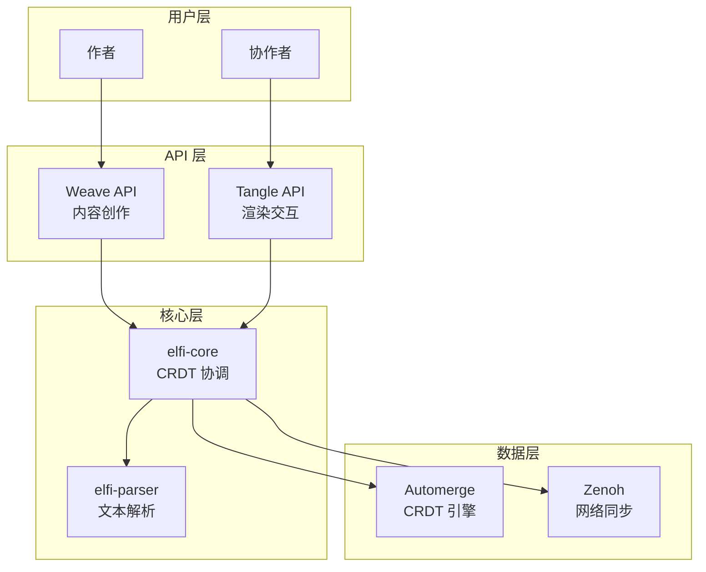

# ELFI: Event-sourcing Literate File Interpreter

> 为协作而生的文学化编程新范式

[](https://www.rust-lang.org/)
[](LICENSE)
[](https://your-docs-url)

ELFI 是一个全新的文学化编程解释器，围绕 `.elf` 文件格式构建。它从零开始设计，旨在实现原生的、去中心化的协作，以克服现有工具的局限性。

## ✨ 核心特性

- 🤝 **原生协作**: 基于 CRDT 的无冲突并发编辑
- 📜 **事件溯源**: 完整的可审计操作历史
- 🌐 **去中心化**: 支持 P2P、网状网络等多种拓扑
- 📝 **人类可读**: 纯文本格式，Git 友好
- 🔧 **可扩展**: 插件化的块类型和渲染器

## 🚀 快速开始

### 自动配置开发环境

```bash
# 克隆项目
git clone <repository-url>
cd elfi

# 自动配置 (macOS/Linux)
./scripts/setup-dev.sh

# 或者 Windows PowerShell
.\scripts\setup-dev.ps1
```

### 手动安装

1. **安装 Rust**
   ```bash
   curl --proto '=https' --tlsv1.2 -sSf https://sh.rustup.rs | sh
   ```

2. **安装工具**
   ```bash
   cargo install just mdbook mdbook-mermaid
   ```

3. **配置文档**
   ```bash
   cd docs
   mdbook-mermaid install .
   just serve  # 启动文档服务器
   ```

## 📖 文档

- 🌟 **[开发环境配置](DEVELOPMENT.md)** - 详细的环境配置指南
- 📚 **[在线文档](http://localhost:3000)** - 完整的架构和 API 文档
- 🎯 **[快速开始教程](docs/src/designs/01-motivation.md)** - 了解 ELFI 的设计理念

## 🏗️ 项目结构

```
elfi/
├── 📁 src/                    # Rust 源代码
│   ├── elfi-core/            # 核心库 (CRDT + Weave/Tangle API)
│   ├── elfi-parser/          # .elf 格式解析器
│   ├── elfi-cli/             # 命令行工具
│   └── elfi-ffi/             # FFI 绑定层
├── 📁 docs/                   # 📖 项目文档
│   ├── src/                  # Markdown 源文件
│   ├── justfile              # 文档任务脚本
│   └── merge_markdown.sh     # 文档合并工具
├── 📁 scripts/               # 🔧 开发脚本
│   ├── setup-dev.sh          # Unix 自动配置
│   ├── setup-dev.ps1         # Windows 自动配置
│   └── README.md             # 脚本说明
├── 📄 DEVELOPMENT.md          # 开发环境配置指南
└── 📄 README.md               # 项目概述 (AI 上下文)
```

## 🛠️ 开发命令

### 文档相关
```bash
cd docs
just serve          # 启动文档服务器
just build          # 构建文档
just merge          # 生成合并的 markdown
just clean          # 清理构建产物
```

### 代码开发
```bash
cargo test          # 运行测试
cargo build         # 构建项目
cargo fmt           # 格式化代码
cargo clippy        # 代码检查
```

## 🏛️ 系统架构

ELFI 采用分层架构设计：



## 📋 路线图

- [x] 核心架构设计
- [x] 文档系统建设
- [x] 开发环境配置
- [ ] `.elf` 格式解析器 (`elfi-parser`)
- [ ] CRDT 核心引擎 (`elfi-core`)
- [ ] Weave API 实现
- [ ] Tangle API 实现
- [ ] CLI 工具 (`elfi-cli`)
- [ ] WebAssembly 绑定
- [ ] 示例和教程

## 🤝 参与贡献

我们欢迎各种形式的贡献！请查看 [DEVELOPMENT.md](DEVELOPMENT.md) 了解如何参与开发。

### 贡献方式

- 🐛 报告 Bug 和提出改进建议
- 📖 完善文档和示例
- 💻 提交代码和功能实现
- 🧪 编写测试和基准测试
- 🎨 改进 UI 和用户体验

### 开发工作流

1. Fork 项目并创建功能分支
2. 运行 `./scripts/setup-dev.sh` 配置环境
3. 进行开发并添加测试
4. 运行 `cargo test` 和 `just build` 确保质量
5. 提交 Pull Request

## 📜 许可证

本项目采用 [MIT 许可证](LICENSE)。

## 🙏 致谢

ELFI 的设计灵感来源于以下优秀项目：

- [Automerge](https://automerge.org/) - CRDT 实现
- [Zenoh](https://zenoh.io/) - 数据中心网络协议
- [Jupyter](https://jupyter.org/) - 交互式计算环境
- [Org-mode](https://orgmode.org/) - 纯文本组织系统

## 📞 联系我们

- 📧 邮箱: your-email@example.com
- 💬 讨论: [GitHub Discussions](https://github.com/your-org/elfi/discussions)
- 🐛 问题: [GitHub Issues](https://github.com/your-org/elfi/issues)

---

<p align="center">
  <b>让文学化编程真正协作起来！</b> 🚀
</p></p>