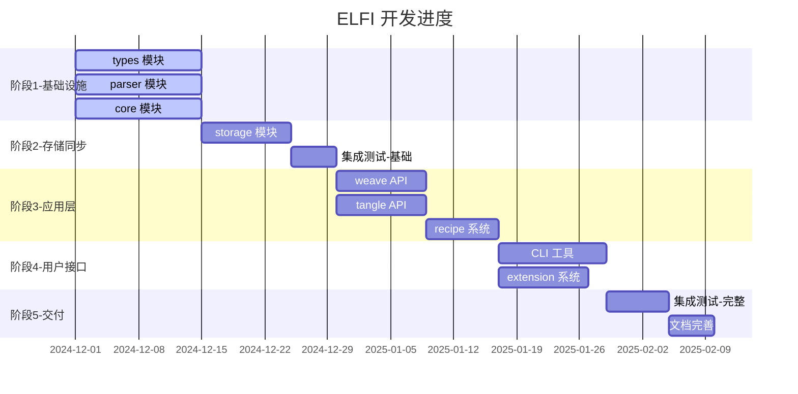

# ELFI 开发路线图

**当前状态**: 基础设施搭建完成，准备开始模块开发

## 📊 总体进度概览

## 🎯 当前里程碑

### ✅ 已完成
- [x] 项目架构设计和文档规划
- [x] 基础目录结构和workspace配置
- [x] 开发环境配置和工具链设置
- [x] TDD开发流程规范制定
- [x] 模块接口定义和Mock框架
- [x] 基础依赖配置（automerge, zenoh, tree-sitter）

### 🚧 进行中 (阶段1: 基础设施)
- [ ] **types 模块** (0% - 等待开发者)
  - Interface定义: `Document`, `Block`, `Relation`
  - 错误类型: `TypesError`
  - 单元测试覆盖 > 80%
  
- [ ] **parser 模块** (0% - 等待开发者)  
  - Tree-sitter语法实现
  - .elf文件解析功能
  - Relations语法解析
  
- [ ] **core 模块** (0% - 等待开发者)
  - CRDT文档管理
  - 事件溯源实现
  - DocumentManager和Main接口

### 📋 待开始

#### 阶段2: 存储同步 (预计开始: types+parser+core完成后)
- [ ] **storage 模块** - Zenoh网络集成和分布式同步
- [ ] **集成测试-基础** - 三大核心用例的基础功能验证

#### 阶段3: 应用层 (预计开始: 2025年1月)
- [ ] **weave API** - 内容创作和关系管理
- [ ] **tangle API** - 渲染执行和Islands架构  
- [ ] **recipe 系统** - 内容转换和导出

#### 阶段4: 用户接口 (预计开始: 2025年2月)
- [ ] **CLI 工具** - 命令行界面和用户体验
- [ ] **extension 系统** - 插件架构和生态

#### 阶段5: 交付 (预计开始: 2025年3月)
- [ ] **集成测试-完整** - 端到端测试和性能基准
- [ ] **文档完善** - API文档和用户指南

## 🎪 三大核心用例验证

### 1. 对话即文档 (`conversation.elf`)
- **依赖模块**: types, parser, core, storage
- **验证重点**: CRDT实时协作，冲突解决
- **预计完成**: 阶段2结束

### 2. 自举开发 (`elfi-dev.elf`) 
- **依赖模块**: weave, recipe, cli
- **验证重点**: Recipe代码导出，双向同步
- **预计完成**: 阶段4结束

### 3. 文档即App (`main.elf` + `component.elf`)
- **依赖模块**: tangle, recipe, extension
- **验证重点**: 跨文档引用，动态组合
- **预计完成**: 阶段4结束

## 👥 团队分工建议

### 阶段1 (并行开发)
- **开发者A**: types 模块 + `@rust-tdd-developer`
- **开发者B**: parser 模块 + `@parser-expert`  
- **开发者C**: core 模块 + `@crdt-specialist`

### 阶段2+ (根据专长分配)
- **网络专家**: storage 模块 + `@network-architect`
- **API设计师**: weave/tangle/recipe + `@api-designer`
- **前端专家**: CLI工具 + `@cli-ux-specialist`
- **测试工程师**: 集成测试 + `@integration-tester`

## 🚨 风险和阻塞因素

### 高风险项目
1. **CRDT集成复杂度** - Automerge与自定义数据结构的集成
2. **Zenoh网络稳定性** - 分布式同步的可靠性保证
3. **Tree-sitter语法** - .elf文件格式的解析正确性

### 依赖阻塞
- storage 模块依赖 core 模块的CRDT实现
- weave/tangle 依赖 storage 的同步功能
- CLI 依赖所有底层模块的稳定API

### 缓解策略
- 严格遵循Interface优先开发，避免模块间的实现依赖
- 使用Mock实现进行并行开发和测试
- 定期进行集成测试，及早发现接口不兼容问题

## 📈 质量指标

### 代码质量
- [ ] 单元测试覆盖率 > 80%
- [ ] 所有模块通过 `cargo clippy` 检查
- [ ] 所有公共API有完整文档

### 性能指标
- [ ] 文档同步延迟 < 100ms
- [ ] 单文档内存使用 < 100MB
- [ ] 支持并发用户数 > 10

### 用例验证
- [ ] conversation.elf 多用户协作场景通过
- [ ] elfi-dev.elf 自举开发场景通过  
- [ ] main.elf + component.elf 跨文档组合场景通过

## 📞 如何贡献

### 新开发者加入流程
1. 阅读 [DEVELOPMENT.md](DEVELOPMENT.md) 配置环境
2. 查看 [plans/01-overview.md](plans/01-overview.md) 了解架构
3. 查看本 ROADMAP.md 了解当前进度
4. 从当前 🚧 进行中的模块开始贡献
5. 参考 [docs/src/usecases/00-overview.md](docs/src/usecases/00-overview.md) 使用subagent

### 更新本文档
- 模块完成后请更新进度状态
- 发现新的风险或阻塞请及时记录
- 里程碑达成后更新时间估计

---

**最后更新**: 2024-12-xx | **下次更新**: 模块开发开始时