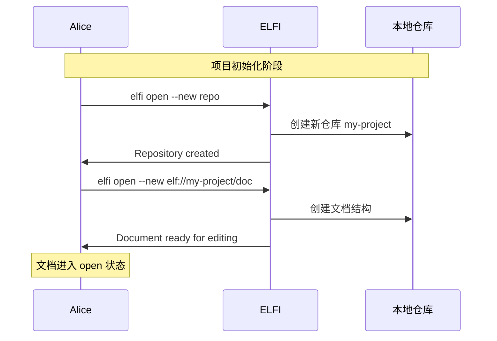
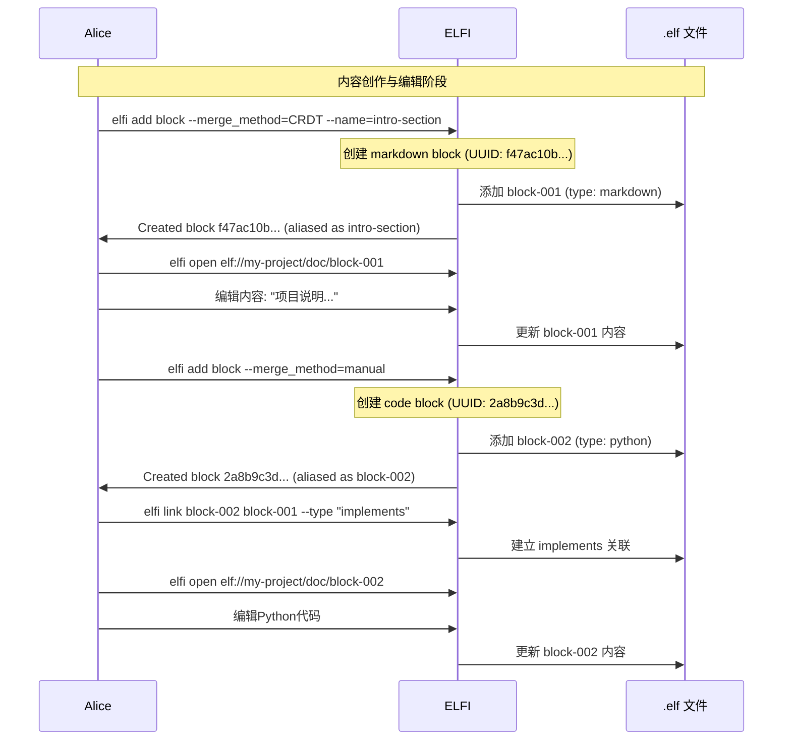
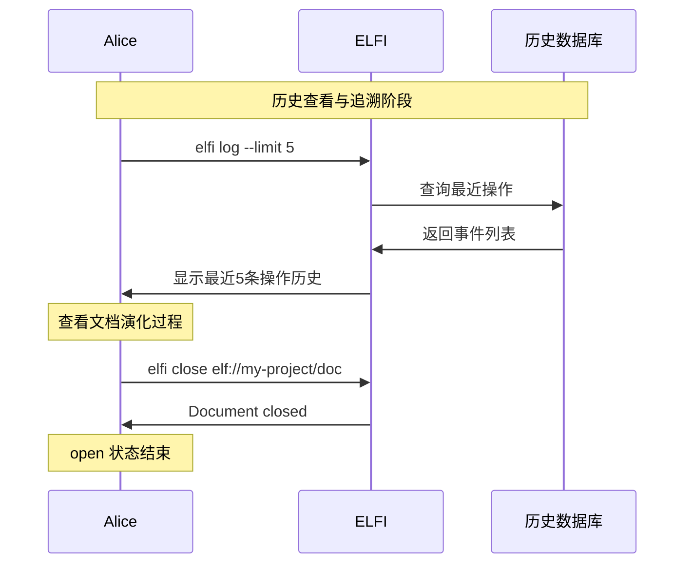
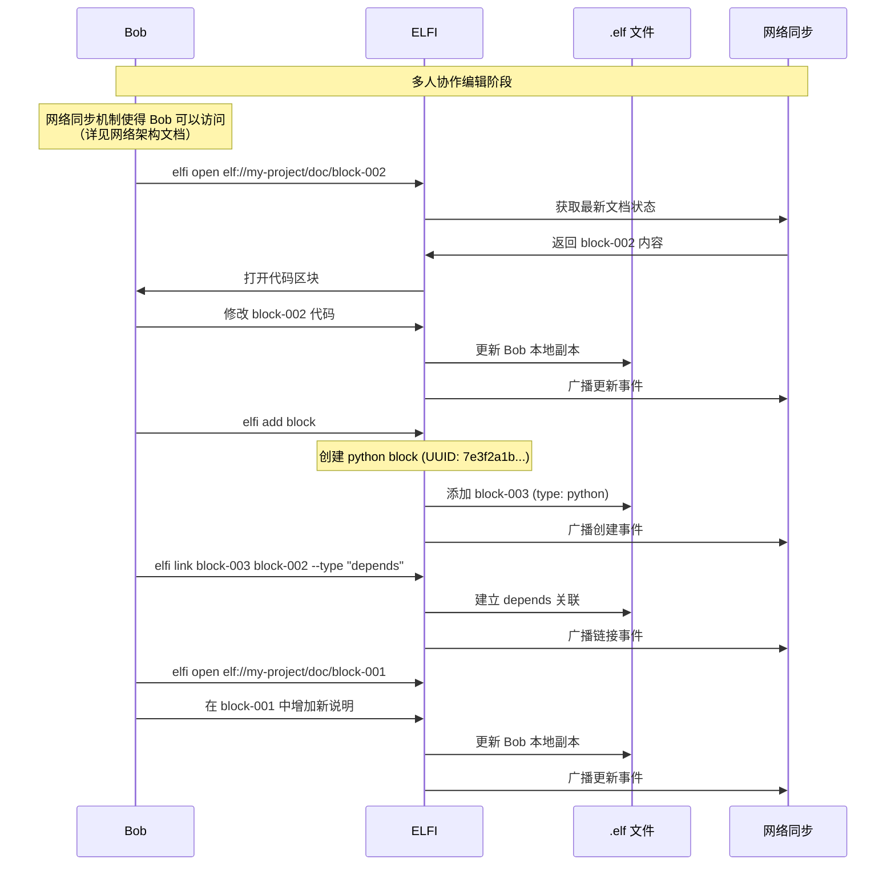
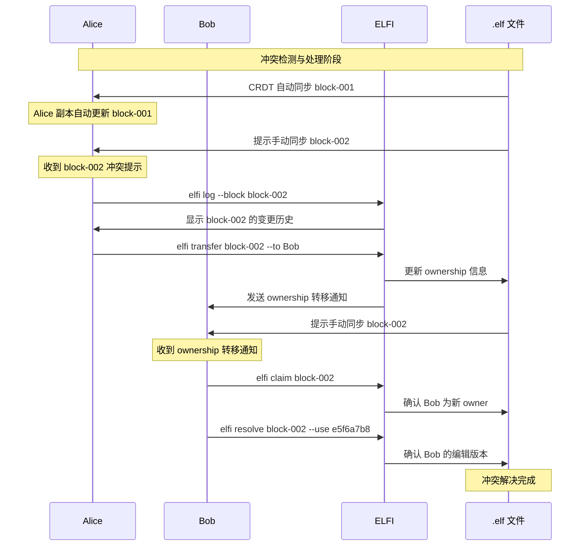
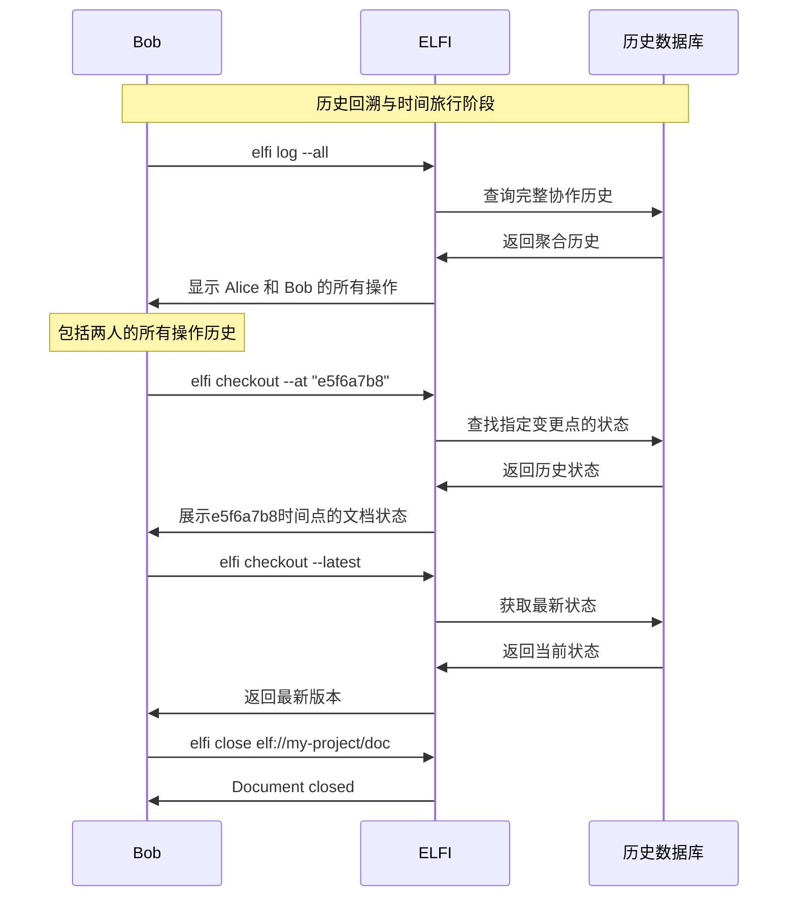
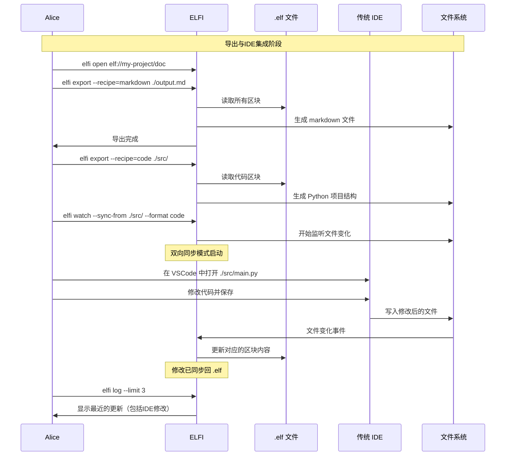
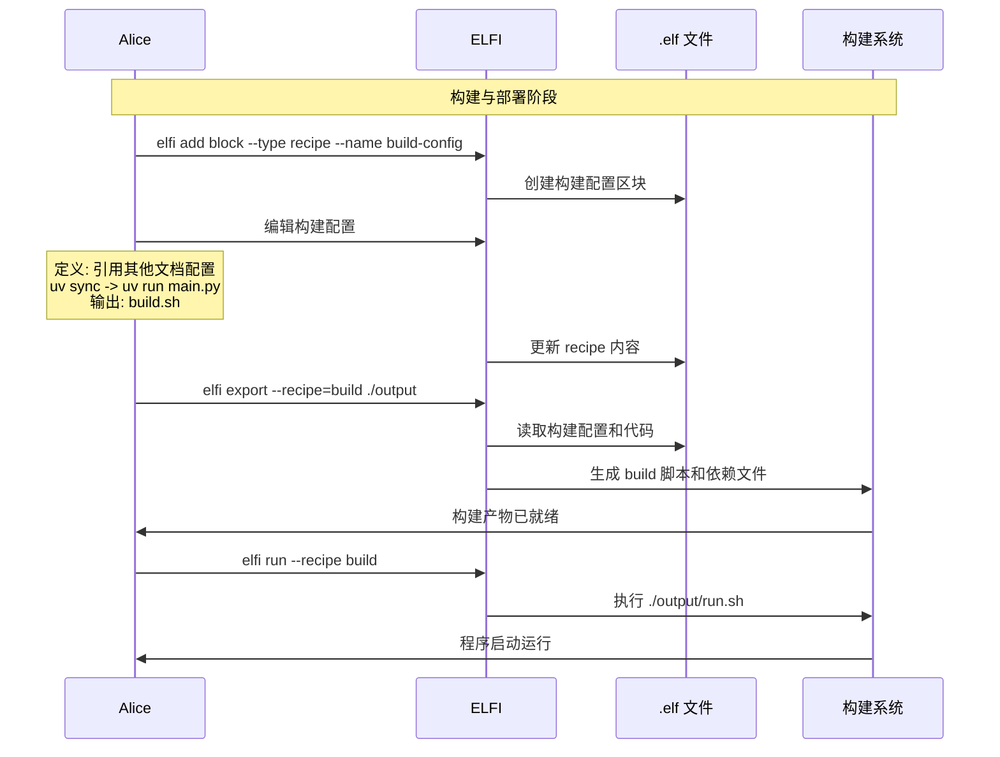
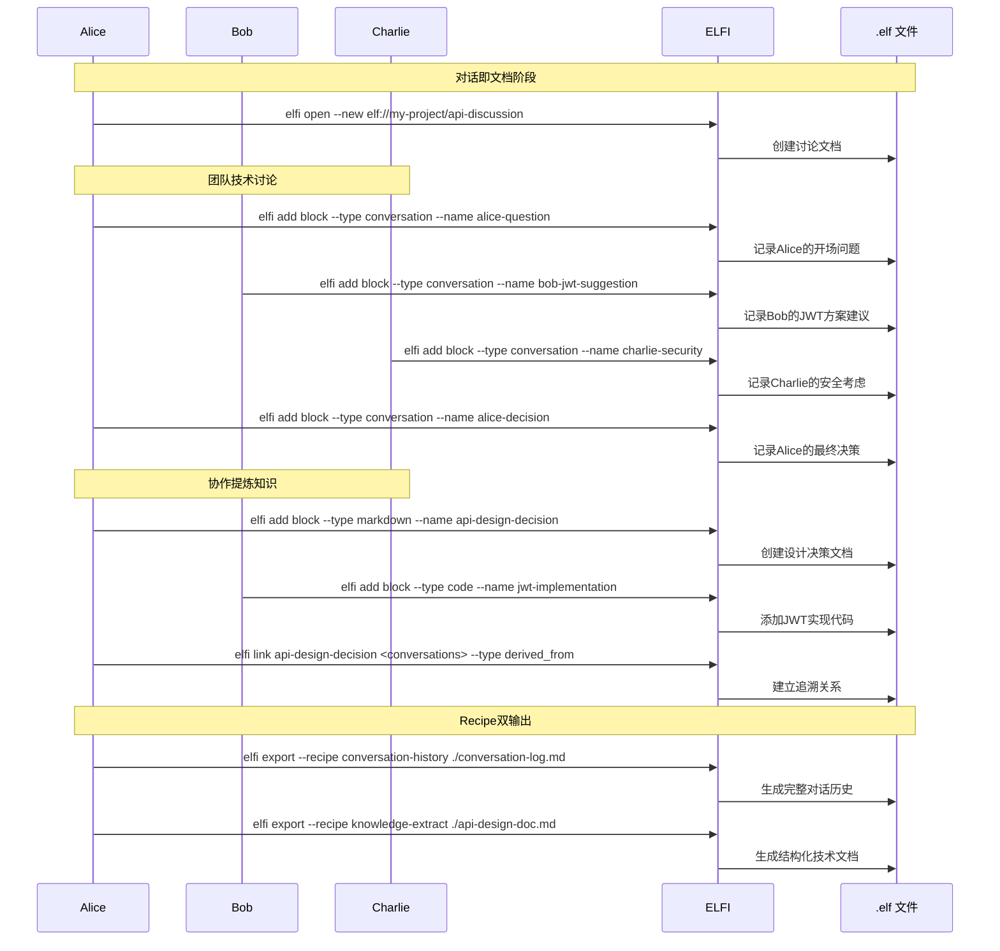
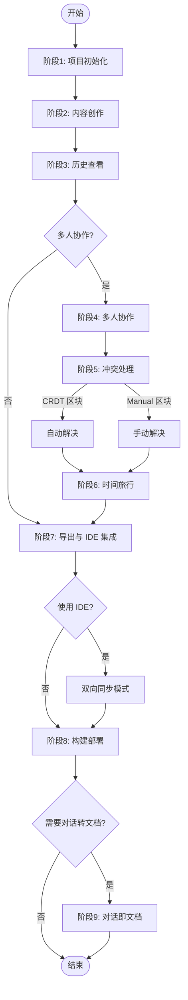

# Elfi 快速入门

`elfi` 是文学化编程文档`.elf`的协作管理工具。本文档通过一个完整的协作示例，展示 elfi 在实际工作中的使用方式，并与传统开发方式进行对比。

## elfi 的核心能力

### 1. 标识符系统：多层次的身份管理

elfi 使用三层标识符系统，确保每个元素都有清晰、唯一的标识：

1. **UUID**：每个区块的真实身份
   - 格式：`f47ac10b-58cc-4372-a567-0e02b2c3d479`
   - 全局唯一，自动生成，不可修改
   - 确保跨仓库和跨设备的唯一性

2. **Hash ID**：操作记录的指纹
   - 格式：`a1b2c3d4`（前8位SHA-256）
   - 用于 `elfi log` 和 `elfi checkout` 命令
   - 每个操作（创建、修改、链接）都有唯一hash

3. **人类可读名称**：便于记忆的别名
   - 格式：`block-001`、`intro-section`、`main-function`
   - 可选，通过 `--name` 参数指定
   - 仅在当前**文档内**唯一（禁止同名区块）

示例：
```bash
# 创建时指定人类可读名称
elfi add block --name=intro-section
# 返回: Created block f47ac10b-58cc-4372-a567-0e02b2c3d479 (aliased as intro-section)

# 使用别名引用
elfi link main-function intro-section --type "implements"

# 查看操作历史（显示hash）
elfi log
# a1b2c3d4 | 2024-01-15 10:30 | Alice | Created intro-section
```

### 2. 文档状态：明确的编辑会话

elfi 通过 open/close 管理编辑会话，确保资源的有效利用：

- **open状态**：文档加载到内存，可以编辑，建立网络连接
- **closed状态**：文档仅存在于存储，不占用资源

```bash
# 打开文档进入编辑会话
elfi open elf://my-project/doc
# 返回: Document loaded, sync enabled

# 关闭文档结束会话
elfi close elf://my-project/doc  
# 返回: Changes saved, connections closed
```

多人同时open同一文档时自动启用实时协作。

### 3. 文学化编程：内容有机融合

在 `.elf` 文件中，文档和代码不是割裂的，而是通过区块（block）有机组织在一起。每个区块都有全局唯一的 UUID 标识符，为了便于人类阅读，我们在示例中使用 `block-001`、`block-002` 等简化标识。

```bash
# 添加一个 markdown 区块
elfi add block --type markdown --merge_method=CRDT --name=block-001
# 返回: Created block: <uuid> (显示为 block-001)

# 添加一个代码区块并链接到上一个区块
elfi add block --type code --link block-001
# 返回: Created block: <uuid> (显示为 block-002)
```

每个区块都可以与其他区块建立关联，形成有机的知识网络。

**命名唯一性约束：**
```bash
# 在同一文档内创建同名区块会失败
elfi add block --name intro-section --type markdown
elfi add block --name intro-section --type code
# 错误: Block name 'intro-section' already exists in this document

# 建议使用描述性后缀
elfi add block --name intro-section-docs --type markdown
elfi add block --name intro-section-code --type code
```

### 3. Recipe系统：可编程的转换规则

Recipe是存储在特殊区块中的转换脚本，定义如何处理和导出内容：

```bash
# 创建Recipe区块
elfi add block --type=recipe --name=markdown-export
# 返回: Created block 2f4a6c8e... (aliased as markdown-export)
```

Recipe内容使用YAML格式定义：
```yaml
name: markdown-export
version: 1.0
description: 导出为Markdown文档

# 选择器：指定要处理的区块
selector:
  types: [markdown, code]
  tags: [public]

# 转换规则
transform:
  - type: markdown
    action: copy
  - type: code
    action: wrap
    template: |
      ```{lang}
      {content}
      ```

# 输出配置  
output:
  format: single-file
  filename: output.md
  header: |
    # Project Documentation
    Generated: {timestamp}
```

```bash
# 使用Recipe导出
elfi export --recipe=markdown-export ./docs/
# 返回: Exported to ./docs/output.md

# 查看项目中的Recipe
elfi list recipes
# 返回: markdown-export | Custom export configuration for this project
```

Recipe区块本身也被版本控制，可以在项目间复制和修改复用。elfi不提供内置Recipe，每个项目根据需要自定义Recipe配置。

### 跨文档引用与内容组合

Recipe系统支持引用其他文档的区块内容，实现动态内容组合：

```yaml
name: cross-doc-composition
version: 1.0
description: 动态组合多个文档内容

# 跨文档引用配置
references:
  - source: "elf://my-project/components/shared-utils"
    target: "shared-code-section"
  - source: "elf://my-project/config/build-settings"
    target: "build-config"

# 选择器和转换规则
selector:
  types: [markdown, code, reference]

transform:
  - type: reference
    action: resolve
    recursive: true
    template: |
      <!-- 引用自: {source_uri} -->
      {resolved_content}

# 错误处理配置
error_handling:
  on_missing_reference: "placeholder"  # 选项: "placeholder", "error", "skip"
  on_circular_reference: "error"
  placeholder_template: |
    <!-- 错误: 引用未找到 {uri} -->
    [内容缺失: {uri}]
```

**支持的引用格式：**
- `elf://repo/doc/block-id` - 引用特定区块
- 仅支持同一仓库内的文档间引用
- 自动检测循环引用并报错

```bash
# 使用跨文档引用的Recipe
elfi export --recipe=cross-doc-composition ./composed-output.md
# 自动解析所有引用，生成组合内容
```

### 4. 去中心化协作：无冲突实时编辑

基于 CRDT 技术，多人可以同时编辑同一个 `.elf` 文件。对于设置为 CRDT 合并策略的区块，系统会自动处理冲突；对于设置为手动合并的区块，系统会提示用户解决冲突。

```bash
# 同步变更
elfi sync  
# ✓ CRDT blocks: 2 auto-merged
# ⚠ Manual blocks: 1 conflict detected, ownership transfer required
```

### 5. 灵活导出：多格式适配

`elfi` 支持将同一份内容导出为不同格式，满足不同场景的需求：

```bash
# 导出为 Markdown 文档
elfi export --recipe=markdown ./output.md

# 导出为源代码
elfi export --recipe=code ./src/

# 生成构建脚本
elfi export --recipe=build ./output/
```

通过不同的 recipe 配置，可以将 `.elf` 文件转换为所需的任何格式。


### 6. 完整历史：事件溯源和时间旅行

每个操作都被记录为不可变的事件，你可以查看完整的演化历史：

```bash
# 查看最近的操作历史
elfi log --limit 5
# a1b2c3d4 | 2024-01-15 10:30 | Alice | Created block-001 (markdown)
# e5f6a7b8 | 2024-01-15 11:15 | Alice | Modified block-001
# c9d0e1f2 | 2024-01-15 14:20 | Bob | Created block-002 (code)

# 查看特定区块的历史
elfi log --block block-002

# 时间旅行：回到某个变更点
elfi checkout --at "a1b2c3d4"
```

这保证了每个设计决策和变更都有完整的上下文记录。


## 协作流程演示

下面通过 Alice 和 Bob 的协作示例，展示 elfi 在实际项目中的使用方式，并与传统开发流程进行对比。

### 阶段1：项目初始化

#### 需求场景
Alice 想要开始一个新的文学化编程项目，将文档、代码和配置统一管理。她需要一个支持协作的仓库环境。

#### 传统方式 vs. elfi 方式

**传统方式：**
- 创建 Git 仓库：`git init`
- 分别创建 README.md、src/ 目录、docs/ 目录
- 配置 .gitignore、CI/CD 脚本
- 各类文件散落在不同位置

**elfi 方式：**
```bash
# 创建新仓库
elfi open --new repo
# Created repository: my-project

# 创建新文档
elfi open --new elf://my-project/doc
# Document created and opened
```

优势：
- 一个 `.elf` 文件包含所有内容
- 内置 CRDT 协作支持
- 自动版本控制和事件溯源

#### 操作流程



### 阶段2：内容创作与编辑

#### Recipe驱动的内容组合示例

在实际项目中，我们经常需要引用和组合其他文档的内容。下面展示如何通过Recipe系统实现动态内容组合：

```bash
# 创建组件文档
elfi open --new elf://my-project/components
elfi add block --type code --name shared-utilities
# 编辑共享的工具函数...

# 在主文档中通过Recipe引用组件
elfi add block --type recipe --name dynamic-composition
# 配置Recipe以引用components文档的内容
```

**Recipe配置示例：**
```yaml
name: dynamic-composition
references:
  - source: "elf://my-project/components/shared-utilities"
    target: "utils-section"
transform:
  - type: reference
    action: resolve
    template: "## 共享工具\n{resolved_content}"
error_handling:
  on_missing_reference: "placeholder"
```

```bash
# 导出时自动组合内容
elfi export --recipe=dynamic-composition ./output.md
# 生成的文档包含来自components的实际内容
```

#### 需求场景
Alice 需要添加项目说明文档和核心代码，并希望它们之间有明确的关联关系。她还需要为不同类型的内容设置合适的合并策略。

#### 传统方式 vs. elfi 方式

**传统方式：**
- 在 README.md 中写项目说明
- 在 src/main.py 中写代码
- 手动维护文档和代码的一致性
- 无法表达文档和代码的关联关系

**elfi 方式：**
```bash
# 添加 markdown 区块（使用 CRDT 合并策略）
elfi add block --merge_method=CRDT --name=block-001
# Created block: <uuid> (显示为 block-001)

# 编辑区块内容
elfi open elf://my-project/doc/block-001
# 输入项目说明文档...

# 添加代码区块（使用手动合并策略）
elfi add block --merge_method=manual
# Created block: <uuid> (显示为 block-002)

# 链接区块关系
elfi link block-002 block-001 --type "implements"

# 编辑代码区块
elfi open elf://my-project/doc/block-002
# 输入 Python 代码...
```

优势：
- 区块间明确的语义关联（implements 关系）
- 灵活的合并策略（CRDT 自动 vs. 手动控制）
- 全局 UUID 保证区块唯一性

注意：`block-001`、`block-002` 是人类可读的简化标识符，实际上每个区块都有仓库内唯一的 UUID。

#### 操作流程



### 阶段3：历史查看与追溯

#### 需求场景
Alice 在编辑过程中想要查看文档的演化历史，了解每个更改的上下文和时间线。这对于理解项目的演化过程非常重要。

#### 传统方式 vs. elfi 方式

**传统方式：**
- 使用 `git log` 查看提交历史
- 只能看到文件级别的变化
- 难以追踪内容的语义关联
- commit 信息可能不够精细

**elfi 方式：**
```bash
# 查看最近的操作历史
elfi log --limit 5
# a1b2c3 | 2024-01-15 10:30 | Alice | Created block-001 (markdown)
# d4e5f6 | 2024-01-15 10:35 | Alice | Modified block-001
# g7h8i9 | 2024-01-15 10:40 | Alice | Created block-002 (python)
# j1k2l3 | 2024-01-15 10:42 | Alice | Linked block-002 to block-001
# m4n5o6 | 2024-01-15 10:45 | Alice | Modified block-002

# 关闭文档
elfi close elf://my-project/doc
```

优势：
- 区块级别的精细操作记录
- 自动记录所有操作（创建、修改、链接）
- 保留完整的上下文信息

#### 操作流程



### 阶段4：多人协作编辑

#### 需求场景
Bob 加入项目，需要与 Alice 同时编辑同一份文档。他要修改现有代码、添加新功能，还要更新文档说明。

#### 传统方式 vs. elfi 方式

**传统方式：**
- Bob 需要 clone 仓库：`git clone`
- 在本地修改文件
- 提交并推送：`git add, commit, push`
- 如果 Alice 同时修改，可能遇到合并冲突

**elfi 方式：**
```bash
# Bob 打开共享文档
# 注：网络同步机制使得 Bob 可以访问 Alice 的文档
# （详见网络架构文档）
elfi open elf://my-project/doc/block-002

# Bob 修改 block-002 的代码
# 编辑 Python 代码...

# Bob 添加新的区块
elfi add block
# Created block: <uuid> (显示为 block-003)

# 设置依赖关系
elfi link block-003 block-002 --type "depends"

# Bob 也编辑 block-001
elfi open elf://my-project/doc/block-001
# 在 markdown 文档中增加新说明...
```

优势：
- 无需手动 clone 和 push
- 实时协作，立即可见
- 自动处理大部分合并情况

#### 操作流程



### 阶段5：冲突检测与处理

#### 需求场景
Alice 和 Bob 同时修改了同一个区块，系统需要智能地处理这种冲突情况。不同的区块类型和合并策略需要不同的处理方式。

#### 传统方式 vs. elfi 方式

**传统方式：**
- 在 `git pull` 或 `git merge` 时遇到冲突
- 手动编辑冲突文件，删除 `<<<<<<< ======= >>>>>>>` 标记
- 可能丢失上下文信息
- 需要手动提交合并结果

**elfi 方式：**
```bash
# Alice 的本地副本接收变更
elfi sync
# ✓ block-001: CRDT 自动合并 Bob 的修改
# ⚠ block-002: Manual 区块检测到冲突

# 查看 block-002 的变更历史
elfi log --block block-002
# a1b2c3d4 | 10:40 | Alice | Modified block-002
# e5f6a7b8 | 10:50 | Bob | Modified block-002 (冲突)

# Alice 决定将 ownership 转移给 Bob
elfi transfer block-002 --to Bob
# 返回: Ownership of block-002 transferred to Bob

# Bob 主动获取所有权并选择他的版本
elfi claim block-002
# 返回: You are now the owner of block-002
elfi resolve block-002 --use e5f6a7b8
# 返回: block-002 resolved with specified version
```

优势：
- CRDT 区块自动合并，无需干预
- 手动区块提供 ownership 转移机制
- 保留完整的冲突上下文
- 灵活的冲突解决策略

### 所有权规则

1. **初始分配**：创建区块的用户自动成为owner
2. **CRDT区块**：无ownership概念，所有人平等
3. **Manual区块**：
   - 只有owner可以解决冲突
   - owner可以转移所有权给其他用户
   - 接收者必须显式接受ownership

```bash
# 查看区块所有权
elfi info block-002
# Type: code (manual)
# Owner: Alice
# Modified: 2 conflicts pending

# 转移所有权（直接转移）
elfi transfer block-002 --to Bob
# 返回: Ownership of block-002 transferred to Bob

# Bob主动获取所有权
elfi claim block-002
# 返回: You are now the owner of block-002
```

#### 操作流程



### 阶段6：历史回溯与时间旅行

#### 需求场景
Bob 想要了解项目的完整协作历史，并且需要查看之前某个时间点的状态来理解某个决策的背景。

#### 传统方式 vs. elfi 方式

**传统方式：**
- 使用 `git log --all --graph` 查看分支历史
- 使用 `git checkout <commit>` 回到指定提交
- 只能看到文件级别的变化
- 难以理解细粒度的内容关联

**elfi 方式：**
```bash
# 查看完整协作历史
elfi log --all
# a1b2c3d4 | 2024-01-15 10:30 | Alice | Created block-001 (markdown)
# e5f6a7b8 | 2024-01-15 10:35 | Alice | Modified block-001
# c9d0e1f2 | 2024-01-15 10:50 | Bob | Modified block-001
# f3a4b5c6 | 2024-01-15 10:55 | Bob | Created block-003 (python)

# 时间旅行：回到指定变更点
elfi checkout --at "e5f6a7b8"
# 展示 e5f6a7b8 时间点的文档状态

# 返回最新版本
elfi checkout --latest

# Bob 关闭文档
elfi close elf://my-project/doc
```

优势：
- 区块级别的精细历史记录
- 灵活的时间旅行能力
- 保留区块间关联关系
- 支持多人协作历史聚合视图

#### 操作流程



### 阶段7：导出与 IDE 集成

#### 需求场景
Alice 需要将 `.elf` 文件中的内容导出为传统格式，以便与现有工具链集成。同时，她希望能够在传统 IDE 中编辑导出的代码，并将修改同步回 elfi。

#### 传统方式 vs. elfi 方式

**传统方式：**
- 手动从文档中复制粘贴代码
- 管理多个分散的文件
- 手动维护文档和代码的一致性
- 无法双向同步

**elfi 方式：**
```bash
# 打开文档
elfi open elf://my-project/doc

# 导出为 Markdown 文档
elfi export --recipe=markdown ./output.md
# 生成包含所有区块内容的 markdown 文件

# 导出为源代码项目
elfi export --recipe=code ./src/
# 生成传统的 Python 项目结构

# 启动 IDE 集成模式（双向同步）
elfi watch --sync-from ./src/ --format code
# 监听文件变化，自动同步回 .elf
```

**IDE 集成优势：**
- 一键导出为传统项目结构
- 在 VSCode/IntelliJ 中正常编辑、调试、测试
- 修改自动同步回 .elf 文件（满足特定条件）
- 兼容现有工具链（linting、formatting、CI/CD）

**同步条件：**
- 修改的文件必须是单个区块导出的
- 文件结构与导出时保持一致
- 不允许删除文件或重命名

#### 操作流程




### 阶段8：构建与部署

#### 需求场景
Alice 需要为项目创建构建流程，将开发环境的代码打包为可部署的应用。同时，她希望构建过程能够引用其他文档的配置并处理各种错误情况。

#### 传统方式 vs. elfi 方式

**传统方式：**
- 分别编写 Dockerfile、requirements.txt、build.sh
- 管理多个配置文件
- 手动同步构建脚本和代码变化

**elfi 方式：**
```bash
# 创建构建配置区块
elfi add block --type recipe --name build-config
# 在区块中定义构建流程（引用其他文档的配置）：

# 生成构建脚本
elfi export --recipe=build ./output
# 生成 output/run.sh 及相关文件

# 执行构建
elfi run --recipe build
# 或者直接运行: ./output/run.sh
```

优势：
- 构建配置与代码在同一个 .elf 文件中
- 自动生成构建脚本和依赖文件
- recipe 系统支持多种输出格式
- 支持跨文档引用和错误处理

**跨文档引用的构建配置示例：**
```yaml
name: build-with-references
description: 引用其他文档的配置和代码

# 引用其他文档的内容
references:
  - source: "elf://my-project/config/dependencies"
    target: "requirements-section"
  - source: "elf://my-project/components/shared-utilities"
    target: "utils-section"

# 选择器和转换
selector:
  types: [code, reference, recipe]

transform:
  - type: reference
    action: resolve
  - type: code
    action: extract
    filter: "python"

# 错误处理策略
error_handling:
  on_missing_reference: "error"  # 缺失引用时停止构建
  on_circular_reference: "error" # 检测到循环引用时停止
  max_recursion_depth: 10        # 最大递归深度

output:
  format: "script"
  filename: "build.sh"
  executable: true
```

**错误处理示例：**
```bash
# 如果引用的文档不存在
elfi export --recipe=build-with-references ./output
# 错误: Reference not found: elf://my-project/config/missing-doc
# Build failed: Missing reference detected

# 检测到循环引用
# 错误: Circular reference detected: config/deps -> build/main -> config/deps
# Build failed: Circular dependency in references
```

#### 操作流程



### 阶段9：对话即文档

#### 需求场景
Alice的团队需要进行API认证方案的技术讨论，并希望能够将会议对话转换为两种格式的文档：完整的对话历史记录和结构化的技术决策文档。

#### 传统方式 vs. elfi 方式

**传统方式：**
- 开会时手动记录会议纪要
- 会后整理成技术文档  
- 文档和对话记录分离
- 决策缺乏完整的上下文追溯

**elfi 方式：**
```bash
# 创建会议讨论文档
elfi open --new elf://my-project/api-discussion

# Alice记录开场问题 (conversation类型)
elfi add block --type conversation --name alice-question
# 编辑内容：记录产品需求和认证方案问题

# Bob记录技术建议 (conversation类型)
elfi add block --type conversation --name bob-jwt-suggestion  
# 编辑内容：JWT方案的优势和技术细节

# Charlie记录安全考虑 (conversation类型)
elfi add block --type conversation --name charlie-security
# 编辑内容：安全要求和防护措施

# Alice记录最终决策 (conversation类型)
elfi add block --type conversation --name alice-decision
# 编辑内容：确定技术方案和实施计划

# 协作提炼知识 (markdown类型)
elfi add block --type markdown --name api-design-decision
# 编辑内容：基于对话整理的技术决策文档

# 添加实现代码 (code类型)  
elfi add block --type code --name jwt-implementation
# 编辑内容：Bob提到的JWT认证服务实现

# 建立追溯关系
elfi link api-design-decision alice-question,bob-jwt-suggestion,charlie-security,alice-decision --type derived_from
elfi link jwt-implementation api-design-decision --type implements

# 生成双格式输出
elfi export --recipe conversation-history ./conversation-log.md
elfi export --recipe knowledge-extract ./api-design-doc.md
```

优势：
- **完整记录**：保留对话的时间线、发言者和上下文
- **知识提炼**：协作生成结构化的技术文档
- **双重价值**：同一份源数据生成两种用途的文档
- **可追溯性**：每个决策都可以追溯到具体的对话

#### Recipe驱动的双输出

**对话历史Recipe配置：**
```yaml
name: conversation-history
selector:
  types: ["conversation"]
transform:
  - type: "conversation"
    action: "copy"
    sort_by: "metadata.timestamp"
    template: |
      ## {{metadata.timestamp}} - {{metadata.speaker}} ({{metadata.role}})
      **话题**: {{metadata.topic}}
      {{content}}
```

**知识提取Recipe配置：**
```yaml
name: knowledge-extract  
selector:
  types: ["markdown", "code"]
transform:
  - type: "markdown"
    action: "copy"
    preserve_format: true
  - type: "code"
    action: "wrap"
    template: |
      ### 代码实现
      **作者**: {{metadata.author}}
      ```{{metadata.language}}
      {{content}}
      ```
```

#### 操作流程



#### 输出示例

**对话历史文档 (conversation-log.md)：**
- 完整的时间线记录
- 每个发言的角色和话题标记
- 原始对话内容保持不变
- 会议统计和总结信息

**技术决策文档 (api-design-doc.md)：**
- 结构化的技术方案描述
- 代码实现示例
- 决策追溯信息
- 实施计划和负责人

这个阶段展示了 `elfi` 在处理复杂内容转换和知识管理方面的强大能力，将实时对话无缝转换为有价值的技术文档。

## 总结

上面的 9 个阶段展示了 elfi 的完整工作流程。下图展示了各个环节的关系和决策点：



上述的流程可以让您了解到elfi 的优势

### 1. 消除信息孤岛
- **传统方式**：需求在文档里，API在另一个文件，实现在代码中，测试又在别处
- **elfi 方式**：所有相关信息在同一个 `.elf` 文件中，通过区块链接自动关联

### 2. 无缝协作
- **传统方式**：Git 合并冲突，需要手动解决，经常丢失上下文  
- **elfi 方式**：CRDT 自动合并，配合手动策略灵活处理，保持完整历史

### 3. 知识图谱
- **传统方式**：文件之间的关系隐含且难以追踪
- **elfi 方式**：区块形成知识图谱，支持图查询和导航

### 4. 完整追溯
- **传统方式**：很难追踪设计决策的来龙去脉
- **elfi 方式**：完整的事件历史，可以时间旅行到任何版本

### 5. 灵活输出
- **传统方式**：需要维护多套文档和配置
- **elfi 方式**：同一份内容，多种输出格式，recipe 驱动自动适配


## 下一步

现在你已经了解了 elfi 的核心能力，可以：

1. **查看[命令速查表](./03-cheatsheet.md)**，了解所有可用命令
2. **阅读[用例文档](./usecases/00-overview.md)**，看看 elfi 如何应对不同场景
3. **探索技术设计**，深入理解实现原理：
   - **[数据建模](./designs/01-data_modeling.md)** - CRDT和区块结构设计
   - **[存储同步](./designs/02-storage_sync.md)** - Zenoh网络架构和同步机制
   - **[Weave API](./designs/03-weave.md)** - 内容创作和IDE集成
   - **[Tangle API](./designs/04-tangle.md)** - 交互渲染和Recipe系统
   - **[解释器](./designs/05-interpreter.md)** - Rust内核实现
4. **开始你的第一个 .elf 项目**！