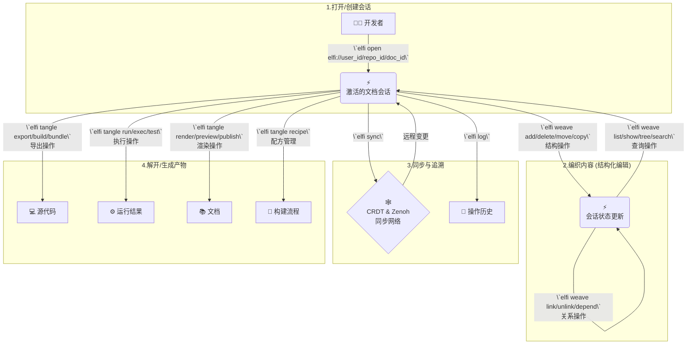

# Elfi 快速入门

`.elf` 是一种为原生、去中心化协作而设计的全新文学化编程范式。本指南将带您快速体验 `.elf` 文件的创建与编辑过程。

## 工作流概览



---

## 1. `elfi open` - 开始一个项目

一切都从 `open` 命令开始。这个命令是您与任何 `.elf` 文档交互的入口。

```bash
# 打开一个文档，如果它在网络或本地不存在，则会新建一个
elfi open elfi://my-dev-project
```

执行此命令后，`elfi` 会在本地激活一个文档会话，并准备好接收后续的 `weave`, `tangle` 等命令。

---

## 2. `elfi weave` - 编织你的内容

`weave` 命令是 `elfi` 的核心编辑工具，它用于执行所有**结构化**的修改。这确保了文档的元数据和块结构始终是有效的，并且所有操作都能被正确地记录和同步。

### 2.1 结构操作 - 管理文档块的层级结构

```bash
# 添加新块
elfi weave add --type <type> --parent <parent-id>

# 删除块（及其子块）
elfi weave delete <block-id> [--recursive]

# 移动块到新位置
elfi weave move <block-id> --parent <new-parent-id> [--after <sibling-id>]

# 复制块（创建副本）
elfi weave copy <block-id> --parent <parent-id> [--deep]
```

### 2.2 内容操作 - 编辑块的实际内容

```bash
# 直接编辑块内容
elfi weave edit <block-id> --content "新内容"

# 从文件更新块内容
elfi weave update <block-id> --file content.md

# 交互式编辑（打开默认编辑器）
elfi weave edit <block-id> --interactive
```

### 2.3 元数据操作 - 管理块的属性和标签

```bash
# 设置/更新元数据
elfi weave meta <block-id> --set key=value

# 添加标签
elfi weave tag <block-id> --add tag1,tag2

# 添加注释
elfi weave annotate <block-id> --note "这是一个重要的实现细节"
```

### 2.4 查询操作 - 浏览和搜索文档结构

```bash
# 列出所有块
elfi weave list [--type <type>] [--parent <id>]

# 显示块详情
elfi weave show <block-id> [--with-content]

# 显示文档树结构
elfi weave tree [--depth <n>] [--from <block-id>]

# 搜索块
elfi weave search <pattern> [--in-content] [--in-meta]
```

### 2.5 关系操作 - 管理块之间的连接

```bash
# 创建链接关系
elfi weave link <source-id> <target-id> [--type <link-type>]

# 删除链接
elfi weave unlink <source-id> <target-id>

# 声明依赖关系
elfi weave depend <block-id> --on <dependency-id>
```

### 2.6 实际使用示例

当您用 `weave` 创建好块的"骨架"后，就可以使用**任何您喜欢的纯文本编辑器**来打开对应的 `.elf` 文件，安全地填充块中的代码或Markdown内容。每个操作都会被记录为一个事件，确保完整的可追溯性。

---

## 3. `elfi sync` & `elfi log` - 协作与追溯

#### 3.1 同步变更

`elfi` 的协作是基于强大的CRDT算法的。当您想与同事同步时，只需运行：

```bash
# 拉取远程变更并与本地合并，同时推送本地变更
elfi sync
```

`elfi` 会在后台通过 Zenoh 网络处理所有操作的合并，自动解决并发冲突，无需手动处理 `git merge` 的烦恼。

#### 3.2 追溯历史

事件溯源是 `elfi` 的核心特性。您随时可以通过 `log` 命令查看文档的完整演化历史：

```bash
elfi log
```

这对于理解项目进展和调试问题非常有帮助。

---

## 4. `elfi tangle` - 生成最终产物

当您完成内容创作后，`tangle` 命令专注于将 `.elf` 文档"解开"，生成各种最终产物、执行代码和渲染文档。

### 4.1 导出操作 - 生成源代码文件

```bash
# 导出单个块到指定文件
elfi tangle export <block-id> --out src/main.rs

# 导出所有代码块到目录
elfi tangle export --all --out-dir ./src

# 执行预定义的构建配方
elfi tangle build --recipe web-app

# 打包整个项目
elfi tangle bundle --type npm-package --out ./dist
```

### 4.2 执行操作 - 运行代码块

```bash
# 运行特定代码块
elfi tangle run <block-id> [--env .env]

# 批量执行多个块
elfi tangle exec --blocks data-prep,analysis,viz [--sequential]

# 运行测试块
elfi tangle test [--pattern "test-*"]
```

### 4.3 渲染操作 - 生成文档

```bash
# 渲染为不同格式的文档
elfi tangle render --format html --template academic --out index.html
elfi tangle render --format pdf --style ieee --out paper.pdf
elfi tangle render --format markdown --out README.md

# 启动实时预览服务器
elfi tangle preview --port 8080 --watch

# 发布到托管平台
elfi tangle publish --target github-pages
elfi tangle publish --target netlify --config netlify.toml
```

### 4.4 配方操作 - 管理构建流程

```bash
# 列出可用的构建配方
elfi tangle recipe list

# 创建新的构建配方
elfi tangle recipe create web-app --steps build-steps.yaml

# 运行指定配方
elfi tangle recipe run web-app --verbose
```

### 4.5 实际使用示例

`tangle` 命令的核心价值在于：
- **智能依赖处理**：自动解析块之间的依赖关系，按正确顺序导出
- **多语言支持**：根据块的元数据生成对应语言的源文件
- **链接解析**：自动处理 `link` 块，组装完整的应用
- **可重现性**：基于 CRDT 数据模型，确保导出结果的确定性

注意：版本管理功能（查看历史、比较版本）请使用 `elfi log` 命令；文件验证请使用 `elfi validate` 命令。

---

## 5. `elfi validate` - 确保稳健

在任何时候，您都可以使用 `validate` 命令来检查一个 `.elf` 文件的语法和结构是否正确。这在CI/CD或Git的pre-commit钩子中特别有用。

```bash
elfi validate elfi-dev.elf
```

希望这份指南能帮助您快速上手 `elfi`！
