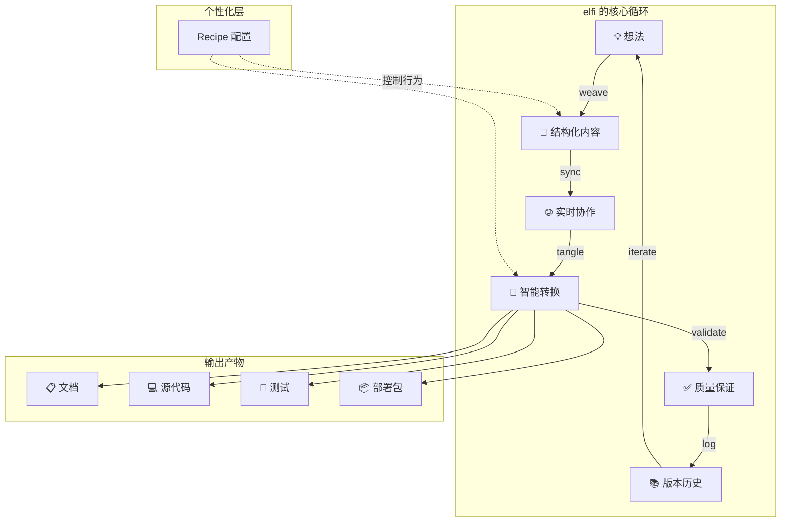

# Elfi 快速入门

## 一个想法的演化之旅

想象你有一个模糊的产品想法——比如一个简单的任务管理工具。在传统开发中，你需要在多个文档和文件间跳转：需求文档、设计稿、API 规范、源代码、测试、部署脚本...信息散落各处，很容易失去上下文。

使用 `elfi`，所有这些内容在一个 `.elf` 文件中有机地生长和演化。从最初的想法，到设计草图，再到可运行的系统——一切都在同一个文档中自然发展，保持完整的关联和历史。

## elfi 的核心能力

### 1. 文学化编程：内容有机融合

不再是"文档在这里，代码在那里"，而是文档和代码相互嵌套、相互解释：

```bash
# 添加一个想法块
elfi weave add --type markdown --tag idea
# 返回: Created block: idea-001

# 在想法基础上添加设计
elfi weave add --type code --meta language=typescript --tag design
elfi weave link design-001 idea-001 --type "implements"

# 从设计生成实现
elfi weave add --type code --meta language=typescript --tag implementation
elfi weave link impl-001 design-001 --type "implements"
```

每个代码块都知道它为什么存在，每个文档段落都知道它对应哪些实现。

### 2. 去中心化协作：无冲突实时编辑

基于 CRDT 技术，多人可以同时编辑同一个 `.elf` 文件，系统自动处理冲突：

```bash
# Alice 和 Bob 同时编辑
elfi sync  # 自动合并，无需手动处理冲突
# ✓ 3 blocks updated, 0 conflicts
```

不像 Git 需要处理合并冲突，elfi 的协作是实时和无缝的。

### 3. 智能纠缠：内容自动转换

`tangle` 不是简单的"导出"，而是智能的内容重组和增强：

```bash
# 从设计自动生成 API 文档
elfi tangle render --from api-design --format openapi --out api.yaml

# 从需求自动生成测试骨架
elfi tangle generate test --from requirements --target typescript --out tests/

# 将相关文档嵌入代码注释
elfi tangle export impl-001 --embed-related-docs --out src/main.ts
```

系统理解内容间的关系，能够智能地将相关信息织入到目标格式中。

### 4. 完整历史：事件溯源和时间旅行

每个操作都被记录，你可以看到想法是如何演化的：

```bash
# 查看项目演化历史
elfi log --limit 10
# 2024-01-15 10:30 | Alex | Added initial idea
# 2024-01-15 11:15 | Alex | Refined API design
# 2024-01-15 14:20 | Alex | Implemented core logic

# 回到任何时间点
elfi log checkout --at "2024-01-15T11:00" --to ./snapshot/
```

不会丢失任何设计决策的上下文。

### 5. 灵活输出：多格式适配

同样的内容，可以生成不同用途的产物：

```bash
# 为开发者：生成简洁的源代码
elfi tangle export --all --format clean-code --out ./src/

# 为文档：生成带注释的可读版本
elfi tangle export --all --format literate --out ./docs/

# 为部署：生成完整的应用包
elfi tangle bundle --type node-app --out ./dist/
```

## 工作流概览



## 场景演示：构建任务管理工具

让我们跟随开发者 Alex，看看一个想法如何在 elfi 中演化成完整的应用。

### 第一阶段：从想法到结构

```bash
# Alex 开始新项目
elfi open --new task-manager
# Created: task-manager.elf

# 记录初始想法
elfi weave add --type markdown --tag concept
# Created block: concept-001
```

Alex 输入：
```markdown
# 任务管理工具概念

## 核心功能
- 添加/删除任务
- 设置优先级和截止时间
- 按项目分组

## 用户体验目标
- 简单直观，无学习成本
- 快速操作，支持键盘快捷键
- 离线可用，自动同步
```

### 第二阶段：设计API接口

基于想法，Alex开始设计具体的API：

```bash
# 添加API设计块
elfi weave add --type code --meta language=typescript --tag api-design
elfi weave link api-001 concept-001 --type implements

elfi weave edit api-001
```

```typescript
// 任务管理API设计

interface Task {
  id: string;
  title: string;
  priority: 'low' | 'medium' | 'high';
  deadline?: Date;
  completed: boolean;
  projectId?: string;
}

interface TaskAPI {
  createTask(task: Omit<Task, 'id'>): Task;
  updateTask(id: string, updates: Partial<Task>): Task;
  deleteTask(id: string): void;
  listTasks(projectId?: string): Task[];
}
```

### 第三阶段：智能补全和实现

现在 Alex 使用 tangle 来分析设计并生成实现骨架：

```bash
# 分析 API 设计，发现需要的组件
elfi tangle analyze api-001
# 输出：
# 📋 分析结果：
# - 需要数据存储层 (Task storage)
# - 需要 ID 生成器 (UUID generator)  
# - 需要日期处理工具 (Date utilities)
# - 建议实现类：TaskManager, TaskStorage

# 生成实现骨架
elfi tangle generate implementation --from api-001 --target typescript
# Created block: impl-001 (linked to api-001)
```

生成的实现骨架：
```typescript
/**
 * 任务管理器实现
 * 基于设计: api-001
 * 
 * 实现概念: concept-001 中定义的核心功能
 * - 添加/删除任务 ✓
 * - 设置优先级和截止时间 ✓  
 * - 按项目分组 ✓
 */
import { v4 as uuid } from 'uuid';

export class TaskManager implements TaskAPI {
  private tasks = new Map<string, Task>();

  createTask(task: Omit<Task, 'id'>): Task {
    const newTask: Task = {
      ...task,
      id: uuid(),
    };
    this.tasks.set(newTask.id, newTask);
    return newTask;
  }

  updateTask(id: string, updates: Partial<Task>): Task {
    // TODO: 实现更新逻辑
    throw new Error('Not implemented');
  }

  // 其他方法的骨架...
}
```

### 第四阶段：协作和迭代

假设 Alex 的同事 Sam 加入了项目：

```bash
# Sam 打开同一个项目
elfi open elfi://alex/task-manager
elfi sync pull

# Sam 查看项目结构  
elfi weave tree
# task-manager.elf
# ├── concept-001 [markdown] "任务管理工具概念"
# ├── api-001 [typescript] "API设计" → concept-001
# └── impl-001 [typescript] "TaskManager实现" → api-001

# Sam 添加测试设计
elfi weave add --type code --meta language=typescript --tag test
elfi weave link test-001 impl-001 --type validates
```

Sam 和 Alex 可以同时工作，系统自动同步他们的更改：

```bash
elfi sync  # 实时同步，无冲突
# ↓ Sam 添加了测试设计
# ↑ Alex 完善了实现逻辑
```

### 第五阶段：多格式输出

项目完成后，需要生成不同的产物：

```bash
# 为开发：生成纯净的 TypeScript 代码
elfi tangle export --all --format clean-code --out ./src/
# 生成：src/api.ts, src/task-manager.ts, src/tests/

# 为文档：生成技术文档
elfi tangle render --format markdown --embed-code --out ./README.md
# 包含概念、API文档和使用示例的完整文档

# 为部署：生成完整应用包
elfi tangle bundle --type npm-package --out ./dist/
# 包含 package.json, build scripts, etc.
```

## Recipe：个性化你的工作方式

不同的开发者有不同的工作偏好。Recipe 系统让每个人都能定制 elfi 的行为：

### Alex 的偏好：文档优先

```bash
# Alex 喜欢详细的文档和注释
elfi recipe set --file task-manager.elf --type typescript --phase tangle with-embedded-docs

# Alex 导出代码时会包含丰富的文档
elfi tangle export impl-001 --out main.ts
```

生成的代码：
```typescript
/**
 * 任务管理器实现
 * 
 * 概念来源: concept-001
 * "简单直观，无学习成本"的任务管理工具
 * 
 * API设计: api-001  
 * 支持添加/删除任务，设置优先级，按项目分组
 */
export class TaskManager implements TaskAPI {
  // 实现代码...
}
```

### Sam 的偏好：简洁代码

```bash
# Sam 喜欢干净的代码，最少注释
elfi recipe set --file task-manager.elf --type typescript --phase tangle clean-code-only

# Sam 导出同样的代码，但更简洁
elfi tangle export impl-001 --out main.ts
```

生成的代码：
```typescript
export class TaskManager implements TaskAPI {
  private tasks = new Map<string, Task>();
  
  createTask(task: Omit<Task, 'id'>): Task {
    const newTask: Task = { ...task, id: uuid() };
    this.tasks.set(newTask.id, newTask);
    return newTask;
  }
  // ...
}
```

同样的设计，不同的个人偏好，各取所需。

## elfi 相比传统开发的优势

### 1. 消除信息孤岛
- **传统方式**：需求在文档里，API在另一个文件，实现在代码中，测试又在别处
- **elfi 方式**：所有相关信息在同一个 `.elf` 文件中，自动关联

### 2. 无缝协作
- **传统方式**：Git 合并冲突，需要手动解决，经常丢失上下文  
- **elfi 方式**：CRDT 自动合并，实时同步，保持完整历史

### 3. 智能转换
- **传统方式**：手动维护文档和代码的一致性，容易出错
- **elfi 方式**：智能纠缠，自动生成相关内容，保持同步

### 4. 完整追溯
- **传统方式**：很难追踪设计决策的来龙去脉
- **elfi 方式**：完整的事件历史，可以时间旅行到任何版本

### 5. 灵活输出
- **传统方式**：需要维护多套文档和配置
- **elfi 方式**：同一份内容，多种输出格式，自动适配

## 需要考虑的权衡

### 1. 学习成本
- 需要学习新的工作方式和概念（weave、tangle、Recipe等）
- 需要适应文学化编程的思维模式

### 2. 工具依赖
- 依赖 elfi 生态系统，不如传统工具通用
- 需要团队成员都掌握相同工具

### 3. 项目规模适配
- 特别适合需要频繁文档-代码同步的项目
- 对于简单脚本可能过于复杂

### 4. 生态成熟度
- 作为新工具，生态系统还在发展中
- 可能需要与传统工具配合使用

## 下一步

现在你已经了解了 elfi 的核心能力，可以：

1. **查看[命令速查表](./03-cheatsheet.md)**，了解所有可用命令
2. **阅读[用例文档](./usecases/00-overview.md)**，看看 elfi 如何应对不同场景
3. **探索[设计文档](./designs/02-data_modeling.md)**，深入理解技术原理
4. **开始你的第一个 .elf 项目**！

## 核心要点

记住 elfi 的核心价值：

1. **内容有机关联**：文档和代码不再孤立存在
2. **实时无冲突协作**：多人协作如单人开发般顺畅  
3. **智能内容纠缠**：相关信息自动织入，保持一致
4. **完整历史追溯**：每个决策都有清晰的来龙去脉
5. **个性化工作体验**：每个人都能按自己的方式使用

elfi 不只是一个工具，它是一种新的工作方式——让想法到实现的路径更短、更清晰、更协作。