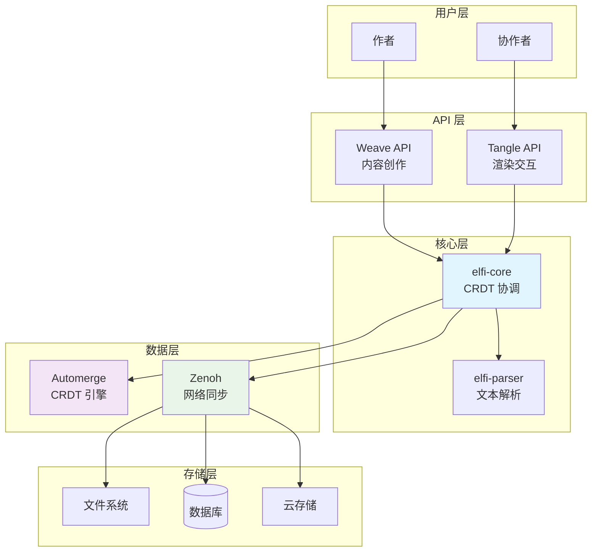

# 数据建模

## 系统职责边界说明 ⚠️

**重要：本文档描述的是 elfi-core 的数据模型设计，但请明确以下边界：**

### elfi-core 负责的范围
- **数据结构管理**：CRDT 列表和映射表的维护
- **同步机制**：跨节点的数据同步和冲突解决框架
- **持久化存储**：操作日志的存储和重放
- **网络通信**：Zenoh 协议的封装和消息传递
- **命令接口**：基础的 CRUD 操作和历史查询

### elfi-core 不负责的范围  
- **类型语义解释**：不定义 `markdown`、`code` 等类型的具体含义
- **内容格式验证**：不验证代码语法、Markdown 格式等
- **业务逻辑**：不实现特定领域的工作流程
- **渲染逻辑**：不负责内容的可视化展示
- **特定冲突策略**：不内置领域特定的冲突解决逻辑

### 插件化架构原则
文档中提到的各种类型（如 `markdown`、`relations`）和属性（如 `language`、`owner`）都是**示例约定**，实际的语义解释和处理逻辑通过以下机制实现：

- **类型处理器插件**：注册特定类型的处理逻辑
- **冲突解决器插件**：实现领域特定的冲突解决策略  
- **验证器插件**：可选的内容和结构验证
- **渲染器插件**：将 `.elf` 内容转换为其他格式

这种设计确保 elfi-core 保持通用性，避免被特定领域需求绑定。

## 2.1. 设计原则：事件溯源与CRDTs的融合

为了实现`.elf`原生协作和事件溯源的核心愿景，其数据模型必须从根本上区别于传统的文件格式。我们采纳了两项关键的设计原则：事件溯源（Event Sourcing）和无冲突复制数据类型（Conflict-Free Replicated Data Types, CRDTs）。

**事件溯源**是一种架构模式，其核心思想是系统的当前状态并非直接存储，而是通过重放一个不可变的、按时间顺序排列的事件日志来派生得出 。在`.elf`的语境下，这意味着文档的最终事实来源（Source of Truth）不是一个静态的文件快照，而是记录了从文档创建之初到当前时刻的每一次修改操作的完整日志。用户的每一个微小动作——无论是输入一个字符、创建一个代码块还是修改一个元数据标签——都直接映射为一个微小的、离散的操作事件 。这种模型为文档提供了终极的透明度、审计能力和强大的版本历史功能。

然而，在分布式协作环境中，简单地记录事件流是不够的。当多个用户在各自的设备上并发地产生事件时，如何保证这些分散的事件日志在合并后能形成一个全局一致的状态，就成了核心挑战。这正是**CRDTs**所要解决的问题。CRDTs是一类特殊的数据结构，它们允许在多个副本上进行并发、无需协调的更新，并保证这些副本在交换更新信息后，最终能收敛到完全相同的状态 [1, 2]。

CRDTs主要分为两大类：基于状态的（State-based, CvRDTs）和基于操作的（Operation-based, CmRDTs） [1, 3]。

-   **CvRDTs**通过传输和合并各自的完整状态来实现同步，设计相对简单，但当状态较大时网络开销会很高 。
-   **CmRDTs**则只传输引发状态变化的更新操作（例如，“在位置5插入字符'a'”），网络效率更高，但对通信层的可靠性有更高要求 。

`.elf`格式选择采用一种**基于操作的模型**，因为它与事件溯源的哲学完美契合：文档的当前状态仅仅是其完整操作历史的一个物化视图，而历史本身才是永恒的、不可篡改的真实记录 。

## 2.2. 技术选型：Automerge作为全历史CRDT实现

在确定了采用基于操作的CRDT和事件溯源原则后，我们选择了受**Automerge**项目启发的模型作为技术实现的基础 [1, 4]。选择Automerge而非其他CRDT实现（如Yjs）的关键决策点在于其对**完整操作历史的保留**。

Yjs为了追求极致的性能和内存效率，其设计默认包含了垃圾回收（GC）机制，会丢弃已删除内容的元数据和部分历史信息，这使得完整的历史追溯变得不可能 。这种设计优化了实时协作的性能，但牺牲了版本控制的深度。

相比之下，Automerge的核心特性是保留完整的、不可变的操作日志 。这个日志是文档的“DNA”，记录了其从诞生到当前状态的每一次演化。这种选择直接回应了Jupyter等工具在版本控制方面的核心痛点，为结构化、富媒体的文档带来了类似Git的强大版本管理能力。通过保留完整的操作日志，`.elf`为每个文档提供了全面的、可验证的演化历史，使得一系列高级功能成为可能 ：

-   **时间旅行**：可以检出（view）文档在任意历史时间点的状态。
-   **精确差异比较**：可以计算任意两个历史版本之间的精确差异（diff）。
-   **明确归因**：每一次变更都可以追溯到其作者和时间。

尽管历史上，保留完整历史的模型在性能和内存占用上存在劣势，但随着新一代实现的出现，通过在运行时也使用压缩的列式存储等技术，这一开销已得到显著降低，使得该模型在更广泛的场景中变得切实可行 。因此，`.elf`优先考虑数据的完整性、可审计性和版本控制能力，将Automerge模型作为其数据层的基石。

## 2.3. .elf文档结构：一个由块组成的CRDT

基于Automerge模型，`.elf`文档的整体结构被建模为一个行为类似JSON对象的CRDT，它本质上是一个从字符串键到CRDT值的映射表（Map CRDT） 。这种设计提供了高度的灵活性，允许在文档的顶层自由扩展，而无需预定义严格的模式。

文档的主要内容被组织在一个顶层键（例如，`"blocks"`）之下，该键对应的值是一个CRDT列表（List CRDT）。**至关重要的是，这个列表被设计为严格的扁平结构：列表中的元素只能是块（Block）对象，而块本身不能再包含其他的块列表。** 这种强制的扁平数据模型是一个核心的架构决策，旨在从根本上简化并发操作和冲突解决的复杂性，因为对扁平列表的操作（增、删、改、移）远比对嵌套树结构的操作更容易在CRDT中实现。这种结构借鉴了笔记本应用中“单元格”的概念，但为其赋予了强大的、原生的协作能力。文档的宏观结构——即块的顺序、增删和移动——都通过对这个CRDT列表的操作来完成。而如何在这种扁平结构之上表达丰富的层级关系，将在2.5节中详细阐述。

文档中的每个块本身也是一个CRDT映射表，采用简化的4字段结构。一个标准的`.elf`块包含以下核心属性：

-   `id`：一个全局唯一的、稳定的块标识符。这个ID由CRDT库在块创建时生成，确保即使在并发创建的情况下也能唯一识别每一个块。
-   `type`：一个字符串字面量，用于声明块的性质。例如，`"markdown"`表示一个散文块，`"code"`表示一个代码块，`"relations"`表示关系管理块。渲染层将根据此类型来决定如何展示和处理该块。
-   `name`：一个可选的、人类可读的块名称标识符。**在同一文档内，区块名称必须唯一，但允许跨文档重复**。这个约束确保了文档内部引用的明确性，同时保持了跨文档协作的灵活性。
-   `attributes`：一个嵌套的CRDT映射表，用于存储与块相关的任意属性。这为块提供了极大的可扩展性，可以用于存储代码语言（如`{"language": "python"}`）、所有权信息、协作策略，以及用于构建层级结构的`parent`引用等。
-   `content`：块的主要内容。对于基于文本的块（如markdown和code），其内容是一个**Text CRDT**实例。对于Relations Block，内容使用特殊的关系语法格式。

## 2.4. Relations Block：统一的关系管理机制

### 2.4.1. Relations Block的设计原理

Relations Block是一种特殊类型的区块（`type: "relations"`），专门用于管理文档中所有块间关系。它将原本散布在各个块中的关系信息集中管理，提供统一的跨文档引用和关系描述机制。

### 2.4.2. Relations Block的数据结构

一个标准的Relations Block采用简化的4字段结构：

```json
{
  "id": "<unique-block-id>",
  "name": "document-relations",
  "type": "relations",
  "attributes": {
    "owner": "alice",
    "merge_method": "manual",
    "description": "管理文档内所有块间关系"
  },
  "content": "setup-code -> introduction [child_of] {}\nintroduction -> elf://shared-lib/utils#helpers [references] {display_text: \"共享工具\"}"
}
```

### 2.4.3. 关系语法规范

Relations Block使用简洁的语法格式来描述关系：

```
source -> target [relation_type] {properties}
```

- **完整URI格式**：`elf://[user/]repo/doc[#block-name]`
- **相对引用**：`./doc#block-name`（同仓库）或 `#block-name`（同文档）
- **关系类型**：`child_of`, `parent_of`, `references`, `includes`, `derived_from`, `implements`, `depends_on`
- **属性对象**：可选的JSON格式关系属性

### 2.4.4. 所有权模型

Relations Block采用ownership模型解决关系冲突：

- **Owner角色**：通过`attributes.owner`指定关系管理者
- **Manual合并**：使用`merge_method: "manual"`避免自动合并冲突
- **冲突解决**：仅有owner可以解决关系层面的合并冲突
- **权限转移**：支持通过`elfi transfer`命令转移所有权

## 2.5. 高级冲突解决：一种块级语义策略

标准的CRDT算法通过确定性规则（例如，比较操作的actorId）来自动解决并发写入，以保证所有副本最终收敛到一致的状态 。这种机制是“无冲突”的，因为它保证了数学上的一致性。然而，这种自动解决方式是**语义盲目**的。例如，当两个用户并发地修改同一个代码块时，简单地选择一个“胜利者”并丢弃另一个用户的修改，虽然保证了数据收敛，但却丢失了用户的意图，这在实践中是不可接受的 [5, 6]。

为了解决这个问题，`.elf`引入了一种更高级的、**块级（block-wise）的语义冲突解决机制**。该机制的核心思想是，冲突的解决方案不应是全局统一的，而应根据发生冲突的**块的类型**来选择最合适的策略。

**⚠️ 重要说明**：以下描述的冲突解决策略都是**可插拔的示例实现**，不是 elfi-core 的内置逻辑。实际的策略由插件系统根据项目需求提供。

### 2.4.1. 策略分发机制

当底层CRDT引擎（如Automerge）检测到并发写入冲突时，它并不会立即丢弃“失败”的更新。相反，Automerge等实现提供了专门的API（如`getConflicts`）来访问这些被覆盖的冲突值 [1, 7]。`.elf`系统在此基础上构建了一个策略分发层。当对一个块的某个属性（如`content`）进行合并并检测到冲突时，系统会：

1.  检查该块的`type`字段。
2.  根据块类型，从一个策略注册表中查找并调用相应的冲突解决处理器。
3.  该处理器负责以一种语义上更合理的方式来处理冲突，而不是简单地依赖CRDT的默认行为。

这种设计将CRDT从一个纯粹的数据结构转变为一个可编程的、具备领域知识的协调引擎。

### 2.4.2. 块类型冲突解决策略示例

以下是针对常用约定块类型的冲突解决策略示例（由插件系统实现）：

-   **约定类型 `"markdown"`**（插件实现）：对于项目约定为Markdown的文本块，其`content`是一个Text CRDT。Text CRDT本身已经能够很好地处理并发的字符级插入和删除，保留用户的编辑意图。因此，对于这类块，默认的Text CRDT合并行为通常是足够的，可以作为基线策略。
-   **约定类型 `"code"`**（插件实现）：对于项目约定为代码的块，简单的文本合并可能破坏语法结构。插件可以实现更复杂的策略：
    1.  **尝试结构化合并**：当检测到`content`冲突时，插件可以尝试三路合并或AST级别的智能合并。
    2.  **标记冲突**：如果自动合并失败，插件可以在内容中添加冲突标记，并在`attributes`中设置冲突标志。
    3.  **UI层呈现**：上层应用可以检测到冲突标志，为用户提供专门的代码合并工具。
-   **约定类型 `"metadata"`**（插件实现）：对于项目约定的元数据块，可以实现各种策略，如LWW规则或智能属性合并。具体策略完全由项目的插件定义。
-   **约定类型 `"relations"`**（插件实现）：对于项目约定用于关系管理的块，插件可以实现ownership模型：
    1. **所有权控制**：基于`attributes.owner`的权限控制
    2. **手动合并**：基于`merge_method`属性的策略选择
    3. **完整性验证**：项目特定的关系验证逻辑
    4. **冲突记录**：在attributes中记录冲突历史
-   **约定类型 `"recipe"`**（插件实现）：对于项目约定的配方块，插件可以实现：
    1. **配置合并**：智能的YAML配置合并策略
    2. **规则冲突**：保留所有版本供用户选择
    3. **属性策略**：基于具体配置项的不同合并规则

这种块级策略使`.elf`系统变得高度可扩展。每当引入一种新的、具有复杂协作语义的块类型（例如，一个`spreadsheet`块或一个`kanban`块）时，开发者不仅需要定义其数据结构，还必须为其实现一个相应的冲突解决策略。这确保了系统的协作完整性可以随着其功能的丰富而同步增强。

## 2.6. 通过Attributes实现层级结构 (Hierarchical Structures via Attributes)

### 2.6.1. 架构概览

下图展示了 `.elf` 文档的整体架构：



### 2.6.2. 问题陈述

纯粹的扁平块列表模型虽然极大地简化了协作的实现，但在表达复杂的、具有内在层级关系的文档结构（如书籍的章节、报告的大纲、嵌套的任务列表）时，其表达能力是有限的。在扁平列表中，所有块都处于同一层级，无法直观地体现它们之间的从属关系。

### 2.6.3. 解决方案：邻接列表模型

为了在不牺牲协作简易性的前提下解决这个问题，`.elf`采用了一种在数据库设计中广泛使用的**邻接列表模型（Adjacency List Model）**。具体实现方式是，在每个块的`attributes`中引入一个可选的`parent`字段，其值是另一个块的`id`。

通过这种方式，我们在**不改变底层扁平数据模型（一个简单的CRDT列表）的前提下，在应用层逻辑中重建了树状的层级关系**。

### 2.6.4. 协作优势

这种"用attributes模拟层级"的方案对于协作场景具有巨大的优势，完美地规避了在CRDT中直接实现树形结构的复杂性：

-   **低冲突的原子操作**：在传统的嵌套模型中，移动一个父块（例如，将整个章节从文档开头移到末尾）需要对大段文本进行操作，在并发编辑时极易产生难以解决的冲突。在我们的模型中，改变一个块的层级关系（例如，将一个小节移动到另一个章节下）仅仅是**修改该块`attributes`中`parent`字段的值**。这是一个极小的、原子性的属性修改，CRDT处理起来非常轻松，冲突概率极低。
-   **职责分离**：该设计清晰地将"数据存储结构"与"逻辑呈现结构"解耦。
    -   **数据层 (`elfi-core`)**：只关心一个扁平的块列表和它们各自的属性。它的首要职责是保证数据同步的绝对可靠。
    -   **渲染层 (`Tangle`)**：负责读取块列表和它们的`parent` attributes，然后在UI上将它们渲染成用户看到的嵌套大纲视图。

这种架构决策让我们既能享受到扁平数据模型在协作上的巨大优势，又能为用户提供丰富的、层级化的视觉和交互体验。

