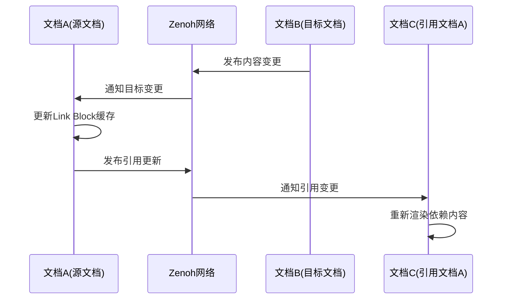

# 存储与同步

## 3.1. 设计原则：将操作历史映射为消息流

在构建了一个强大的、为协作而生的数据模型之后，下一个关键挑战是设计一个高效、可靠且灵活的机制来持久化数据和同步更新。传统协作系统通常紧密耦合于特定的网络协议（如WebSocket）和后端架构（如中心化服务器），这限制了其部署的灵活性。

`.elf`的存储与同步架构基于一个核心的抽象原则：**将文档的CRDT操作历史记录（op log）映射为一个逻辑上的、持久化的消息发送流**。根据第二章的数据模型，文档的每一次变更都会生成一个或多个离散的、不可变的操作（operation）。我们可以将每一个这样的操作都看作是一条消息。因此，一个文档的完整历史就等同于一个按因果顺序排列的、包含了所有操作的消息队列或流。

这个简单的概念映射带来了巨大的架构优势。它将**数据模型（CRDT操作）**与**通信和存储（消息传递系统）**彻底解耦。一旦我们将问题重新定义为“如何可靠地传输、存储和查询一个命名的消息流”，我们就可以利用整个行业在消息队列、发布/订阅系统和分布式日志领域积累的成熟技术和解决方案，而无需重新发明轮子。这使得`.elf`的内核可以专注于CRDT逻辑，而将复杂的网络传输、路由、持久化和查询任务委托给一个专门的通信引擎。

## 3.2. 技术选型：Zenoh作为统一的数据中心网络

基于上述设计原则，我们选择了**Eclipse Zenoh**作为`.elf`底层的通信、存储和查询网络 。Zenoh并非一个简单的消息队列，而是一个集发布/订阅、分布式查询和存储于一体的统一数据中心协议，旨在统一处理动态数据（data in motion）、静态数据（data at rest）和计算 [1, 9]。Zenoh的架构特性与`.elf`的本地优先、去中心化协作的目标高度契合。

选择Zenoh的关键理由包括：

-   **拓扑无关性与去中心化**：Zenoh原生支持多种通信拓扑，包括点对点（P2P）、网状网络（Mesh）、路由模式（Routed）和代理模式（Brokered）。这意味着`.elf`文档可以在没有中心服务器的情况下，在局域网内的设备间直接同步；也可以通过Zenoh路由器跨越广域网和NAT，实现全球范围的协作。应用代码无需关心底层的网络拓扑。
-   **位置透明性**：在Zenoh网络中，数据生产者和消费者是解耦的。应用程序只需关心数据的“名字”（即Key Expression），而无需知道数据存储在哪里或由谁发布。Zenoh网络负责智能地路由数据和查询 。
-   **统一的API**：Zenoh通过一套统一的API来处理实时数据流（发布/订阅）和历史数据查询（查询/存储）。这完美地匹配了我们的核心抽象，即一个新加入的协作者既需要获取历史操作记录（数据在静止），也需要接收后续的实时更新（数据在运动）。
-   **高性能**：公开的性能评测显示，Zenoh在吞吐量和延迟方面显著优于MQTT、Kafka和DDS等主流协议，这对于提供流畅的实时协作体验至关重要 [10, 11, 12]。

## 3.3. 实现模型：Zenoh网络上的文档生命周期

`.elf`的数据模型与Zenoh的通信模型之间存在一种天然的、优雅的映射关系，这使得集成变得非常简单和高效。

-   **文档即键空间（Key-Space）**：每一个独立的`.elf`文档在Zenoh网络中被赋予一个唯一的键空间前缀，例如`/elf/docs/<doc_uuid>`。这个前缀成为了该文档在整个分布式系统中的唯一标识。
-   **操作即发布的消息**：当用户进行编辑时，由CRDT层生成的每一个原子操作（如第二章所述），都会被序列化并通过Zenoh**发布（PUT）**到该文档键空间下的一个特定子主题（或称通道）上，例如`/elf/docs/<doc_uuid>/ops`。
-   **事件流的实现**：因此，Zenoh通道上按时间顺序排列的消息流，就构成了该文档的完整、不可变的操作日志。
-   **实时同步**：已加入协作会话的客户端通过**订阅（SUBSCRIBE）**该主题来接收实时的更新操作。
-   **历史同步**：新加入的客户端或离线后重新上线的客户端，可以通过向该主题发起**查询（GET）**来获取所有历史操作记录。

这种设计将事件溯源的数据模型无缝地转化为一个发布/订阅/查询的通信模型。Zenoh的统一抽象使得实时同步（动态数据）和历史数据获取（静态数据）可以使用同一套API和底层机制来完成。一个新客户端只需对文档的键空间同时表达`GET`和`SUBSCRIBE`两种意图，Zenoh网络就会透明地处理从持久化存储中拉取历史数据，并转发后续的实时数据流，极大地简化了客户端的逻辑。

## 3.4. 通过Zenoh存储后端实现可插拔的持久化

`.elf`架构的一个核心优势在于将应用逻辑与底层的基础设施（存储和网络）彻底解耦，而Zenoh是实现这一目标的关键。Zenoh提供了一个强大的**存储后端（Storage Backend）插件机制** 。存储后端是一个特殊的Zenoh节点，它订阅特定的键空间，并将接收到的所有消息持久化到某种存储介质中。当有针对该键空间的查询请求时，存储后端会从介质中检索数据并返回。

这种机制为`.elf`带来了极大的灵活性：

-   **灵活的持久化选项**：通过为Zenoh路由器配置不同的存储后端插件，`.elf`文档的操作日志可以被持久化到任何地方，而无需修改`.elf`内核的任何代码。支持的存储选项包括：
    -   **文件系统后端**：将操作日志以文件形式存储在本地磁盘，适用于单机或简单的本地网络环境 。
    -   **RocksDB后端**：使用高性能的嵌入式键值数据库进行存储，适用于需要更高性能的服务器或桌面应用 。
    -   **InfluxDB后端**：适用于需要对操作历史进行复杂时序分析的场景 。
    -   **自定义后端**：可以通过Zenoh的API开发与其他任何数据库（如PostgreSQL, S3）集成的后端。
-   **真正的网络无关性**：`.elf`内核的职责仅限于向Zenoh网络发布和订阅CRDT操作。至于这些操作如何在网络中传输（TCP, UDP, QUIC）、如何路由、如何跨越NAT、以及最终如何被存储，完全由底层的Zenoh基础设施（由对等节点、路由器和存储节点组成）来决定和管理 。

这种架构使得`.elf`应用可以根据部署环境的需要，灵活地从一个完全离线的单机应用，无缝扩展为一个全球分布式的实时协作平台，而应用层的代码保持不变。

## 3.5. 跨文档同步与Link Block支持

### 3.5.1. 跨文档引用的网络机制

当文档包含Link Block时，Zenoh网络需要处理更复杂的跨文档依赖关系：

#### URI解析与路由

```rust
// 跨文档引用的解析流程
async fn resolve_cross_document_reference(uri: &str) -> Result<BlockContent, RefError> {
    // 1. 解析URI格式 elf://[user/]repo/doc[#block-name]
    let parsed = parse_elf_uri(uri)?;
    
    // 2. 通过Zenoh查询目标文档
    let doc_key = format!("/elf/docs/{}/{}/{}", parsed.user, parsed.repo, parsed.doc);
    let query_result = zenoh_session.get(&doc_key).await?;
    
    // 3. 在目标文档中查找指定区块
    if let Some(block_name) = parsed.block_name {
        return find_block_by_name(&query_result.doc, &block_name);
    }
    
    Ok(query_result.doc)
}
```

#### 分布式引用缓存

- **本地缓存**：客户端维护已解析引用的本地缓存，包含目标内容和版本哈希
- **缓存失效**：通过订阅目标文档的变更通知实现缓存的智能失效
- **预取策略**：根据引用模式预先获取可能需要的跨文档内容

### 3.5.2. Recipe系统的分布式引用解析

Recipe执行时需要解析其`references`字段中的跨文档引用：

#### 引用解析流程

```yaml
# Recipe配置中的跨文档引用
name: "cross-doc-composition"
references:
  - source: "elf://my-project/components/shared-utils#helper-functions"
    target: "shared-code-section"
    cache_policy: "on_change"
  - source: "./docs/api#authentication"
    target: "auth-docs"
    cache_policy: "always_fresh"
```

Recipe引擎通过以下步骤处理跨文档引用：

1. **依赖发现**：解析Recipe配置，提取所有跨文档引用
2. **并行解析**：通过Zenoh并行查询所有依赖的文档
3. **内容合成**：将解析得到的外部内容整合到当前Recipe的执行上下文中
4. **版本追踪**：记录所有依赖的版本信息，用于缓存失效判断

### 3.5.3. 引用完整性维护

#### 引用验证机制

系统通过多层机制确保Link Block引用的完整性：

- **创建时验证**：Link Block创建时异步验证目标URI的可达性
- **变更通知**：目标文档变更时向所有引用者发送通知
- **定期检查**：后台定期验证长期缓存的引用是否仍然有效
- **损坏处理**：当引用目标不可达时，标记为损坏状态并在UI中提示

#### 引用更新传播



### 3.5.4. 网络分区与离线处理

#### 网络分区策略

当网络分区导致跨文档引用无法解析时：

- **优雅降级**：使用本地缓存的内容，并在UI中标示为"可能过期"
- **冲突标记**：网络恢复后检测到引用内容变更时，标记潜在冲突
- **手动同步**：提供手动触发跨文档同步的机制

#### 离线模式支持

- **依赖预取**：在线时预先下载常用的跨文档依赖
- **离线创建**：允许离线创建Link Block，但标记为"待验证"
- **批量同步**：网络恢复时批量验证和更新所有待处理的跨文档引用

### 3.5.5. 网络同步机制实现细节

### 连接建立与发现

多人协作时的网络连接建立过程：

1. **本地发现**：使用mDNS在局域网内自动发现其他elfi实例
2. **路由连接**：通过Zenoh路由器建立跨网络连接
3. **P2P直连**：在条件允许时建立点对点连接以降低延迟
4. **密钥交换**：使用基于身份的加密确保协作安全

### 同步策略与冲突处理

详细的同步机制包括：

- **实时同步**：通过Zenoh订阅机制实现毫秒级变更推送
- **增量同步**：只传输变更的CRDT操作，最小化网络开销
- **断网续传**：离线编辑后自动同步所有变更
- **冲突检测**：基于因果关系的操作排序避免大部分冲突
- **跨文档一致性**：Link Block的目标变更会触发引用文档的自动更新通知

