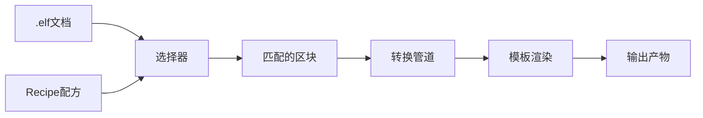
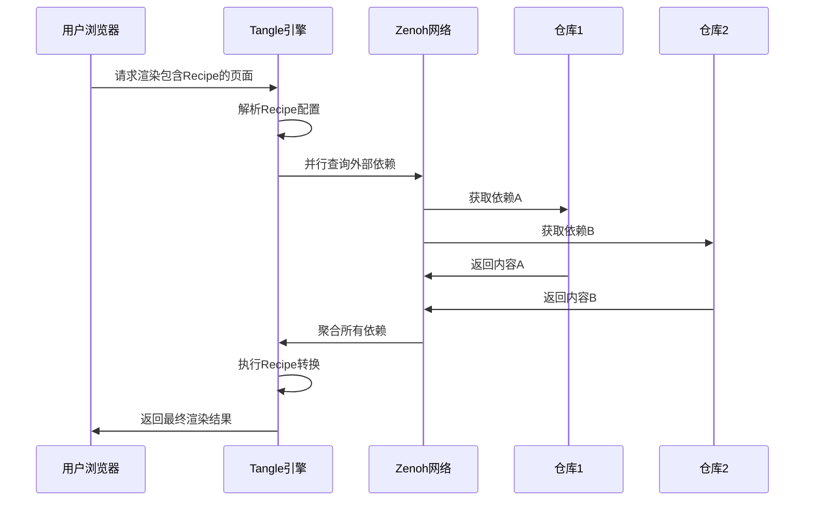

# Tangle: 执行与查看`.elf`

## 5.1. 设计原则：通过选择性水合解耦状态与视图

如果说Weave层是为文档的“创作者”服务的，那么Tangle层就是为文档的“消费者”和“交互开发者”服务的。它的核心职责是将`.elf`文档中存储的静态数据（文本、代码）“水合”（hydrate）成一个动态的、可交互的、可执行的视图。

Tangle层的核心设计原则是**严格分离数据模型与UI视图**。UI（无论是DOM还是其他渲染目标）应被视为底层CRDT文档状态的一个纯粹的、反应式的**投影（projection）**，而不是事实的来源 。渲染过程遵循清晰的单向数据流：当Weave层通知有新的文档状态时，Tangle层会接收到这个新的、不可变的文档状态，然后通过协调（Reconciliation）过程，高效地将变化应用到UI上 。

至关重要的是，Tangle层必须解决现代富媒体文档的一个核心性能挑战：如何处理高频的UI交互事件（如拖动滑块、缩放图表）而不过度污染文档的持久化历史。传统的单页应用（SPA）模型通常将整个页面视为一个大的、有状态的JavaScript应用，这会导致初始加载时间长、可交互时间（Time to Interactive）延迟等问题 [14, 15]。为了避免这种情况，Tangle层采纳了**选择性水合（Partial Hydration）**的原则，即只为页面上真正需要交互性的部分加载和执行客户端JavaScript [16, 17]。

## 5.2. 技术选型：来自Slate.js和Lexical的灵感

Tangle层的架构深受Slate.js  和Lexical  等现代富文本编辑器框架的影响。这些框架的核心思想是，编辑器UI只是底层数据模型的一个渲染目标。它们通过定义一个与DOM解耦的、可序列化的`EditorState`对象来管理内容，并通过插件化的节点系统来支持自定义和嵌入式内容的渲染。例如，Lexical的`DecoratorNode`  或Slate.js的`void`元素  允许在文本流中嵌入任意的、由React等框架渲染的交互式组件。Tangle层将借鉴这种模式，将`.elf`文档中的每种块`type`映射到一个特定的渲染组件。

## 5.3. 更通用的基础：岛屿架构抽象

为了将选择性水合的原则提升到一个更通用和强大的架构层面，Tangle层的实现将基于**岛屿架构（Islands Architecture）** [18, 19, 20]。这一模式由Astro等现代Web框架推广，其核心思想是将网页视为一片静态HTML的“海洋”，其中点缀着若干个交互式的JavaScript“岛屿” [18, 21]。

### 5.3.1. 岛屿架构在.elf中的应用

将岛屿架构应用于`.elf`文档的渲染，意味着Tangle层的渲染器会执行以下操作：

1.  **生成嵌套的静态海洋**：渲染器的核心职责之一是，在生成静态HTML“海洋”时，**必须读取所有块的`parent`元数据，并根据这些关系来构建DOM的嵌套结构**。它不再是渲染一个扁平的`<div>`列表，而是一个能够反映出章节和子章节关系的嵌套HTML结构（例如，使用嵌套的`<section>`或`<ul>`列表）。这部分构成了页面的“大陆”或“海洋”，可以被浏览器极快地解析和显示，并为UI层实现折叠/展开章节、面包屑导航等功能提供了结构基础。
2.  **定义交互岛屿**：对于需要交互性的块（例如，一个`type: "code"`且`metadata: {"interactive": true}`的块，或一个自定义的`type: "plotly-chart"`块），渲染器不会立即执行其逻辑。相反，它会在静态HTML中渲染一个占位符（例如一个带有特定`data-`属性的`<div>`），并标记这是一个需要“水合”的岛屿。
3.  **选择性水合**：客户端的JavaScript加载器会根据不同的策略来激活这些岛屿。例如，一个代码块的“运行”按钮可能在页面加载后立即水合（`client:load`），而一个位于文档末尾的数据可视化图表可能只有当用户滚动到它时才被水合（`client:visible`） [20]。每个岛屿都是一个独立的、自包含的应用（例如一个React或Vue组件），它只负责管理自己内部的逻辑和UI状态。

### 5.3.2. 岛屿架构与CRDT的协同

岛屿架构天然地解决了交互组件之间状态管理复杂性的问题。在岛屿模型中，各个岛屿默认是相互隔离的 [22, 23]。这与`.elf`的架构完美契合：

-   **本地临时状态**：每个交互式岛屿（例如一个数据可视化组件）可以自由管理其内部的、临时的UI状态（如缩放级别、高亮选项）。这些状态是客户端独有的，不会自动同步或持久化，从而避免了因高频UI事件（如鼠标移动）而产生大量的CRDT操作。
-   **全局持久状态**：`.elf`文档的CRDT本身充当了所有岛屿共享的、唯一的**全局状态总线**。当一个岛屿需要将一个**有意义的、需要被持久化和协作共享**的状态变更提交时，它不会直接与其他岛屿通信，而是通过Tangle API调用一个特定的函数（见下文的`pinBlockState`），将该状态变更写入到全局的CRDT文档中。
-   **单向数据流**：其他客户端（或其他岛屿）通过订阅CRDT文档的变化来被动地接收这个状态更新，并以只读的方式反应在自己的视图中。

这种模式在瞬时UI状态和持久化协作状态之间建立了一道清晰、健壮且高性能的边界，是Tangle层架构的核心创新。

## 5.4. Tangle API 规范

Tangle API为渲染客户端（如Web前端）提供了一个更高层次的、面向状态的抽象，隐藏了Weave层的复杂性。

| **函数签名**                                                 | **描述**                                                     |
| ------------------------------------------------------------ | ------------------------------------------------------------ |
| `getDocumentState(docUrl: String) -> Promise<RenderableStateJSON>` | 高效地获取文档当前物化状态的一个可序列化、用于渲染的只读快照。返回的格式是易于前端框架消费的结构化对象（例如，一个与Lexical的`EditorState`兼容的JSON结构 ）。 |
| `pinBlockState(docUrl: String, blockId: String, metadataPatch: Object) -> Promise<void>` | **“钉合”（Pinning）机制**。这是Tangle层的核心API，允许一个交互式岛屿将其重要的内部状态变更提交回CRDT模型。它在底层会触发一次Weave层的`change()`操作，将`metadataPatch`合并到对应`blockId`的`metadata`属性中。例如，一个滑块组件可以在用户停止拖动时调用此函数，将最终的数值“钉合”到文档历史中。 |
| `executeCodeBlock(docUrl: String, blockId: String) -> AsyncStream<ExecutionEvent>` | 请求执行一个代码块。内核负责将代码和上下文路由到相应的沙箱化执行引擎（如通过Jupyter协议连接的Python内核），并将执行结果（如`stdout`, `stderr`, `display_data`等）以事件流的形式异步返回给客户端进行渲染。 |

## 5.5. Tangle配方系统

### 5.5.1. 配方架构设计

Tangle层的配方（Recipe）系统是一个声明式的内容转换引擎，允许用户定义如何将`.elf`文档中的结构化内容转换为各种输出格式：

- **选择器引擎**：基于区块类型、标签和元数据的灵活内容选择
- **转换管道**：可组合的内容处理步骤
- **模板系统**：支持变量插值和条件渲染
- **输出配置**：定义最终产物的结构和格式

### 5.5.2. 配方执行流程



### 5.5.3. Recipe创建脚手架

系统提供Recipe创建的脚手架支持：

1. **基础模板**：通过 `elfi add block --type recipe` 创建带有基本YAML结构的Recipe区块
2. **语法验证**：编辑时提供YAML语法检查和Recipe结构验证
3. **示例参考**：文档中提供常见用例的Recipe配置示例
4. **跨项目复用**：Recipe区块可以在不同项目间复制和修改

### 5.5.4. 扩展配方语法规范

```yaml
# Recipe配方的完整语法结构（增强版）
name: string                    # 配方名称
version: string                 # 版本号
description: string            # 描述

# 跨文档引用支持
references:                    # 外部引用列表
  - source: string            # 源URI (elf://[user/]repo/doc[#block-name])
    target: string            # 本地别名
    cache_policy: string      # 缓存策略: "on_change" | "always_fresh" | "manual"
    resolve_mode: string      # 解析模式: "lazy" | "eager" | "prefetch"

selector:                      # 内容选择器
  types: [string]             # 区块类型过滤
  tags: [string]              # 标签过滤
  names: [string]             # 区块名称过滤
  metadata:                   # 元数据条件
    key: value
  references: [string]        # 引用的外部内容
  
transform:                     # 转换规则数组
  - type: string              # 转换类型
    action: string            # 转换动作
    template: string          # 模板字符串（支持引用变量 {{target_name}}）
    config:                   # 转换配置
      key: value
    depends_on: [string]      # 转换依赖的引用

# 错误处理配置
error_handling:
  on_missing_reference: string    # "placeholder" | "error" | "skip"
  on_circular_reference: string   # "error" | "warn"
  on_network_failure: string      # "cache" | "error" | "skip"
  fallback_content: string        # 备用内容模板

output:                        # 输出配置
  format: string              # 输出格式
  structure: string           # 文件结构
  filename: string            # 文件名模板
  header: string              # 文件头部
  footer: string              # 文件尾部
  
# 执行配置
execution:
  timeout_ms: number          # 执行超时时间
  max_depth: number           # 最大引用深度
  parallel_refs: number       # 并行解析引用数量
  cache_ttl_ms: number        # 缓存生存时间
```

### 5.5.5. Link Block处理流程

Recipe系统需要特殊处理Link Block类型的区块：

#### Link Block识别与解析

```rust
impl RecipeEngine {
    async fn process_link_blocks(&self, recipe: &Recipe) -> Result<ProcessedContent, RecipeError> {
        let mut link_resolver = LinkResolver::new(&self.zenoh_session);
        let mut resolved_content = HashMap::new();
        
        // 1. 识别所有需要解析的Link Block
        for reference in &recipe.references {
            match link_resolver.resolve_uri(&reference.source).await {
                Ok(content) => {
                    resolved_content.insert(reference.target.clone(), content);
                }
                Err(e) => {
                    // 2. 根据错误处理策略处理失败情况
                    self.handle_reference_error(reference, e, &recipe.error_handling)?;
                }
            }
        }
        
        // 3. 将解析的内容注入到Recipe执行上下文
        Ok(ProcessedContent {
            local_blocks: self.select_local_blocks(&recipe.selector),
            resolved_references: resolved_content,
        })
    }
    
    fn handle_reference_error(
        &self, 
        reference: &Reference, 
        error: RefError, 
        error_config: &ErrorHandling
    ) -> Result<(), RecipeError> {
        match (&error, &error_config.on_missing_reference) {
            (RefError::NotFound, "placeholder") => {
                // 使用占位符内容
                self.inject_placeholder(reference);
                Ok(())
            }
            (RefError::NotFound, "skip") => {
                // 跳过此引用，继续处理
                self.skip_reference(reference);
                Ok(())
            }
            (RefError::NotFound, "error") => {
                // 抛出错误，停止执行
                Err(RecipeError::MissingReference(reference.source.clone()))
            }
            (RefError::CircularRef, _) => {
                // 循环引用总是错误
                Err(RecipeError::CircularReference)
            }
            _ => Ok(())
        }
    }
}
```

### 5.5.6. Recipe与Islands Architecture的集成

#### 动态Recipe岛屿

Recipe系统支持创建动态的岛屿组件：

```javascript
// Recipe驱动的岛屿组件示例
class RecipeIsland extends Component {
    constructor(recipeId, dependencies) {
        super();
        this.recipeId = recipeId;
        this.dependencies = dependencies;
        this.content = null;
    }
    
    async hydrate() {
        // 1. 订阅Recipe的依赖变更
        for (const dep of this.dependencies) {
            await this.subscribeToReference(dep);
        }
        
        // 2. 执行Recipe获取初始内容
        this.content = await this.executeRecipe();
        
        // 3. 渲染内容到岛屿
        this.render();
    }
    
    async onReferenceChange(reference, newContent) {
        // 4. 依赖变更时重新执行Recipe
        this.content = await this.executeRecipe();
        this.render();
    }
    
    async pinState(newState) {
        // 5. 将岛屿状态变更反向同步到CRDT
        await tangleApi.pinBlockState(this.docUrl, this.recipeId, {
            last_execution: Date.now(),
            user_overrides: newState
        });
    }
}
```

#### Recipe岛屿的生命周期管理

- **延迟激活**：Recipe岛屿只在需要时才解析外部依赖和执行转换
- **依赖追踪**：自动追踪Recipe的跨文档依赖，并在依赖变更时重新执行
- **缓存策略**：根据`cache_policy`配置智能缓存解析结果
- **错误恢复**：网络错误时使用缓存内容，并在UI中标示状态

### 5.5.7. 网络依赖处理机制

#### 分布式Recipe执行

Recipe系统需要处理复杂的网络依赖场景：



#### 网络优化策略

1. **预取优化**：
   - 分析Recipe依赖图，预先获取可能需要的内容
   - 基于用户历史行为预测常用依赖
   - 在空闲时间预热缓存

2. **并发控制**：
   - 限制同时进行的跨文档查询数量
   - 对相同URI的重复查询进行去重
   - 实现请求队列和优先级调度

3. **降级策略**：
   - 部分依赖失败时继续执行Recipe
   - 提供多级缓存回退机制
   - 向用户展示当前可用的内容

4. **性能监控**：
   - 追踪每个外部依赖的响应时间
   - 记录缓存命中率和有效性
   - 基于性能数据调整缓存策略

#### 错误处理的用户体验

```typescript
interface RecipeExecutionResult {
    success: boolean;
    content: string;
    warnings: Warning[];
    errors: Error[];
    dependencies: DependencyStatus[];
}

interface DependencyStatus {
    uri: string;
    status: 'resolved' | 'cached' | 'failed' | 'timeout';
    last_updated: Date;
    error_message?: string;
}
```

用户界面应当清晰展示Recipe执行状态：

- **成功状态**：正常显示转换后的内容
- **部分失败**：显示可用内容，并标示不可用的部分
- **完全失败**：显示错误信息和重试选项
- **缓存状态**：标示内容可能不是最新的，提供刷新按钮

