# Extension系统设计

本文档阐述 ELFI Extension系统的整体设计，包括插件架构、安装机制、安全模型和生态系统建设。Extension系统为ELFI提供强大的可扩展能力，使用户能够通过第三方插件扩展核心功能。

## 1. 设计理念

### 1.1. Extension vs 基础功能的边界

ELFI采用分层的功能架构，明确区分基础功能和Extension系统的职责：

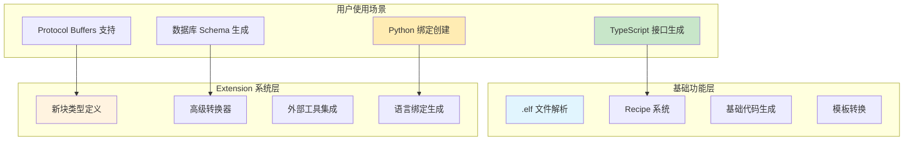

**核心设计原则**：

| 功能类型 | 基础代码生成 | Extension 系统 |
|----------|-------------|---------------|
| **实现方式** | .elf 文件 + Recipe | `elfi install` + 插件动态加载 |
| **扩展能力** | 配置驱动的模板转换 | 可编程的核心功能扩展 |
| **安装需求** | 零依赖，开箱即用 | 需要安装和管理外部 Extension |
| **适用场景** | 标准代码生成任务 | 复杂的领域特定功能 |
| **开发复杂度** | 简单的 YAML 配置 | 完整的 Rust 插件开发 |

### 1.2. 插件优先的设计理念

**开放式可扩展架构**：

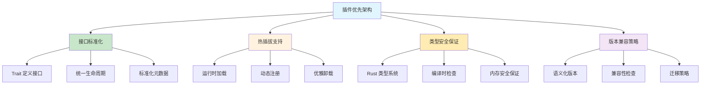

**可扩展性策略**：

| 扩展维度 | 设计策略 | 实现机制 | 应用场景 |
|----------|----------|----------|----------|
| **块类型扩展** | Trait 接口 + 注册机制 | BlockType trait | 自定义内容类型 |
| **转换器扩展** | 管道模式 + 插件链 | Transform trait | 专业格式转换 |
| **渲染器扩展** | 主题系统 + 模板 | Renderer trait | 定制输出样式 |
| **协议扩展** | 适配器模式 | NetworkAdapter trait | 新网络协议支持 |

## 2. 系统架构

### 2.1. 分层架构设计

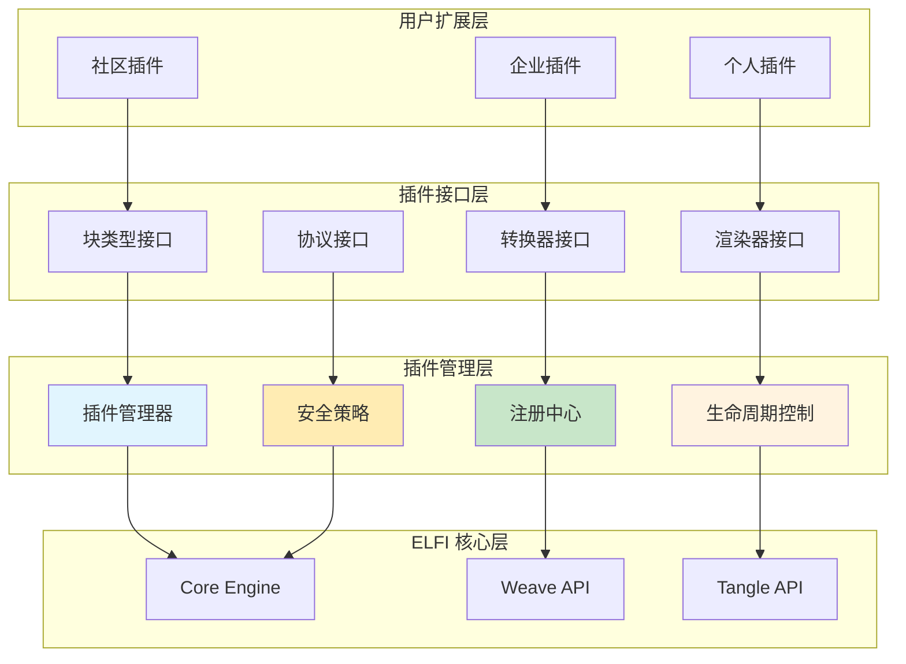

### 2.2. 插件生命周期管理

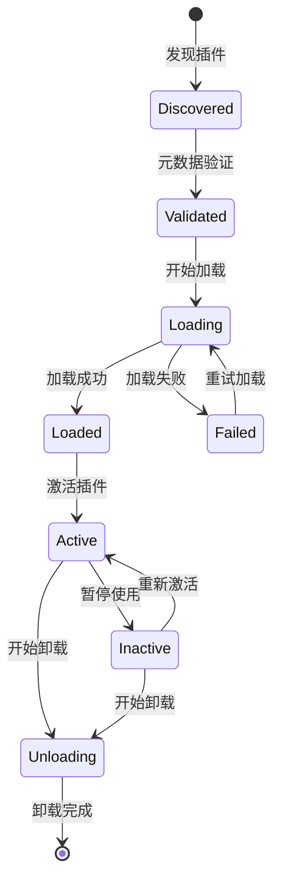

**关键管理策略**：

| 生命周期阶段 | 管理策略 | 技术实现 | 错误处理 |
|-------------|----------|----------|----------|
| **发现阶段** | 自动扫描 + 手动注册 | 文件系统监控 | 忽略无效插件 |
| **验证阶段** | 元数据检查 + 依赖分析 | JSON Schema 验证 | 详细错误报告 |
| **加载阶段** | 动态链接 + 初始化 | libloading + 安全沙箱 | 资源清理 |
| **运行阶段** | 状态监控 + 性能追踪 | 健康检查 + 降级策略 | 优雅降级 |

## 3. Extension包管理

### 3.1. 包格式规范

**Extension包结构**：

```
my-extension/
├── extension.toml          # Extension 元数据
├── src/
│   ├── lib.rs             # 主要实现代码
│   ├── block_types.rs     # 自定义块类型
│   ├── transformers.rs    # 转换器实现
│   └── renderers.rs       # 渲染器实现
├── templates/             # 模板文件
├── tests/                 # 测试文件
├── docs/                  # 文档
├── examples/              # 示例
└── Cargo.toml            # Rust 项目配置
```

**extension.toml元数据示例**：

```toml
[extension]
name = "protobuf-support"
version = "1.0.0"
description = "Protocol Buffers support for ELFI"
authors = ["community@elfi.dev"]
license = "MIT"
repository = "https://github.com/elfi-extensions/protobuf-support"

# ELFI 兼容性
[compatibility]
elfi_version = ">=1.0.0, <2.0.0"
api_version = "1.0"

# Extension 能力声明
[capabilities]
block_types = ["proto_message", "proto_service", "proto_enum"]
transformers = ["protobuf_compiler", "grpc_generator"]
renderers = ["proto_docs"]

# 安全和权限
[permissions]
file_system = ["read", "write"]
network = ["http", "grpc"]
external_commands = ["protoc"]

# 资源限制
[resource_limits]
max_memory = "100MB"
max_cpu_time = "30s"
max_file_size = "10MB"
```

### 3.2. 安装流程设计

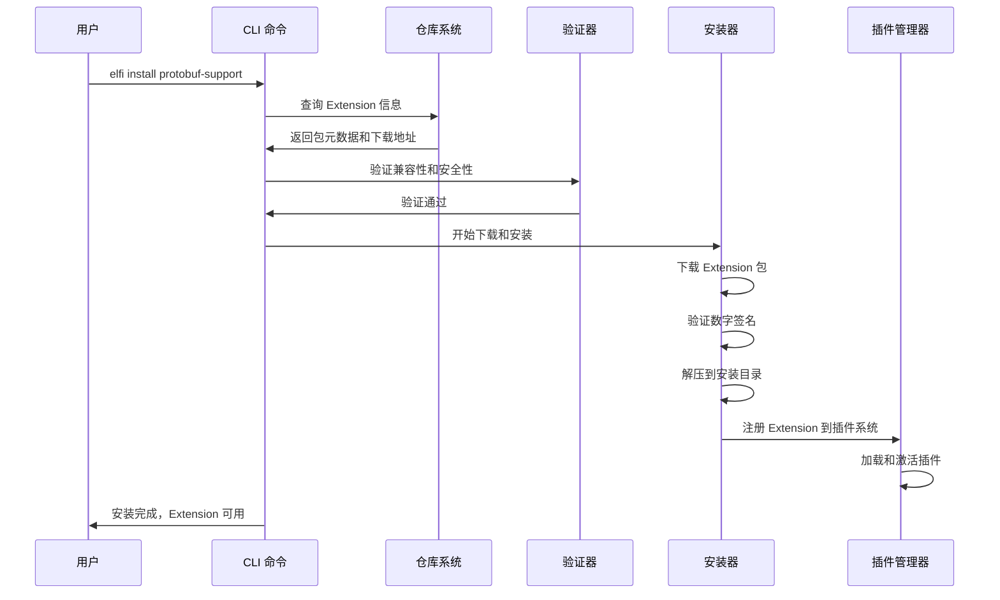

## 4. 扩展接口设计

### 4.1. 块类型扩展接口

**自定义块类型支持策略**：

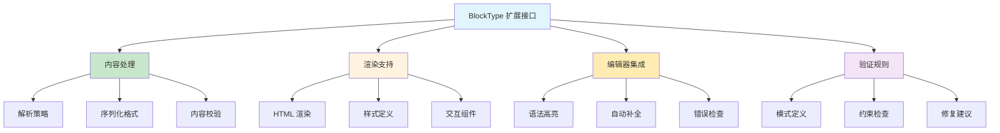

### 4.2. 转换器扩展接口

**内容转换管道策略**：

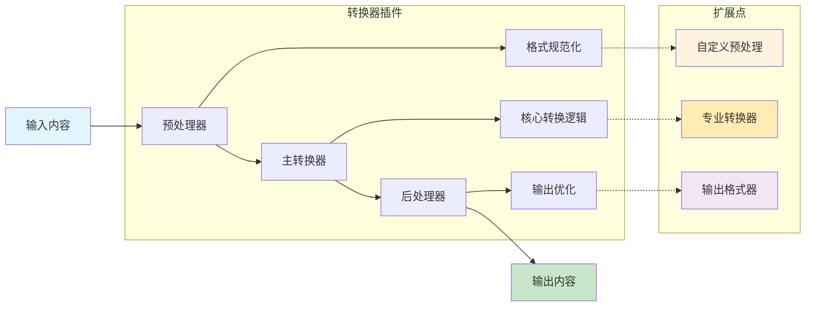

## 5. 安全模型

### 5.1. 多层安全防护

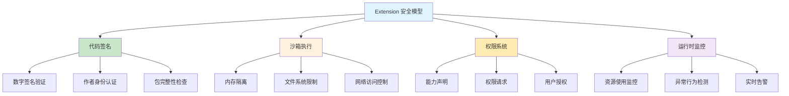

### 5.2. 权限控制策略

**安全策略实施要点**：

| 安全层面 | 防护策略 | 技术实现 | 监控机制 |
|----------|----------|----------|----------|
| **权限控制** | 声明式权限 + 动态检查 | Capability-based security | 权限使用审计 |
| **内存安全** | Rust 安全特性 + 边界检查 | 类型系统 + 运行时检查 | 内存泄漏检测 |
| **资源限制** | Cgroup + 配额管理 | 系统级资源控制 | 资源使用监控 |
| **行为分析** | 异常检测 + 模式识别 | 机器学习 + 规则引擎 | 实时告警系统 |

## 6. 生态系统设计

### 6.1. 仓库架构

**多层仓库系统**：

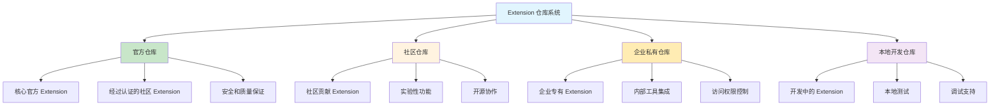

### 6.2. 发布流程

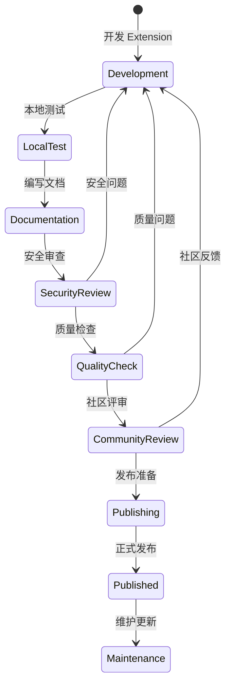

### 6.3. 版本兼容性管理

**向后兼容策略**：
- **语义化版本**：遵循 SemVer 规范进行版本管理
- **API 稳定性**：保证公开接口的向后兼容性
- **渐进式迁移**：提供平滑的版本升级路径
- **兼容性测试**：自动化的兼容性验证流程

## 7. 开发支持

### 7.1. 开发工具链

**Extension 开发生态**：

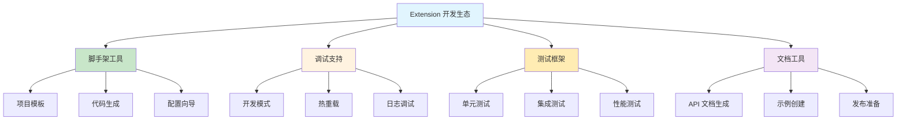

### 7.2. 社区支持

**开发者支持体系**：
- **文档中心**：详细的 API 文档和最佳实践
- **示例库**：丰富的Extension开发示例和模板
- **论坛社区**：开发者交流和技术支持
- **培训材料**：视频教程和实践指南

## 8. 实施策略

### 8.1. 分阶段实施

**基础层（Foundation Layer）**：
- Extension 包格式和元数据规范
- 基础的 `elfi install` 命令实现
- Extension 注册到插件系统的接口

**功能层（Feature Layer）**：
- 完整仓库系统和安全权限管理
- 开发工具链和社区平台集成
- Extension 市场和评价系统

**增强层（Enhancement Layer）**：
- 高级安全监控和异常检测
- 性能优化和扩展性增强
- 企业级功能和定制支持

### 8.2. 验证标准

**核心功能验证**：
- Extension 包格式规范完整
- 安装、卸载、升级流程稳定
- 权限控制和安全机制有效
- 插件接口设计灵活且稳定

**生态系统验证**：
- 仓库系统运行正常
- 开发工具链功能完整
- 社区平台用户体验良好
- Extension 质量和安全保障到位

Extension系统确保了 ELFI 具备强大的可扩展性，能够适应不断变化的用户需求和技术发展，为构建繁荣的插件生态提供坚实的基础。