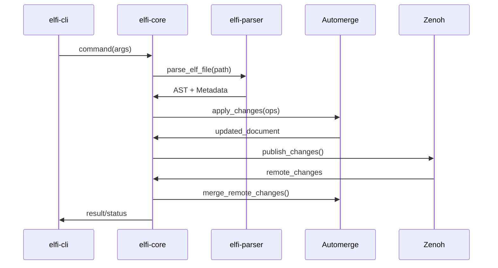

# ELFI 架构重新设计

基于用例场景（对话即文档、自举、文档即App）和设计原则，本文档重新定义了 `elfi` 系统的完整实现架构。

## 1. 架构概览

### 1.1. 系统层次结构

```
┌─────────────────────────────────────────────────────────────┐
│                    前端接口层                                │
├─────────────┬─────────────┬─────────────┬─────────────────────┤
│  elfi-cli   │   elfi-ffi  │  elfi-wasm  │    IDE Extensions   │
│ (命令行工具)  │  (多语言绑定)  │ (浏览器运行) │   (VS Code等)      │
└─────────────┴─────────────┴─────────────┴─────────────────────┘
┌─────────────────────────────────────────────────────────────┐
│                      API 层                                 │
├─────────────────────┬───────────────────────────────────────┤
│     Weave API       │           Tangle API                  │
│   (文档创作协作)      │        (渲染执行交互)                   │
└─────────────────────┴───────────────────────────────────────┘
┌─────────────────────────────────────────────────────────────┐
│                   elfi-core 核心层                          │
├─────────────┬─────────────┬─────────────┬─────────────────────┤
│   Session   │  Document   │   Recipe    │      Link          │
│  Manager    │   Manager   │   Engine    │    Resolver        │
└─────────────┴─────────────┴─────────────┴─────────────────────┘
┌─────────────────────────────────────────────────────────────┐
│                   基础设施层                                 │
├─────────────┬─────────────┬─────────────┬─────────────────────┤
│elfi-parser  │   Automerge │    Zenoh    │    Tree-sitter     │
│(.elf解析)    │   (CRDT)    │   (网络)     │     (语法解析)      │
└─────────────┴─────────────┴─────────────┴─────────────────────┘
```

### 1.2. 核心组件与职责

| 组件 | 职责 | 关键功能 |
|------|------|----------|
| **SessionManager** | 会话和连接管理 | Zenoh连接、认证、网络发现 |
| **DocumentManager** | 文档生命周期管理 | CRDT操作、同步、持久化 |
| **RecipeEngine** | 内容转换引擎 | 跨文档引用、模板渲染、导出 |
| **LinkResolver** | 跨文档引用解析 | URI解析、内容获取、缓存管理 |

## 2. 外部依赖清单

### 2.1. 核心依赖 (Cargo.toml)

```toml
[workspace]
resolver = "2"
members = [
    "crates/elfi-core",
    "crates/elfi-parser", 
    "crates/elfi-cli",
    "crates/elfi-ffi",
    "crates/elfi-wasm"
]

[workspace.dependencies]
# CRDT 和数据建模
automerge = "0.5"
serde = { version = "1.0", features = ["derive"] }
serde_json = "1.0"
serde_yaml = "0.9"

# 网络同步
zenoh = { version = "0.11", features = ["unstable"] }
tokio = { version = "1.0", features = ["full"] }

# 解析
tree-sitter = "0.20"

# CLI 和错误处理
clap = { version = "4.0", features = ["derive"] }
anyhow = "1.0"
thiserror = "1.0"

# 并发和数据结构
dashmap = "5.5"
uuid = { version = "1.0", features = ["v4", "serde"] }

# 异步运行时
async-trait = "0.1"
futures = "0.3"

# 文件监视 (用于 IDE 集成)
notify = "6.0"

# FFI 支持
safer-ffi = "0.1"

# WebAssembly 支持
wasm-bindgen = "0.2"
js-sys = "0.3"
```

### 2.2. 开发和测试依赖

```toml
[workspace.dev-dependencies]
tokio-test = "0.4"
tempfile = "3.8" 
criterion = { version = "0.5", features = ["html_reports"] }
proptest = "1.4"
```

## 3. 数据流与组件交互

### 3.1. 用户操作流程



### 3.2. Recipe 执行流程

```mermaid
sequenceDiagram
    participant User as 用户
    participant Recipe as RecipeEngine
    participant Link as LinkResolver
    participant Network as Zenoh网络
    participant Cache as 本地缓存
    
    User->>Recipe: execute_recipe(recipe_id)
    Recipe->>Link: resolve_references(refs)
    Link->>Cache: check_cache(uri)
    alt Cache Hit
        Cache->>Link: cached_content
    else Cache Miss
        Link->>Network: fetch_content(uri)
        Network->>Link: remote_content
        Link->>Cache: store(uri, content)
    end
    Link->>Recipe: resolved_content
    Recipe->>Recipe: apply_transforms()
    Recipe->>User: final_output
```

## 4. 错误处理与用户体验

### 4.1. 统一错误类型

```rust
use thiserror::Error;

#[derive(Error, Debug)]
pub enum ElfiError {
    #[error("Parse error: {message} at line {line}")]
    Parse { message: String, line: usize },
    
    #[error("Network error: {0}")]
    Network(#[from] zenoh::Error),
    
    #[error("CRDT error: {0}")]  
    DataModel(#[from] automerge::AutomergeError),
    
    #[error("Document not found: {doc_id}")]
    DocumentNotFound { doc_id: String },
    
    #[error("Block not found: {block_id} in document {doc_id}")]
    BlockNotFound { doc_id: String, block_id: String },
    
    #[error("Reference error: {uri} - {reason}")]
    ReferenceError { uri: String, reason: String },
    
    #[error("Recipe error: {recipe_id} - {message}")]
    RecipeError { recipe_id: String, message: String },
    
    #[error("Circular reference detected: {chain}")]
    CircularReference { chain: String },
    
    #[error("Permission denied: {operation} on {resource}")]
    PermissionDenied { operation: String, resource: String },
    
    #[error("IO error: {0}")]
    Io(#[from] std::io::Error),
}

impl ElfiError {
    pub fn user_message(&self) -> String {
        match self {
            ElfiError::Parse { message, line } => 
                format!("语法错误（第{}行）: {}", line, message),
            ElfiError::DocumentNotFound { doc_id } => 
                format!("文档不存在: {}", doc_id),
            ElfiError::CircularReference { chain } => 
                format!("检测到循环引用: {}", chain),
            _ => self.to_string(),
        }
    }
    
    pub fn suggestions(&self) -> Vec<&'static str> {
        match self {
            ElfiError::Parse { .. } => vec![
                "检查 YAML 元数据格式",
                "确保块分隔符 '---' 独占一行",
                "验证必需字段 'id' 和 'type'"
            ],
            ElfiError::ReferenceError { .. } => vec![
                "检查 URI 格式是否正确",
                "确认目标文档和区块存在",
                "验证网络连接"
            ],
            _ => vec![]
        }
    }
}
```

## 5. 性能优化策略

### 5.1. 缓存层次

```rust
pub struct CacheManager {
    // L1: 内存缓存 - 活跃文档
    memory_cache: Arc<DashMap<String, Arc<Document>>>,
    
    // L2: 磁盘缓存 - 解析结果
    disk_cache: Arc<Mutex<sled::Db>>,
    
    // L3: 网络缓存 - 远程内容
    network_cache: Arc<RwLock<LruCache<String, CachedContent>>>,
}

struct CachedContent {
    content: Vec<u8>,
    etag: Option<String>,
    expires: SystemTime,
}
```

### 5.2. 并发控制

```rust
pub struct DocumentHandle {
    doc_id: String,
    // 读写锁允许多个读取者或一个写入者
    document: Arc<RwLock<automerge::AutoCommit>>,
    // 订阅者使用广播通道
    change_notifier: broadcast::Sender<ChangeEvent>,
    // 网络同步状态
    sync_state: Arc<Mutex<SyncState>>,
}
```

## 6. 可观察性与监控

### 6.1. 指标收集

```rust
pub struct Metrics {
    // 文档操作计数器
    pub document_operations: Counter,
    
    // Recipe 执行时间直方图
    pub recipe_execution_duration: Histogram,
    
    // 网络延迟测量
    pub network_latency: Histogram,
    
    // 缓存命中率
    pub cache_hit_ratio: Gauge,
    
    // 活跃连接数
    pub active_connections: Gauge,
}

impl Metrics {
    pub fn record_recipe_execution(&self, duration: Duration, success: bool) {
        self.recipe_execution_duration.record(duration.as_secs_f64());
        self.document_operations.increment(1);
    }
}
```

### 6.2. 结构化日志

```rust
use tracing::{info, warn, error, debug, span, Level};

#[tracing::instrument(skip(self))]
pub async fn execute_recipe(&self, recipe_id: &str) -> Result<RecipeOutput, ElfiError> {
    let span = span!(Level::INFO, "recipe_execution", recipe_id = %recipe_id);
    let _enter = span.enter();
    
    info!("开始执行 Recipe: {}", recipe_id);
    
    // 执行逻辑...
    
    match result {
        Ok(output) => {
            info!("Recipe 执行成功，输出大小: {} bytes", output.size());
            Ok(output)
        }
        Err(e) => {
            error!("Recipe 执行失败: {}", e);
            Err(e)
        }
    }
}
```

## 7. 下一步：实现优先级

### 阶段 1: 基础核心 (MVP)
1. **elfi-parser**: .elf 格式解析和验证
2. **elfi-core**: 基础 CRDT 文档管理
3. **elfi-cli**: 基本命令 (new, validate, export)

### 阶段 2: 协作功能
1. **SessionManager**: Zenoh 网络集成
2. **实时同步**: 多客户端协作
3. **冲突解决**: 语义冲突处理

### 阶段 3: 高级功能  
1. **RecipeEngine**: 跨文档引用和转换
2. **IDE 集成**: watch 命令和双向同步
3. **多语言绑定**: FFI 和 WebAssembly

### 阶段 4: 生产就绪
1. **性能优化**: 缓存和并发
2. **监控系统**: 指标和日志
3. **部署工具**: 容器化和分发

这个重新设计的架构确保了 `elfi` 能够支持所有用例场景，同时保持代码的模块化、可测试性和可维护性。