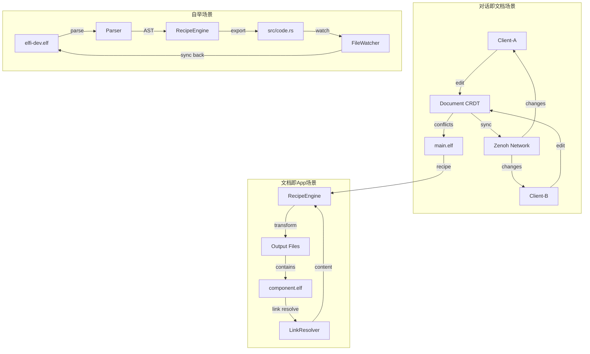
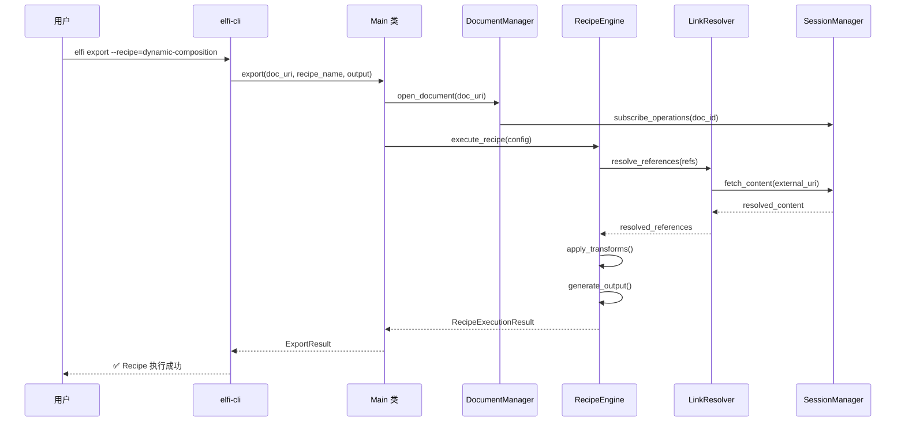

# 实现设计重新设计 - 总览

基于三个核心用例场景（对话即文档、自举、文档即App）的需求分析，重新设计了完整的 `elfi` 实现架构。本文档整合所有组件设计，提供统一的实现指南。

## 1. 架构总览

### 1.1. 重新设计的组件结构

```
elfi-workspace/
├── crates/
│   ├── elfi-core/          # 核心逻辑库
│   │   ├── src/
│   │   │   ├── lib.rs           # 公共 API 导出
│   │   │   ├── main.rs          # Main 类接口（对应 CLI 命令）
│   │   │   ├── session/         # SessionManager - 网络会话管理
│   │   │   ├── document/        # DocumentManager - 文档生命周期
│   │   │   ├── recipe/          # RecipeEngine - 内容转换引擎
│   │   │   ├── link/            # LinkResolver - 跨文档引用
│   │   │   ├── cache/           # 多级缓存系统
│   │   │   ├── conflict/        # 冲突解决机制
│   │   │   ├── types/           # 核心数据类型
│   │   │   └── error/           # 统一错误处理
│   │   └── Cargo.toml
│   │
│   ├── elfi-parser/        # .elf 格式解析
│   │   ├── src/
│   │   │   ├── lib.rs           # 解析器主接口
│   │   │   ├── grammar/         # Tree-sitter 语法定义
│   │   │   ├── ast/             # AST 数据结构
│   │   │   ├── validator/       # 语法验证器
│   │   │   └── converter/       # AST → CRDT 转换
│   │   └── Cargo.toml
│   │
│   ├── elfi-cli/           # 命令行工具
│   │   ├── src/
│   │   │   ├── main.rs          # CLI 入口点
│   │   │   ├── commands/        # 命令实现
│   │   │   ├── config/          # 配置管理
│   │   │   ├── progress/        # 进度显示
│   │   │   └── error/           # 用户友好错误处理
│   │   └── Cargo.toml
│   │
│   ├── elfi-ffi/           # 多语言绑定
│   │   ├── src/
│   │   │   ├── lib.rs           # FFI 导出
│   │   │   ├── c_api/           # C 兼容接口
│   │   │   ├── python/          # Python 绑定
│   │   │   └── node/            # Node.js 绑定
│   │   └── Cargo.toml
│   │
│   └── elfi-wasm/          # WebAssembly 支持
│       ├── src/
│       │   ├── lib.rs           # WASM 接口
│       │   └── web_api/         # 浏览器 API
│       └── Cargo.toml
│
├── Cargo.toml              # 工作空间配置
├── Cargo.lock
└── README.md
```

### 1.2. 核心组件职责矩阵

| 组件 | 对话即文档 | 自举 | 文档即App | 主要职责 |
|------|-----------|------|----------|----------|
| **SessionManager** | ✅ CRDT 实时同步 | ✅ 离线文档管理 | ✅ 跨文档网络访问 | Zenoh 网络管理、对等发现 |
| **DocumentManager** | ✅ 冲突解决 | ✅ 代码区块管理 | ✅ 文档生命周期 | CRDT 操作、文档缓存 |
| **RecipeEngine** | ⚪ 不需要 | ✅ 代码导出 | ✅ 跨文档组合 | 内容转换、模板渲染 |
| **LinkResolver** | ⚪ 不需要 | ⚪ 不需要 | ✅ 引用解析 | URI 解析、内容获取 |
| **elfi-parser** | ✅ .elf 解析 | ✅ .elf 解析 | ✅ .elf 解析 | 语法解析、验证 |
| **elfi-cli** | ✅ sync 命令 | ✅ export 命令 | ✅ 完整命令集 | 用户接口封装 |

## 2. 数据流架构

### 2.1. 三个用例场景的数据流



### 2.2. 组件交互序列



## 3. 核心接口设计

### 3.1. Main 类接口（多语言统一）

```rust
// elfi-core/src/main.rs
pub struct Main {
    session: SessionManager,
    documents: DocumentManager,
    recipes: RecipeEngine,
}

impl Main {
    // === 对应 CLI 命令的核心方法 ===
    
    /// elfi open [--new] <uri>
    pub async fn open(&self, uri: &str) -> Result<DocumentHandle, ElfiError>;
    
    /// elfi add block --type <type> --name <name>
    pub async fn add_block(&self, doc_uri: &str, block_type: BlockType, name: Option<String>) -> Result<String, ElfiError>;
    
    /// elfi export --recipe <recipe> <output>
    pub async fn export(&self, doc_uri: &str, recipe_name: &str, output_path: &str) -> Result<ExportResult, ElfiError>;
    
    /// elfi sync [doc_uri]
    pub async fn sync(&self, doc_uri: &str) -> Result<SyncResult, ElfiError>;
    
    /// elfi watch --project <path>
    pub async fn watch(&self, config: WatchConfig) -> Result<WatchHandle, ElfiError>;
    
    /// elfi transfer <block_id> --to <user>
    pub async fn transfer_ownership(&self, doc_uri: &str, block_id: &str, to_user: &str) -> Result<(), ElfiError>;
    
    /// elfi claim <block_id>
    pub async fn claim_ownership(&self, doc_uri: &str, block_id: &str) -> Result<(), ElfiError>;
    
    /// elfi close <uri>
    pub async fn close_document(&self, uri: &str) -> Result<(), ElfiError>;
    
    // === 辅助方法 ===
    
    /// 列出可用的 Recipe
    pub async fn list_recipes(&self, doc_uri: &str) -> Result<Vec<RecipeInfo>, ElfiError>;
    
    /// 获取文档信息
    pub async fn get_document_info(&self, uri: &str) -> Result<DocumentInfo, ElfiError>;
    
    /// 验证 .elf 文件
    pub async fn validate_file(&self, path: &Path) -> Result<ValidationResult, ElfiError>;
}
```

### 3.2. 错误处理统一

```rust
// elfi-core/src/error/mod.rs
#[derive(Error, Debug)]
pub enum ElfiError {
    #[error("解析错误: {message} (第 {line} 行)")]
    Parse { message: String, line: usize },
    
    #[error("网络错误: {0}")]
    Network(#[from] zenoh::Error),
    
    #[error("CRDT 错误: {0}")]
    DataModel(#[from] automerge::AutomergeError),
    
    #[error("文档未找到: {doc_id}")]
    DocumentNotFound { doc_id: String },
    
    #[error("区块未找到: {block_id} (在文档 {doc_id} 中)")]
    BlockNotFound { doc_id: String, block_id: String },
    
    #[error("引用错误: {uri} - {reason}")]
    ReferenceError { uri: String, reason: String },
    
    #[error("Recipe 错误: {recipe_id} - {message}")]
    RecipeError { recipe_id: String, message: String },
    
    #[error("检测到循环引用: {chain}")]
    CircularReference { chain: String },
    
    #[error("权限拒绝: {operation} 操作 {resource}")]
    PermissionDenied { operation: String, resource: String },
    
    #[error("IO 错误: {0}")]
    Io(#[from] std::io::Error),
}

impl ElfiError {
    /// 用户友好的错误信息
    pub fn user_message(&self) -> String {
        match self {
            ElfiError::Parse { message, line } => 
                format!("语法错误（第{}行）: {}", line, message),
            ElfiError::DocumentNotFound { doc_id } => 
                format!("找不到文档: {}", doc_id),
            ElfiError::CircularReference { chain } => 
                format!("检测到循环引用: {}", chain),
            _ => self.to_string(),
        }
    }
    
    /// 错误修复建议
    pub fn suggestions(&self) -> Vec<&'static str> {
        match self {
            ElfiError::Parse { .. } => vec![
                "检查 YAML 元数据格式是否正确",
                "确保块分隔符 '---' 独占一行",
                "验证必需字段 'id' 和 'type' 是否存在"
            ],
            ElfiError::ReferenceError { .. } => vec![
                "检查 URI 格式: elf://[user/]repo/doc[#block-name]",
                "确认目标文档和区块存在",
                "验证网络连接状态"
            ],
            ElfiError::CircularReference { .. } => vec![
                "检查 Recipe 的 references 配置",
                "避免 A 引用 B，B 又引用 A 的情况",
                "使用不同的文档结构设计"
            ],
            _ => vec![]
        }
    }
}
```

## 4. 性能和可观察性

### 4.1. 性能指标

```rust
// elfi-core/src/metrics.rs
#[derive(Debug, Clone)]
pub struct SystemMetrics {
    // 核心性能指标
    pub document_operations_total: u64,
    pub recipe_executions_total: u64,
    pub network_requests_total: u64,
    pub cache_hits_total: u64,
    pub cache_misses_total: u64,
    
    // 延迟指标 (毫秒)
    pub avg_sync_latency_ms: f64,
    pub avg_recipe_execution_ms: f64,
    pub avg_reference_resolution_ms: f64,
    
    // 资源使用
    pub memory_usage_mb: f64,
    pub active_documents: usize,
    pub active_connections: usize,
    
    // 错误统计
    pub total_errors: u64,
    pub network_errors: u64,
    pub parse_errors: u64,
    pub reference_errors: u64,
}

impl SystemMetrics {
    pub fn new() -> Self {
        Self::default()
    }
    
    pub fn record_operation(&mut self, operation: MetricOperation, duration: Duration) {
        match operation {
            MetricOperation::DocumentSync => {
                self.document_operations_total += 1;
                self.update_avg_latency(&mut self.avg_sync_latency_ms, duration);
            }
            MetricOperation::RecipeExecution => {
                self.recipe_executions_total += 1;
                self.update_avg_latency(&mut self.avg_recipe_execution_ms, duration);
            }
            MetricOperation::ReferenceResolution => {
                self.network_requests_total += 1;
                self.update_avg_latency(&mut self.avg_reference_resolution_ms, duration);
            }
        }
    }
    
    fn update_avg_latency(&self, current_avg: &mut f64, new_duration: Duration) {
        let new_ms = new_duration.as_millis() as f64;
        *current_avg = (*current_avg * 0.9) + (new_ms * 0.1); // 指数移动平均
    }
}
```

### 4.2. 结构化日志

```rust
// elfi-core/src/logging.rs
use tracing::{info, warn, error, debug, instrument};

pub fn init_logging(config: &LogConfig) -> Result<(), ElfiError> {
    use tracing_subscriber::{layer::SubscriberExt, util::SubscriberInitExt};
    
    tracing_subscriber::registry()
        .with(
            tracing_subscriber::fmt::layer()
                .with_file(true)
                .with_line_number(true)
                .with_level(true)
                .with_target(false)
        )
        .with(
            tracing_subscriber::filter::LevelFilter::from_str(&config.level)
                .unwrap_or(tracing::Level::INFO)
        )
        .init();
    
    Ok(())
}

// 使用示例
#[instrument(skip(self))]
pub async fn execute_recipe(&self, recipe_name: &str) -> Result<RecipeOutput, ElfiError> {
    info!("开始执行 Recipe: {}", recipe_name);
    
    let start_time = Instant::now();
    
    match self.internal_execute_recipe(recipe_name).await {
        Ok(output) => {
            let duration = start_time.elapsed();
            info!("Recipe 执行成功: {} ({:.2}s, {} 个区块)", 
                recipe_name, duration.as_secs_f64(), output.blocks_processed);
            Ok(output)
        }
        Err(e) => {
            error!("Recipe 执行失败: {} - {}", recipe_name, e);
            Err(e)
        }
    }
}
```

## 5. 部署和集成

### 5.1. 多语言绑定

```rust
// elfi-ffi/src/lib.rs
use safer_ffi::prelude::*;

#[derive_ReprC]
#[repr(C)]
pub struct CElfiResult {
    pub success: bool,
    pub error_message: char_p::Box,
    pub data: *mut c_void,
}

/// C API: 创建新的 elfi 实例
#[ffi_export]
pub extern "C" fn elfi_new(config_json: char_p::Ref) -> CElfiResult {
    let config_str = config_json.to_str();
    
    match serde_json::from_str::<ElfiConfig>(config_str) {
        Ok(config) => {
            match tokio::runtime::Runtime::new() {
                Ok(rt) => {
                    match rt.block_on(Main::new(config)) {
                        Ok(main) => CElfiResult {
                            success: true,
                            error_message: char_p::new(""),
                            data: Box::into_raw(Box::new(main)) as *mut c_void,
                        },
                        Err(e) => CElfiResult {
                            success: false,
                            error_message: char_p::new(&e.to_string()),
                            data: std::ptr::null_mut(),
                        }
                    }
                }
                Err(e) => CElfiResult {
                    success: false,
                    error_message: char_p::new(&e.to_string()),
                    data: std::ptr::null_mut(),
                }
            }
        }
        Err(e) => CElfiResult {
            success: false,
            error_message: char_p::new(&e.to_string()),
            data: std::ptr::null_mut(),
        }
    }
}

/// C API: 打开文档
#[ffi_export] 
pub extern "C" fn elfi_open_document(
    elfi_ptr: *mut c_void,
    uri: char_p::Ref
) -> CElfiResult {
    if elfi_ptr.is_null() {
        return CElfiResult {
            success: false,
            error_message: char_p::new("Invalid elfi instance"),
            data: std::ptr::null_mut(),
        };
    }
    
    let main = unsafe { &mut *(elfi_ptr as *mut Main) };
    let uri_str = uri.to_str();
    
    // 使用异步运行时执行
    match tokio::runtime::Runtime::new() {
        Ok(rt) => {
            match rt.block_on(main.open(uri_str)) {
                Ok(handle) => CElfiResult {
                    success: true,
                    error_message: char_p::new(""),
                    data: Box::into_raw(Box::new(handle)) as *mut c_void,
                },
                Err(e) => CElfiResult {
                    success: false,
                    error_message: char_p::new(&e.user_message()),
                    data: std::ptr::null_mut(),
                }
            }
        }
        Err(e) => CElfiResult {
            success: false,
            error_message: char_p::new(&e.to_string()),
            data: std::ptr::null_mut(),
        }
    }
}
```

### 5.2. WebAssembly 支持

```rust
// elfi-wasm/src/lib.rs
use wasm_bindgen::prelude::*;

#[wasm_bindgen]
pub struct ElfiWasm {
    main: Main,
    rt: tokio::runtime::Runtime,
}

#[wasm_bindgen]
impl ElfiWasm {
    #[wasm_bindgen(constructor)]
    pub fn new(config_json: &str) -> Result<ElfiWasm, JsError> {
        let config: ElfiConfig = serde_json::from_str(config_json)
            .map_err(|e| JsError::new(&e.to_string()))?;
            
        let rt = tokio::runtime::Runtime::new()
            .map_err(|e| JsError::new(&e.to_string()))?;
            
        let main = rt.block_on(Main::new(config))
            .map_err(|e| JsError::new(&e.user_message()))?;
        
        Ok(ElfiWasm { main, rt })
    }
    
    #[wasm_bindgen(js_name = openDocument)]
    pub fn open_document(&mut self, uri: &str) -> Result<String, JsError> {
        self.rt.block_on(self.main.open(uri))
            .map(|handle| serde_json::to_string(&handle.get_info()).unwrap_or_default())
            .map_err(|e| JsError::new(&e.user_message()))
    }
    
    #[wasm_bindgen(js_name = executeRecipe)]
    pub fn execute_recipe(&mut self, doc_uri: &str, recipe_name: &str, output_path: &str) -> Result<String, JsError> {
        self.rt.block_on(self.main.export(doc_uri, recipe_name, output_path))
            .map(|result| serde_json::to_string(&result).unwrap_or_default())
            .map_err(|e| JsError::new(&e.user_message()))
    }
}
```

## 6. 测试策略

### 6.1. 集成测试

```rust
// tests/integration_tests.rs
#[tokio::test]
async fn test_conversation_as_document_scenario() {
    // 对话即文档场景完整测试
    let config = ElfiConfig::default();
    let main_a = Main::new(config.clone()).await.unwrap();
    let main_b = Main::new(config.clone()).await.unwrap();
    
    // Client-A 创建文档
    let doc_uri = "elf://test/conversation";
    let doc_a = main_a.open(doc_uri).await.unwrap();
    
    // Client-B 打开同一文档
    let doc_b = main_b.open(doc_uri).await.unwrap();
    
    // 并发编辑测试
    let (result_a, result_b) = tokio::join!(
        doc_a.add_block(BlockType::Markdown, Some("block-a".to_string())),
        doc_b.add_block(BlockType::Markdown, Some("block-b".to_string()))
    );
    
    assert!(result_a.is_ok());
    assert!(result_b.is_ok());
    
    // 等待同步
    tokio::time::sleep(Duration::from_millis(100)).await;
    
    // 验证状态一致性
    let info_a = doc_a.get_info().await.unwrap();
    let info_b = doc_b.get_info().await.unwrap();
    
    assert_eq!(info_a.block_count, info_b.block_count);
    assert_eq!(info_a.document_hash, info_b.document_hash);
}

#[tokio::test]
async fn test_bootstrapping_scenario() {
    // 自举场景测试
    let config = ElfiConfig::default();
    let main = Main::new(config).await.unwrap();
    
    // 创建包含 Rust 代码的文档
    let doc_uri = "elf://test/elfi-dev";
    let doc = main.open(doc_uri).await.unwrap();
    
    let code_block_id = doc.add_block(BlockType::Code, Some("rust-code".to_string())).await.unwrap();
    
    // 添加 Rust 代码内容
    doc.change(|doc| {
        let blocks = doc.get_or_create_map("blocks")?;
        let block = blocks.get_map(&code_block_id).unwrap();
        let content = block.get_or_create_text("content")?;
        content.splice(0, 0, "fn main() { println!(\"Hello from elfi!\"); }")?;
        Ok(())
    }).await.unwrap();
    
    // 执行 Recipe 导出
    let result = main.export(doc_uri, "code-export", "./test_output").await.unwrap();
    
    assert!(result.blocks_processed > 0);
    assert!(!result.output_files.is_empty());
    
    // 验证导出的文件存在且内容正确
    let exported_content = tokio::fs::read_to_string("./test_output/rust-code.rs").await.unwrap();
    assert!(exported_content.contains("fn main()"));
}

#[tokio::test]  
async fn test_document_as_app_scenario() {
    // 文档即App场景测试
    let config = ElfiConfig::default();
    let main = Main::new(config).await.unwrap();
    
    // 创建组件文档
    let component_uri = "elf://test/component";
    let component_doc = main.open(component_uri).await.unwrap();
    
    let util_block_id = component_doc.add_block(BlockType::Code, Some("reusable-utilities".to_string())).await.unwrap();
    
    // 添加工具函数
    component_doc.change(|doc| {
        let blocks = doc.get_or_create_map("blocks")?;
        let block = blocks.get_map(&util_block_id).unwrap();
        let content = block.get_or_create_text("content")?;
        content.splice(0, 0, "def calculate_sum(a, b): return a + b")?;
        Ok(())
    }).await.unwrap();
    
    // 创建主文档
    let main_uri = "elf://test/main";
    let main_doc = main.open(main_uri).await.unwrap();
    
    // 添加 Link Block
    let link_block_id = main_doc.add_block(BlockType::Link, Some("placeholder-utils".to_string())).await.unwrap();
    
    // 设置引用目标
    main_doc.change(|doc| {
        let blocks = doc.get_or_create_map("blocks")?;
        let block = blocks.get_map(&link_block_id).unwrap();
        let content = block.get_or_create_text("content")?;
        content.splice(0, 0, "target: elf://test/component#reusable-utilities")?;
        Ok(())
    }).await.unwrap();
    
    // 执行跨文档组合 Recipe
    let result = main.export(main_uri, "dynamic-composition", "./test_output").await.unwrap();
    
    assert!(result.blocks_processed > 0);
    assert!(result.references_resolved > 0);
    assert!(!result.output_files.is_empty());
    
    // 验证输出包含引用的内容
    let composed_content = tokio::fs::read_to_string("./test_output/composed-document.md").await.unwrap();
    assert!(composed_content.contains("calculate_sum"));
}
```

这个重新设计的实现架构确保了：

1. **完整的用例支持**：三个核心场景都有对应的组件和数据流
2. **统一的接口设计**：Main 类提供一致的 API，CLI 是其简单封装
3. **多语言支持**：通过 FFI 和 WebAssembly 支持其他语言调用
4. **性能和可观察性**：内置指标收集和结构化日志
5. **健壮的错误处理**：用户友好的错误信息和修复建议
6. **完整的测试覆盖**：每个用例场景都有对应的集成测试

这样的架构能够满足所有用例需求，同时保持代码的可维护性和扩展性。