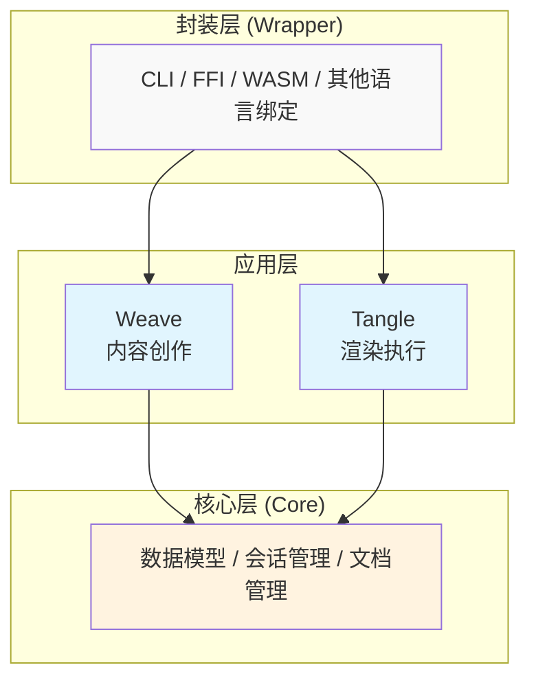
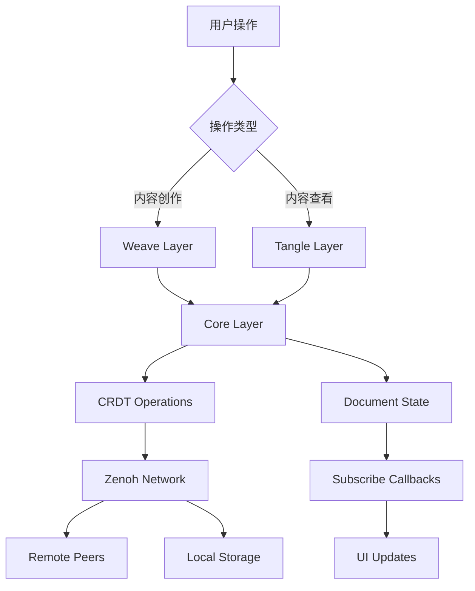

# 实现总览 - 核心原则和整体架构

本文档阐述 `elfi` (Event-sourcing Literate File Interpreter) 的实现核心原则和整体架构设计，为所有具体实现模块提供指导框架。

## 1. 核心设计原则

### 1.1. 三层架构模式

ELFI 采用清晰的三层架构，每层职责明确且相互独立：



- **核心层**：CRDT 数据模型、Zenoh 网络同步、文档生命周期管理
- **应用层**：Weave (内容创作) 和 Tangle (渲染执行) 两个专门化模块  
- **封装层**：多语言接口，CLI 作为 Main 类的直接封装

### 1.2. 事件溯源优先

所有文档操作基于不可变的操作日志，提供：

- **完整历史追溯**：每个变更都有完整的因果链记录
- **时间旅行**：可回到文档的任意历史状态
- **透明协作**：所有协作者都能看到完整的变更历史
- **冲突可见性**：并发修改的冲突信息被完整保留

### 1.3. 去中心化协作

基于 CRDT 和 Zenoh 网络的无服务器协作：

- **最终一致性**：无需中央服务器的状态同步
- **离线优先**：本地操作不依赖网络连接
- **冲突自动合并**：大部分冲突通过 CRDT 自动解决
- **语义冲突处理**：需要人工判断的冲突通过清晰的 API 暴露

### 1.4. 模块化与扩展性

- **职责分离**：每个模块有明确的边界和职责
- **接口统一**：通过 Main 类提供统一的多语言接口
- **插件架构**：通过 `.elf` 文件本身提供扩展能力

## 2. 技术栈概览

### 2.1. 核心依赖

```toml
# core/Cargo.toml 主要依赖
[dependencies]
# CRDT 实现
automerge = "0.5"

# 网络层
zenoh = "0.10"

# 异步运行时  
tokio = { version = "1.0", features = ["full"] }

# 序列化
serde = { version = "1.0", features = ["derive"] }
serde_json = "1.0"
serde_yaml = "0.9"

# 解析器
tree-sitter = "0.20"

# 错误处理
thiserror = "1.0"
anyhow = "1.0"

# 模板引擎
handlebars = "4.0"

# 并发数据结构
dashmap = "5.0"

# 日志和追踪
tracing = "0.1"
tracing-subscriber = { version = "0.3", features = ["env-filter"] }

# HTTP 客户端 (跨文档引用)
reqwest = { version = "0.11", features = ["json"] }

# 文件监听
notify = "6.0"

# UUID 生成
uuid = { version = "1.0", features = ["v4", "serde"] }

# 时间处理
chrono = { version = "0.4", features = ["serde"] }
```

### 2.2. 工作空间结构

```
elfi-workspace/
├── core/                   # 核心库
│   ├── src/
│   │   ├── lib.rs             # 公共 API 导出
│   │   ├── main.rs            # Main 类统一接口
│   │   ├── parser/            # .elf 解析器
│   │   ├── types/             # 核心数据类型
│   │   ├── crdt/              # CRDT 操作封装
│   │   ├── storage/           # 存储同步
│   │   ├── session/           # Zenoh 会话管理
│   │   ├── document/          # 文档生命周期
│   │   ├── weave/             # 内容创作层
│   │   ├── tangle/            # 渲染执行层
│   │   ├── recipe/            # Recipe 引擎
│   │   ├── link/              # 跨文档引用
│   │   ├── cache/             # 缓存管理
│   │   ├── conflict/          # 冲突解决
│   │   └── error/             # 错误类型
│   └── Cargo.toml
│
├── cli/                    # 命令行工具
│   ├── src/
│   │   ├── main.rs            # CLI 入口
│   │   ├── commands/          # 子命令实现
│   │   ├── config/            # 配置管理
│   │   └── progress/          # 用户体验
│   └── Cargo.toml
│
├── extensions/             # 扩展系统
│   ├── src/
│   │   ├── lib.rs             # 扩展 API
│   │   ├── bindings/          # 多语言绑定
│   │   │   ├── ffi.rs         # C FFI
│   │   │   ├── wasm.rs        # WebAssembly
│   │   │   ├── python/        # Python 绑定
│   │   │   └── node/          # Node.js 绑定
│   │   └── plugins/           # 内置插件
│   └── Cargo.toml
│
├── Cargo.toml              # 工作空间配置
└── Cargo.lock
```

## 3. 数据流架构

### 3.1. 操作流程



### 3.2. 核心接口设计

所有功能通过统一的 Main 类接口暴露：

```rust
// core/src/main.rs
pub struct Main {
    session: Arc<SessionManager>,
    documents: Arc<DocumentManager>,
    recipes: Arc<RecipeEngine>,
    cache: Arc<CacheManager>,
}

impl Main {
    // === 文档管理 ===
    pub async fn open(&self, uri: &str) -> Result<DocumentHandle>;
    pub async fn create(&self, config: CreateConfig) -> Result<DocumentHandle>;
    pub async fn close(&self, uri: &str) -> Result<()>;
    
    // === 内容操作 ===
    pub async fn add_block(&self, doc_uri: &str, block_type: BlockType, name: Option<String>) -> Result<String>;
    pub async fn delete_block(&self, doc_uri: &str, block_id: &str) -> Result<()>;
    
    // === 协作功能 ===
    pub async fn sync(&self, doc_uri: &str) -> Result<SyncResult>;
    pub async fn transfer_ownership(&self, doc_uri: &str, block_id: &str, to_user: &str) -> Result<()>;
    pub async fn claim_ownership(&self, doc_uri: &str, block_id: &str) -> Result<()>;
    
    // === 内容转换 ===
    pub async fn export(&self, doc_uri: &str, recipe_name: &str, output_path: &str) -> Result<ExportResult>;
    pub async fn list_recipes(&self, doc_uri: &str) -> Result<Vec<RecipeInfo>>;
    
    // === IDE 集成 ===
    pub async fn watch(&self, config: WatchConfig) -> Result<WatchHandle>;
    
    // === 历史与冲突 ===
    pub async fn get_history(&self, doc_uri: &str) -> Result<HistoryGraph>;
    pub async fn resolve_conflict(&self, doc_uri: &str, block_id: &str, resolution: ConflictResolution) -> Result<()>;
}
```

## 4. 关键特性实现策略

### 4.1. 三个核心用例场景支持

**对话即文档**：
- CRDT 自动合并处理并发编辑
- 冲突检测和用户辅助解决
- 实时状态同步

**自举开发**：
- Recipe 系统处理代码导出
- 文件监听实现双向同步
- IDE 集成工作流

**文档即App**：
- 跨文档引用和动态组合
- Islands 架构支持交互式组件
- 分布式内容获取和缓存

### 4.2. 性能和可靠性

**缓存策略**：
- 多级缓存：内存 → 本地存储 → 网络
- 智能失效：基于依赖关系的缓存更新
- 预取优化：预测性内容加载

**错误处理**：
- 分层错误类型，用户友好的错误信息
- 优雅降级：部分功能失败时的备用方案
- 自动恢复：网络中断后的状态同步

**可观察性**：
- 结构化日志记录所有关键操作
- 性能指标收集和分析
- 分布式追踪支持

## 5. 开发和测试策略

### 5.1. 模块测试框架

每个模块都应包含以下测试维度：

```rust
#[cfg(test)]
mod tests {
    // 单元测试：内部逻辑正确性
    #[test] 
    fn test_internal_logic() { /* ... */ }
    
    // 集成测试：模块间协作
    #[tokio::test]
    async fn test_integration() { /* ... */ }
    
    // 性能测试：关键路径性能
    #[bench]
    fn bench_critical_path() { /* ... */ }
    
    // 属性测试：边界条件覆盖
    #[proptest]
    fn test_properties() { /* ... */ }
}
```

### 5.2. 端到端验证

基于三个核心用例场景的完整验证：

- **场景测试**：每个用例的端到端工作流测试
- **压力测试**：高并发协作场景下的系统稳定性
- **兼容性测试**：跨平台和多语言绑定的兼容性

## 6. 部署和分发

### 6.1. 二进制分发

- **单一可执行文件**：所有依赖静态链接
- **跨平台构建**：支持 Windows、macOS、Linux
- **包管理器集成**：Homebrew、Chocolatey、APT 等

### 6.2. 库集成

- **Rust crates**：发布到 crates.io
- **多语言绑定**：Python PyPI、Node.js npm 等
- **WebAssembly**：支持浏览器和 Deno 运行时

## 验证清单

### 架构设计
- [ ] 三层架构职责边界清晰
- [ ] 模块间依赖关系合理
- [ ] 接口设计支持多语言绑定
- [ ] 扩展点设计满足插件需求

### 技术选型
- [ ] 核心依赖版本兼容性验证
- [ ] 性能关键路径的技术验证
- [ ] 跨平台兼容性确认
- [ ] 内存和网络资源使用合理

### 用例覆盖
- [ ] 三个核心用例场景完整支持
- [ ] 关键功能的端到端测试通过
- [ ] 错误处理和边界条件覆盖完整
- [ ] 性能指标达到预期要求

这个总览文档为整个 ELFI 实现提供了清晰的架构指导和技术框架，后续的各个模块文档将在此基础上展开具体设计。