# 数据模型实现策略

本文档阐述 ELFI 数据模型的实现策略和技术决策，说明为什么选择特定的架构方案以及如何解决关键技术挑战。

## 1. CRDT 数据模型设计

### 1.1. 设计理念：事件溯源与协作优先

ELFI 的数据模型基于两个核心原则：

**事件溯源 (Event Sourcing)**：
- 文档状态通过不可变操作日志重建，而非静态快照
- 每个编辑操作都是一个原子事件，具有完整的因果链
- 支持时间旅行、精确差异比较和明确变更归因

**无冲突复制数据类型 (CRDT)**：
- 支持并发、无协调的分布式编辑
- 自动合并大部分冲突，保证最终一致性
- 保留完整操作历史，支持语义冲突解决

### 1.2. 技术选型：为什么选择 Automerge

我们选择 Automerge 而非其他 CRDT 实现（如 Yjs）的核心考量：

**Automerge vs Yjs 权衡分析**：

| 方面 | Automerge | Yjs | ELFI 的选择理由 |
|------|-----------|-----|----------------|
| 历史保留 | 完整保留 | 为性能会丢弃 | 文学编程需要完整历史 |
| 内存占用 | 较高 | 较低 | 可接受，换取功能完整性 |
| 性能 | 中等 | 很高 | 协作文档对性能要求适中 |
| 版本控制 | 原生支持 | 需额外实现 | Git-like 功能是核心需求 |
| 审计追踪 | 完整 | 有限 | 学术和企业使用必需 |

**实现架构**：
```rust
// 核心类型定义（详细实现见 API 文档）
struct ElfiDocument {
    inner: AutoCommit,              // Automerge CRDT 实例
    metadata: DocumentMetadata,     // 文档级元数据
}

struct DocumentMetadata {
    id: String,                     // 文档唯一标识
    title: Option<String>,          // 可选标题
    // 时间戳、作者等元数据
}
```

**全历史保留的优势**：
- 完整的操作日志支持审计和版本控制
- 可实现类似 Git 的分支和合并机制
- 支持冲突的透明化处理，不丢失任何编辑信息

## 2. 块级数据结构设计

### 2.1. 扁平化 vs 层级化的架构决策

**核心问题**：如何在 CRDT 环境下实现既支持协作编辑又支持复杂层级结构的数据模型？

**方案对比**：

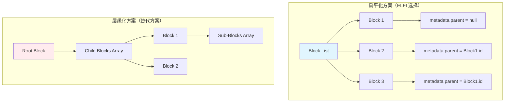

**实现策略分析**：

| 方面 | 扁平化方案 | 层级化方案 | 选择理由 |
|------|------------|------------|--------|
| CRDT 复杂度 | 低，只需处理列表 | 高，需处理嵌套结构 | 简化同步逻辑 |
| 移动操作 | 修改一个字段 | 重新组织整个子树 | 降低冲突概率 |
| 并发编辑 | 安全，互不干扰 | 危险，可能破坏结构 | 支持高并发 |
| 渲染复杂度 | 需重建树结构 | 直接遵循结构 | 可接受的性能成本 |

**核心数据结构**：
```rust
// 块的核心结构（详细定义见 API 文档）
struct Block {
    id: Uuid,                    // 全局唯一标识
    name: Option<String>,        // 人类可读名称
    block_type: BlockType,       // 块类型
    content: BlockContent,       // 主要内容
    metadata: BlockMetadata,     // 扩展元数据
}

// 关键的块类型
enum BlockType {
    Markdown,                    // 标准文本
    Code,                        // 程序代码
    Link,                        // 跨文档引用
    Recipe,                      // 内容转换
    Custom(String),              // 插件扩展
}

// 关键元数据
struct BlockMetadata {
    parent: Option<Uuid>,        // 父块引用（实现层级）
    owner: Option<String>,       // 所有者（协作权限）
    merge_method: MergeMethod,   // 冲突合并策略
    // 其他属性…
}
```

### 2.2. 邻接列表模型的实现策略

**实现核心思路**：在扁平数据结构上构建逻辑层级关系

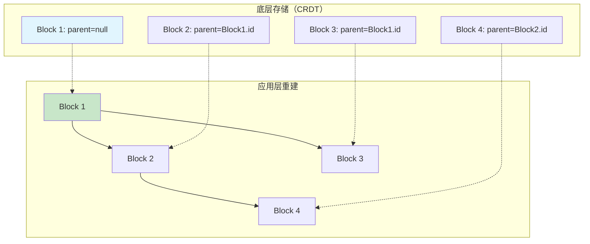

**关键实现策略**：
- **分离关注点**：数据同步与结构渲染完全分离
- **冲突最小化**：移动操作只修改一个字段，不影响其他块
- **性能优化**：渲染时才重建树，平时保持扁平结构

**核心接口设计**（具体实现见 API 文档）：
```rust
// 层级操作接口
interface HierarchyOps {
    fn get_children(parent_id: Uuid) -> Vec<Block>;
    fn get_parent(block_id: Uuid) -> Option<Block>;
    fn build_hierarchy() -> HierarchyTree;
    fn move_block(block_id: Uuid, new_parent: Option<Uuid>);
}
```

**协作优势**：
- 移动块只需修改 `parent` 字段，操作原子且冲突概率低
- 扁平存储简化 CRDT 合并逻辑
- 层级关系在应用层重建，不影响底层数据同步

## 3. 跨文档引用的实现策略

### 3.1. Link Block 设计决策

**核心问题**：如何在分布式环境下实现可靠的跨文档引用？

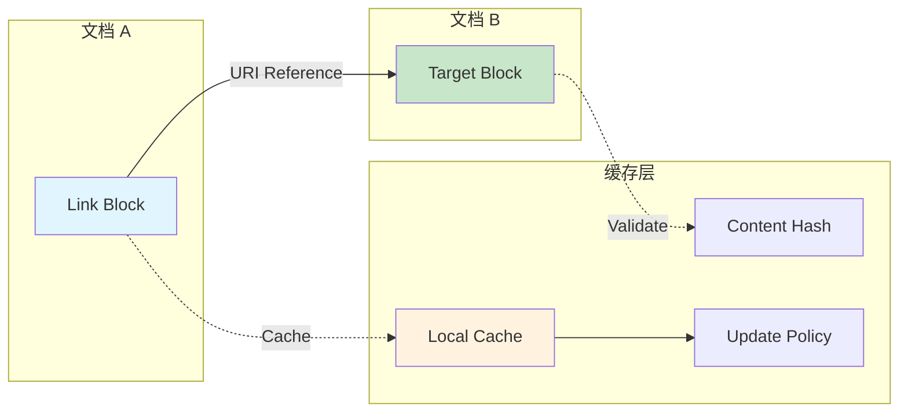

**引用类型策略**：

| 引用类型 | 实现策略 | 使用场景 | 技术挑战 |
|------------|----------|----------|----------|
| **Include** | 内容内嵌，自动同步 | 代码复用、模板引用 | 缓存一致性 |
| **Reference** | 仅保存链接，懒加载 | 文档引用、目录组织 | 引用完整性 |
| **Embed** | 可编辑嵌入，双向同步 | 协作编辑、实时更新 | 冲突解决 |

**核心数据结构**（详细定义见 API 文档）：
```rust
struct LinkContent {
    target: String,              // elf://[user/]repo/doc[#block]
    ref_type: ReferenceType,     // Include/Reference/Embed
    display_text: Option<String>, // 显示文本
    cache_policy: CachePolicy,   // 缓存策略
}

enum ReferenceType { Include, Reference, Embed }
enum CachePolicy { OnChange, AlwaysFresh, Manual }
```

### 3.2. URI 解析策略

**设计目标**：支持灵活的引用方式，兼容各种使用场景

**URI 格式规范**：
```
elf://[user/]repo/document[#block-name]
```

**支持的引用方式**：

| 引用类型 | 格式示例 | 使用场景 | 实现策略 |
|------------|-----------|----------|----------|
| **绝对引用** | `elf://alice/repo/doc#block` | 跨用户引用 | 直接解析 |
| **用户相对** | `elf://repo/doc#block` | 同用户内 | 继承当前用户 |
| **仓库相对** | `./doc#block` | 同仓库内 | 继承当前仓库 |
| **文档相对** | `#block` | 同文档内 | 继承当前文档 |

**解析实现策略**：

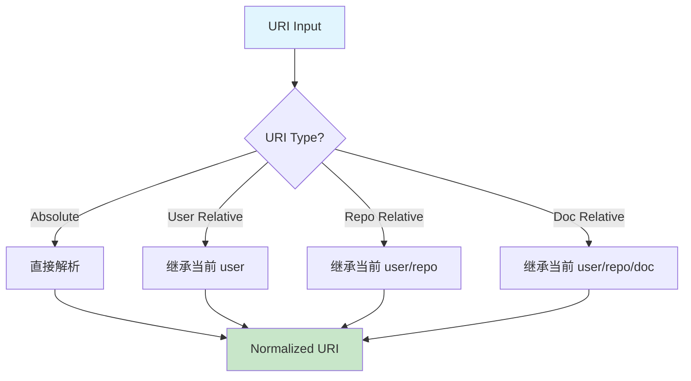

**核心数据结构**（详细定义见 API 文档）：
```rust
struct ElfUri {
    user: Option<String>,        // 用户/组织
    repo: String,                // 仓库名
    document: String,            // 文档名
    block_name: Option<String>,  // 块名称
}

interface UriResolver {
    fn parse(uri: &str) -> Result<ElfUri>;
    fn normalize(uri: &ElfUri, base: &ElfUri) -> String;
    fn validate(uri: &ElfUri) -> Result<()>;
}
```

## 4. Recipe 系统数据模型策略

### 4.1. Recipe 配置设计决策

**设计目标**：支持复杂的跨文档内容组合与转换

**Recipe 执行流程**：

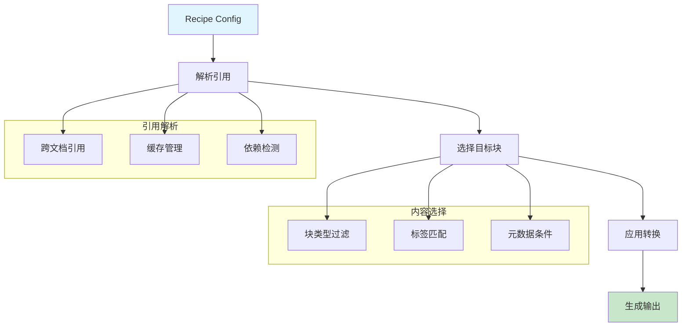

**核心组件设计**：

| 组件 | 职责 | 实现策略 | 技术挑战 |
|------|------|----------|----------|
| **ReferenceResolver** | 跨文档引用解析 | 并行获取 + 缓存 | 循环依赖检测 |
| **BlockSelector** | 内容选择与过滤 | 多维匹配条件 | 复杂查询优化 |
| **TransformPipeline** | 内容转换与处理 | 链式转换器 | 错误传播与恢复 |
| **OutputGenerator** | 结果生成与格式化 | 模板引擎 | 多格式输出 |

**核心数据结构**（详细定义见 API 文档）：
```rust
struct RecipeConfig {
    name: String,                        // Recipe 名称
    references: Vec<CrossDocumentReference>, // 跨文档引用
    selector: BlockSelector,             // 内容选择器
    transform: Vec<TransformRule>,       // 转换规则
    output: OutputConfig,                // 输出配置
}

struct CrossDocumentReference {
    source: String,                      // 源 URI
    target: String,                      // 本地别名
    resolve_mode: ResolveMode,           // 解析策略
}

enum ResolveMode { Lazy, Eager, Prefetch }
```

#[derive(Debug, Clone, Serialize, Deserialize)]
pub struct BlockSelector {
    /// 块类型过滤
    #[serde(default)]
    pub types: Vec<String>,
    /// 标签过滤
    #[serde(default)]
    pub tags: Vec<String>,
    /// 块名称过滤 (支持通配符)
    #[serde(default)]
    pub names: Vec<String>,
    /// 引用过滤
    #[serde(default)]
    pub references: Vec<String>,
    /// 元数据条件
    #[serde(default)]
    pub metadata: HashMap<String, JsonValue>,
}
```

## 5. 冲突解决机制实现策略

### 5.1. 语义冲突解决的分层策略

**核心设计问题**：CRDT自动合并无法理解内容语义，需要针对不同块类型设计专门的冲突解决策略。

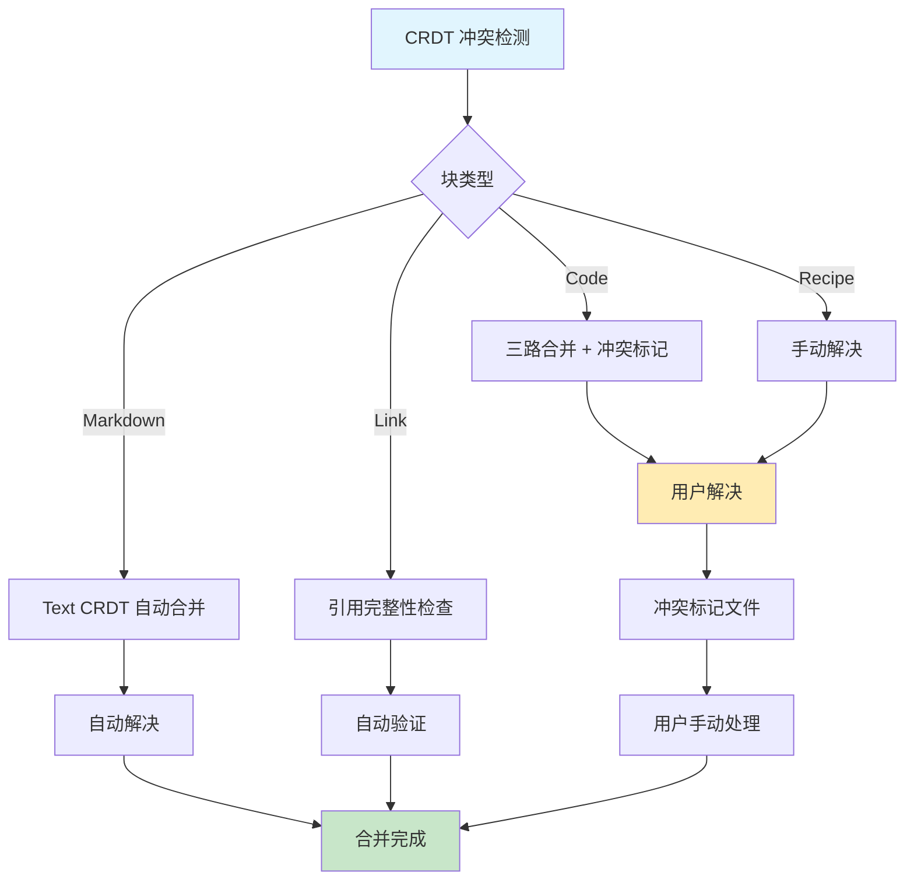

**分层冲突策略**：

| 块类型 | 冲突策略 | 实现原理 | 用户体验 |
|--------|----------|----------|----------|
| **Markdown** | Text CRDT 自动合并 | 字符级操作，保留编辑意图 | 透明，无感知 |
| **Code** | 结构化合并 + 冲突标记 | AST分析，Git-style标记 | 明确的冲突提示 |
| **Link** | 引用完整性优先 | 验证目标有效性 | 防止断链 |
| **Recipe** | 强制手动解决 | 配置复杂度高 | 明确的用户决策 |

**核心接口设计**（详细实现见 API 文档）：
```rust
trait ConflictStrategy {
    fn resolve_conflict(block: &Block, conflicts: &Conflicts) -> ConflictResolution;
}

enum ConflictResolution {
    AutoResolve(value),              // 自动解决
    RequireManualResolution(marker), // 需要用户干预
    MergeAll(values),               // 合并所有版本
    LastWriterWins,                 // 最后写入者获胜
}
```

## 6. 存储与同步机制实现策略

### 6.1. Zenoh 网络集成策略

**核心实现思路**：将 CRDT 操作日志映射为 Zenoh 消息流

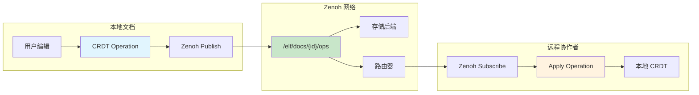

**实现策略要点**：

1. **键空间设计**：`/elf/docs/{doc_uuid}/ops` - 每个文档独立的操作流
2. **消息格式**：序列化的 CRDT 操作 + 时间戳 + 作者信息
3. **订阅模式**：实时订阅新操作 + 查询历史操作
4. **存储解耦**：通过 Zenoh 存储插件支持多种后端（文件系统、数据库、云存储）

### 6.2. 多级缓存架构

**缓存分级策略**：

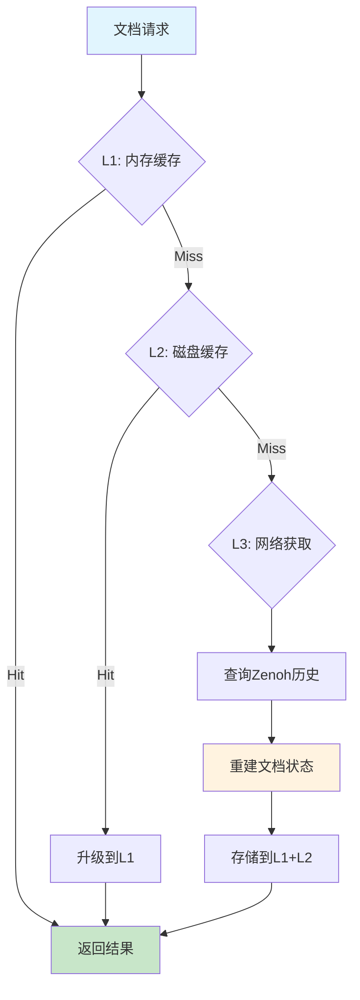

**缓存实现策略**：

| 层级 | 技术选择 | 容量限制 | 失效策略 | 用途 |
|------|----------|----------|----------|------|
| **L1 内存** | DashMap | ~100MB | LRU | 热点文档 |
| **L2 磁盘** | 本地文件/SQLite | ~1GB | TTL | 最近访问 |
| **L3 网络** | Zenoh 查询 | 无限 | 实时 | 完整历史 |

### 6.3. 跨文档引用解析

**引用解析流程**：

1. **URI 解析**：标准化引用格式
2. **缓存检查**：验证本地缓存的有效性
3. **并行获取**：多个引用并行解析
4. **完整性验证**：确保引用目标存在且可访问
5. **循环检测**：防止引用循环导致的无限递归

## 7. 数据验证机制策略

### 7.1. 分层验证架构

**验证策略分工**：

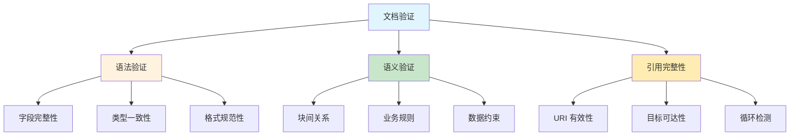

**验证时机策略**：

- **实时验证**：用户输入时的基础检查
- **保存验证**：文档保存时的完整检查
- **后台验证**：定期的引用完整性检查
- **协作验证**：接收远程操作时的安全检查

### 7.2. 错误处理与用户体验

**用户友好的错误报告**：
- 错误分级：Error（阻塞性）vs Warning（提示性）
- 位置定位：精确到块和字段的错误位置
- 修复建议：提供具体的修复方案
- 批量处理：一次性显示所有问题

## 8. 实施验证策略

### 8.1. 分阶段验证方法

**阶段一：基础功能验证**

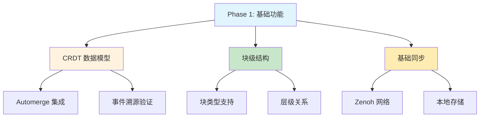

**阶段二：协作功能验证**

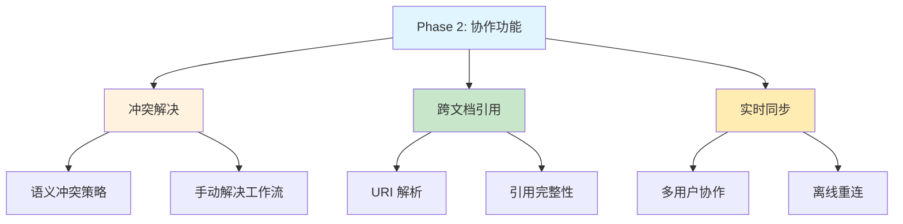

### 8.2. 关键性能指标

**系统性能基准**：

| 指标类型 | 目标值 | 测试场景 | 验证方法 |
|----------|--------|----------|----------|
| **文档加载** | < 200ms | 100个块的文档 | 端到端时间测量 |
| **同步延迟** | < 100ms | 实时协作编辑 | 网络往返时间 |
| **内存使用** | < 10MB | 1000个块文档 | 内存分析工具 |
| **并发编辑** | 10+ 用户 | 高频编辑场景 | 压力测试 |

### 8.3. 验证清单

**核心数据模型验证**：
- [ ] **Automerge 集成**：事件溯源完整性和历史重建准确性
- [ ] **块级结构**：所有标准块类型（Markdown/Code/Link/Recipe）功能完整  
- [ ] **层级关系**：邻接列表模型的父子关系操作和渲染正确
- [ ] **并发安全**：多用户并发操作的因果关系和操作顺序维护

**冲突解决机制验证**：
- [ ] **分层策略**：不同块类型的冲突解决策略按预期工作
- [ ] **检测覆盖**：能识别所有类型的并发冲突（内容、结构、引用）
- [ ] **解决工作流**：手动冲突解决的用户界面和数据流完整
- [ ] **信息保留**：冲突解决过程不丢失任何编辑信息或历史

**网络同步验证**：
- [ ] **Zenoh 集成**：实时操作发布/订阅和历史查询功能正常
- [ ] **缓存系统**：L1/L2/L3 多级缓存的命中率和失效策略有效
- [ ] **引用解析**：跨文档 URI 解析的准确性和性能满足要求
- [ ] **离线支持**：断网编辑和重连同步的数据完整性保证

**数据完整性验证**：
- [ ] **语法验证**：所有必需字段和格式约束的检查覆盖完整
- [ ] **引用完整性**：损坏链接和循环引用的检测算法准确无误
- [ ] **验证体验**：错误信息的用户友好性和修复建议的实用性
- [ ] **性能优化**：验证过程的性能开销在可接受范围内

**扩展性和可靠性验证**：
- [ ] **大规模文档**：1000+ 块文档的操作响应时间和内存使用合理
- [ ] **网络性能**：分布式协作的延迟在目标范围内（< 100ms）
- [ ] **资源使用**：内存和存储使用随文档规模线性增长
- [ ] **扩展支持**：自定义块类型和验证策略的集成机制完整

### 8.4. 实施层次和依赖关系

**基础层（Foundation Layer）**：
- CRDT 数据模型和事件溯源机制：作为整个系统的数据基础
- 基本的块操作和层级结构管理：提供文档内容的基本组织方式
- Zenoh 网络的核心同步功能：建立分布式数据同步的底层能力
- *说明：这一层构成数据模型的核心基石，所有上层功能都基于这些基础组件*

**功能层（Feature Layer）**：
- 基于 CRDT 的冲突检测和语义解决策略：在数据同步基础上实现智能冲突处理
- 基于网络层的跨文档引用和 URI 解析：利用同步能力实现文档间的关联
- 基于数据层的多级缓存和性能优化：在稳定数据模型上构建性能提升机制
- *说明：这一层在基础层稳定后构建，提供数据模型的核心业务功能*

**增强层（Enhancement Layer）**：
- 基于功能层的复杂验证规则和错误处理：在稳定功能基础上增强数据质量保证
- 基于冲突解决的高级工作流界面：为用户提供友好的冲突处理体验
- 基于成熟架构的扩展性和插件支持：允许第三方扩展数据模型功能
- *说明：这一层提供高级特性和用户体验优化，依赖于底层架构的稳定性*

这个数据模型实现策略确保了 ELFI 能够支持大规模、分布式的协作编辑，同时保持数据的完整性、一致性和出色的用户体验。通过分阶段验证和明确的性能基准，我们可以系统性地构建一个稳定、可靠的文学化编程平台。