# 核心功能模块实现策略

本文档阐述 ELFI 核心模块的实现策略，包括统一 Main 接口设计、会话管理策略、文档管理策略以及被 Weave 和 Tangle 层共同使用的核心功能架构。

## 1. Main 类统一接口设计

### 1.1. 设计理念和架构决策

**核心问题**：如何设计一个统一的接口层，既支持多语言绑定，又保持高性能和良好的用户体验？

**设计原则**：
- **接口统一性**：所有功能通过 Main 类暴露，确保 CLI、FFI、WASM 等封装的一致性
- **异步优先**：所有网络和 I/O 操作采用异步设计，避免阻塞
- **错误透明**：提供详细的错误信息和用户友好的建议
- **状态管理**：管理文档生命周期和网络会话状态

**架构决策对比**：

| 设计方案 | 优势 | 劣势 | 选择理由 |
|----------|------|------|----------|
| **统一 Main 类** | 接口一致、易于绑定 | 单一职责可能过重 | 多语言绑定需求优先 |
| **分模块接口** | 职责清晰、扩展灵活 | 绑定复杂、一致性难保证 | 不符合简化目标 |
| **Facade 模式** | 隐藏复杂性、接口简洁 | 可能限制高级功能 | 适合大部分用例 |

### 1.2. Main 类架构策略

**组件组合设计**：

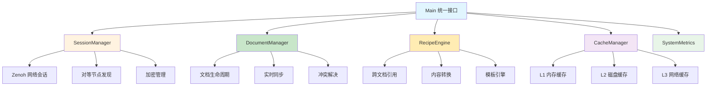

**核心组件职责分工**：

| 组件 | 主要职责 | 实现策略 | 性能考量 |
|------|----------|----------|----------|
| **SessionManager** | Zenoh 网络管理 | 连接池 + 自动重连 | 连接复用、异步IO |
| **DocumentManager** | 文档生命周期 | 懒加载 + 智能卸载 | 内存管理、缓存策略 |
| **RecipeEngine** | 内容转换处理 | 并行处理 + 依赖解析 | 任务队列、资源限制 |
| **CacheManager** | 多级缓存管理 | LRU + TTL 策略 | 命中率优化、内存控制 |
| **SystemMetrics** | 性能指标收集 | 原子操作 + 移动平均 | 低开销、实时统计 |

**初始化策略设计**（详细实现见 API 文档）：
```rust
// 核心初始化流程接口
interface MainInitialization {
    async fn initialize_network_session(config: &NetworkConfig) -> SessionManager;
    async fn setup_document_management(session: SessionManager) -> DocumentManager;
    async fn configure_caching_strategy(config: &CacheConfig) -> CacheManager;
    async fn integrate_components() -> Main;
}
```

### 1.3. 文档管理接口策略

**文档生命周期管理流程**：

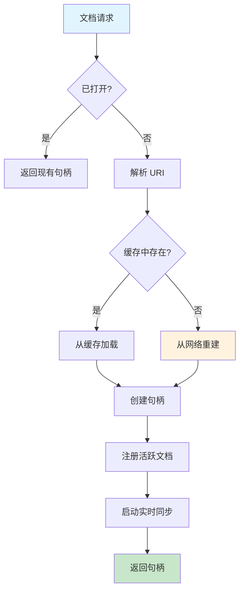

**核心接口设计策略**：

| 操作类型 | 实现策略 | 性能优化 | 错误处理 |
|----------|----------|----------|----------|
| **文档打开** | 缓存优先 + 懒加载 | 连接复用、并行加载 | 渐进式失败、备用方案 |
| **文档创建** | 立即持久化 + 网络发布 | 批量操作、异步写入 | 事务回滚、一致性保证 |
| **文档关闭** | 优雅关闭 + 资源清理 | 延迟清理、内存优化 | 强制关闭、资源泄漏防护 |
| **状态同步** | 增量更新 + 冲突解决 | 差量传输、智能合并 | 冲突标记、手动介入 |

**文档句柄管理策略**：

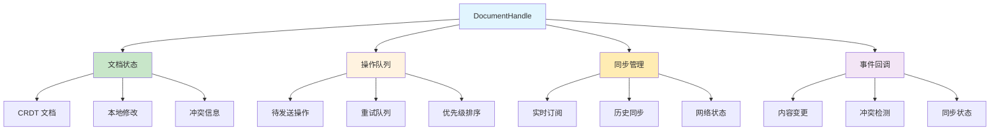

**关键设计决策**：
- **句柄复用**：相同 URI 的文档共享句柄，减少内存开销
- **操作队列**：异步操作队列确保操作顺序和错误恢复
- **智能缓存**：基于访问模式的缓存策略，平衡内存和性能
- **监控集成**：内置指标收集，支持性能分析和问题诊断

### 1.4. 内容操作接口策略

**CRDT 操作映射策略**：

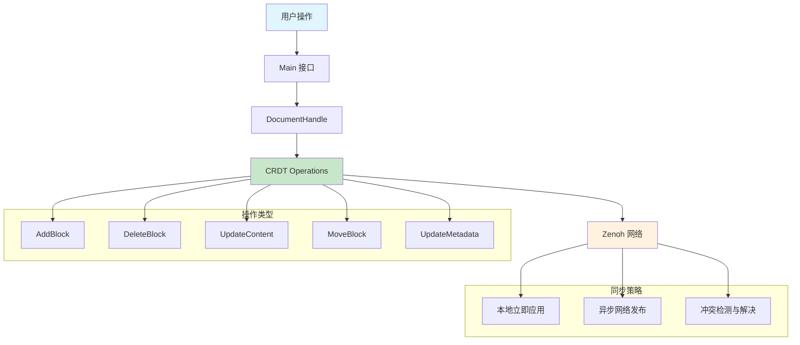

**内容操作设计原则**：

| 操作类型 | 实现策略 | 冲突处理 | 性能优化 |
|----------|----------|----------|----------|
| **添加块** | UUID 生成 + 默认内容 | 不可能冲突 | 批量添加、模板初始化 |
| **删除块** | 软删除 + 标记 | Last-Write-Wins | 延迟清理、垃圾回收 |
| **内容更新** | 差量操作 + Text CRDT | 语义合并 | 增量传输、密集合并 |
| **结构移动** | 父子关系修改 | 规则优先级 | 原子操作、最小影响 |
| **元数据编辑** | 结构化合并 | 字段级合并 | 模式验证、缓存失效 |

**操作驱动的设计模式**：
- **操作原子性**：每个用户操作对应一个或多个原子 CRDT 操作
- **乐观并发**：本地立即应用，网络异步同步，冲突后续处理
- **操作幂等性**：相同操作多次执行结果一致，支持网络重试
- **语义保证**：操作顺序可能改变，但语义意图得到保留

**核心接口设计**（详细实现见 API 文档）：
```rust
// 内容操作统一接口
interface ContentOperations {
    async fn add_block(doc_uri: &str, block_type: BlockType, init_options: BlockInitOptions) -> BlockId;
    async fn delete_block(doc_uri: &str, block_id: &str, deletion_policy: DeletionPolicy) -> ();
    async fn update_content(doc_uri: &str, block_id: &str, content_delta: ContentDelta) -> ();
    async fn move_block(doc_uri: &str, block_id: &str, target_parent: Option<&str>) -> ();
    async fn batch_operations(doc_uri: &str, operations: Vec<Operation>) -> BatchResult;
}
```

### 1.5. 协作功能接口策略

**分布式协作架构**：

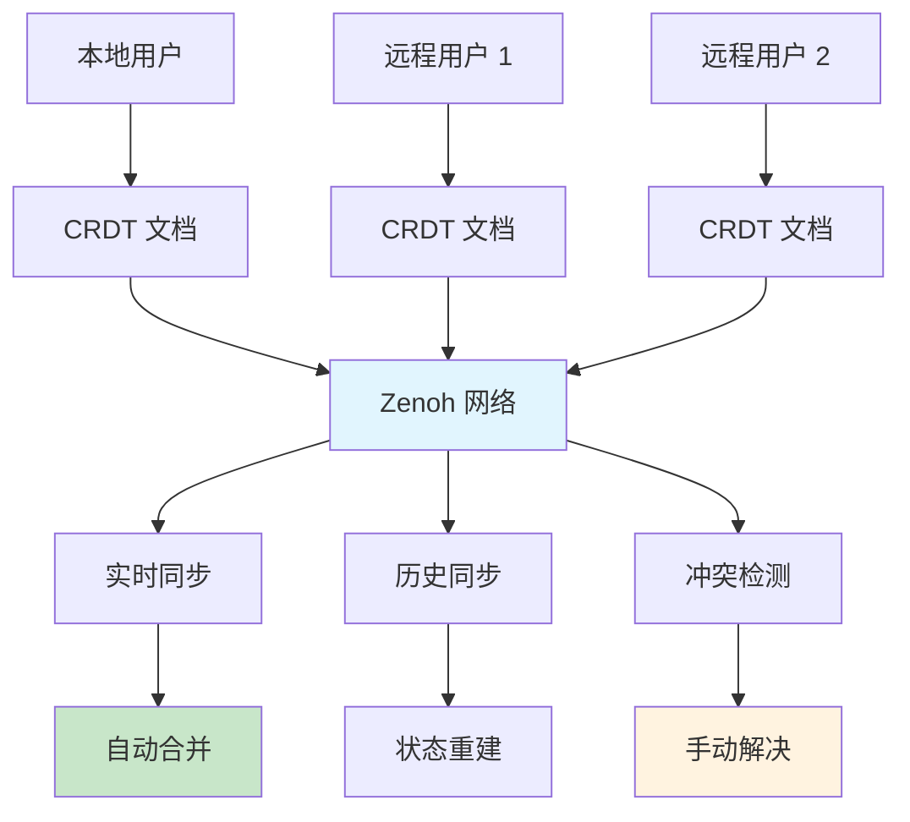

**协作策略分层设计**：

| 协作层级 | 实现策略 | 冲突解决 | 性能特点 |
|----------|----------|----------|----------|
| **实时同步** | 事件驱动 + 自动合并 | CRDT 自动处理 | 低延迟 (< 100ms) |
| **历史同步** | 量化查询 + 按需加载 | 操作日志重放 | 高吞吐量 |
| **所有权管理** | 乐观锁 + 分布式一致性 | 最后写入者获胜 | 支持冲突解决 |
| **网络分区** | 离线编辑 + 重连同步 | 向量时钟合并 | 弹性恢复 |

**协作流程策略**：

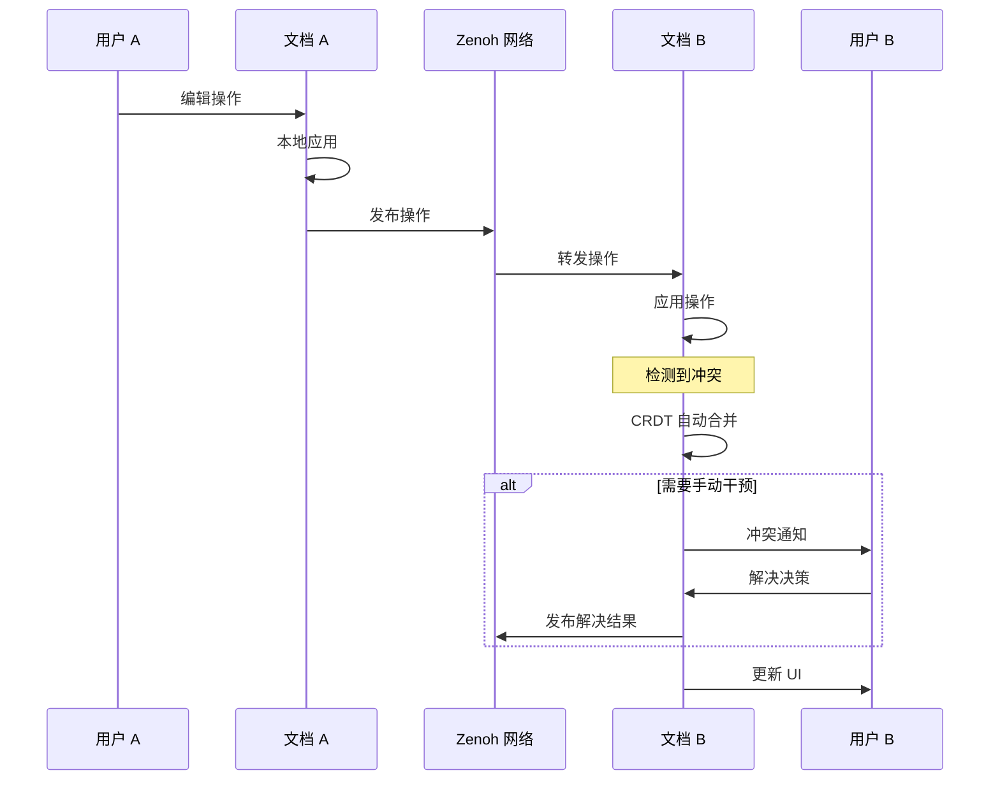

**所有权管理策略**：
- **乐观锁机制**：允许并发编辑，冲突时才加锁
- **分级所有权**：文档级 > 块级 > 字段级权限管理
- **权限传递**：支持所有权转移和授权机制
- **容错设计**：网络分区时的所有权冲突处理

**核心接口设计**（详细实现见 API 文档）：
```rust
// 协作功能统一接口
interface CollaborationOperations {
    async fn sync_document(doc_uri: &str, sync_options: SyncOptions) -> SyncResult;
    async fn transfer_ownership(doc_uri: &str, block_id: &str, target_user: &str) -> ();
    async fn claim_ownership(doc_uri: &str, block_id: &str, force: bool) -> ClaimResult;
    async fn resolve_conflict(doc_uri: &str, conflict_id: &str, resolution: ConflictResolution) -> ();
    async fn get_collaboration_status(doc_uri: &str) -> CollaborationStatus;
}
```

### 1.6. Recipe 和导出接口策略

**Recipe 执行引擎架构**：

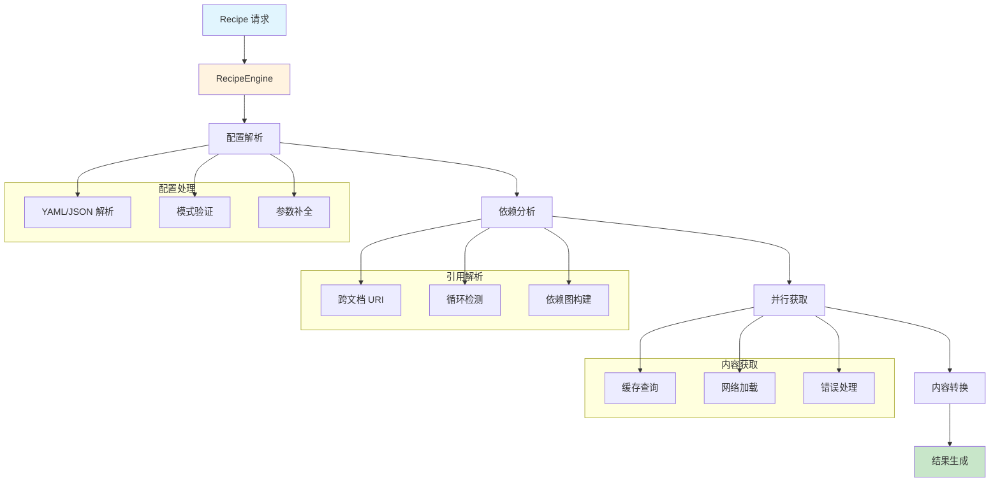

**Recipe 执行策略设计**：

| 处理阶段 | 实现策略 | 错误处理 | 性能优化 |
|----------|----------|----------|----------|
| **配置解析** | 模式验证 + 参数补全 | 详细错误信息 | 配置缓存、懒加载 |
| **依赖分析** | 拓扑排序 + 循环检测 | 依赖图裁剪 | 并行分析、结果缓存 |
| **内容获取** | 批量获取 + 缓存复用 | 部分失败容错 | 预取、连接池 |
| **内容转换** | 流式处理 + 模板引擎 | 转换错误隔离 | 内存流、并行处理 |
| **结果输出** | 原子写入 + 校验和 | 输出失败回滚 | 增量更新、文件锁 |

**跨文档引用处理策略**：

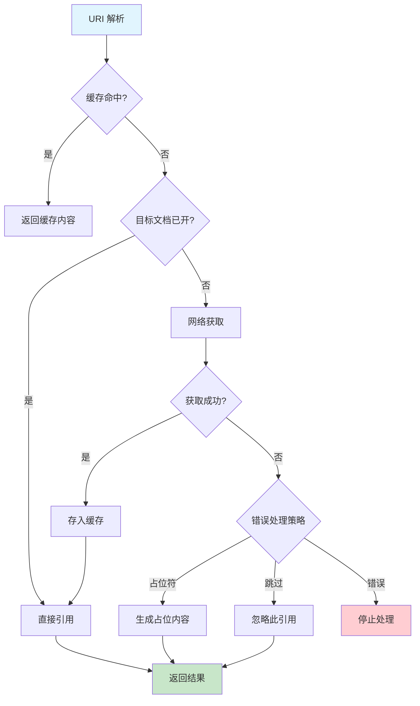

**性能优化策略**：
- **并行处理**：依赖图引导的并行任务调度
- **流式处理**：大型文档的流式转换，避免内存溢出
- **缓存策略**：多级缓存 + 内容哈希验证
- **资源控制**：并发限制 + 内存使用监控

**核心接口设计**（详细实现见 API 文档）：
```rust
// Recipe 执行统一接口
interface RecipeOperations {
    async fn list_recipes(doc_uri: &str) -> Vec<RecipeInfo>;
    async fn validate_recipe(doc_uri: &str, recipe_name: &str) -> RecipeValidation;
    async fn execute_recipe(doc_uri: &str, recipe_name: &str, output_config: OutputConfig) -> ExportResult;
    async fn preview_recipe(doc_uri: &str, recipe_name: &str) -> PreviewResult;
    async fn cancel_recipe_execution(execution_id: &str) -> ();
}
```

## 2. SessionManager - 网络会话管理策略

### 2.1. Zenoh 网络抽象策略

**网络架构设计决策**：

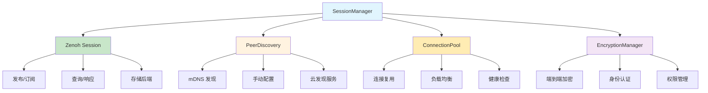

**核心接口设计**（详细实现见 API 文档）：
```rust
// 网络会话管理统一接口
interface SessionManagement {
    async fn initialize_session(config: &NetworkConfig) -> SessionManager;
    async fn publish_operation(doc_uri: &str, operation: &CrdtOperation) -> ();
    async fn subscribe_operations(doc_uri: &str, callback: OperationCallback) -> Subscription;
    async fn query_history(doc_uri: &str, since: Option<DateTime>) -> Vec<CrdtOperation>;
    async fn discover_peers() -> Vec<PeerInfo>;
}
```

### 2.2. 对等节点发现

```rust
// core/src/session/peer_discovery.rs
pub struct PeerDiscovery {
    zenoh_session: Arc<zenoh::Session>,
    discovered_peers: Arc<DashMap<String, PeerInfo>>,
    mdns_service: Option<mdns::Service>,
}

#[derive(Debug, Clone)]
pub struct PeerInfo {
    pub user_id: String,
    pub device_name: String,
    pub capabilities: Vec<String>,
    pub last_seen: chrono::DateTime<chrono::Utc>,
    pub network_address: String,
}

impl PeerDiscovery {
    pub fn new(session: Arc<zenoh::Session>, config: &NetworkConfig) -> Self {
        let mdns_service = if config.enable_mdns_discovery {
            Some(Self::setup_mdns_discovery(config))
        } else {
            None
        };
        
        Self {
            zenoh_session: session,
            discovered_peers: Arc::new(DashMap::new()),
            mdns_service,
        }
    }
    
    /// 启动对等发现服务
    pub async fn start_discovery(&self) -> Result<(), DiscoveryError> {
        // 发布自身信息
        let self_info = PeerInfo {
            user_id: "current_user".to_string(), // 从配置获取
            device_name: hostname::get()?.to_string_lossy().to_string(),
            capabilities: vec!["elfi-core".to_string()],
            last_seen: chrono::Utc::now(),
            network_address: "".to_string(), // Zenoh 会自动处理
        };
        
        let key = format!("/elf/peers/{}", self_info.user_id);
        self.zenoh_session
            .put(&key, serde_json::to_vec(&self_info)?)
            .await?;
        
        // 订阅其他节点信息
        let discovered_peers = self.discovered_peers.clone();
        self.zenoh_session
            .declare_subscriber("/elf/peers/*")
            .callback(move |sample| {
                if let Ok(peer_info) = serde_json::from_slice::<PeerInfo>(sample.payload()) {
                    discovered_peers.insert(peer_info.user_id.clone(), peer_info);
                }
            })
            .await?;
        
        Ok(())
    }
    
    /// 获取发现的对等节点列表
    pub fn get_peers(&self) -> Vec<PeerInfo> {
        self.discovered_peers
            .iter()
            .map(|entry| entry.value().clone())
            .collect()
    }
}
```

## 3. DocumentManager - 文档生命周期管理

### 3.1. 文档管理核心

```rust
// core/src/document/manager.rs
pub struct DocumentManager {
    session_manager: Arc<SessionManager>,
    cache_manager: Arc<CacheManager>,
    active_documents: Arc<DashMap<String, Arc<RwLock<ElfiDocument>>>>,
    parser: Arc<ElfParser>,
    conflict_resolver: Arc<ConflictResolver>,
}

impl DocumentManager {
    pub async fn new(
        session_manager: Arc<SessionManager>,
        cache_manager: Arc<CacheManager>
    ) -> Result<Self, DocumentError> {
        Ok(Self {
            session_manager,
            cache_manager,
            active_documents: Arc::new(DashMap::new()),
            parser: Arc::new(ElfParser::new()?),
            conflict_resolver: Arc::new(ConflictResolver::new()),
        })
    }
    
    /// 打开文档
    pub async fn open_document(&self, uri: &ElfUri) -> Result<Arc<RwLock<ElfiDocument>>, DocumentError> {
        let uri_str = uri.to_string();
        
        // 检查是否已加载
        if let Some(doc) = self.active_documents.get(&uri_str) {
            return Ok(doc.clone());
        }
        
        // 从缓存或网络加载
        let document = match self.cache_manager.get_document(&uri_str).await {
            Ok(cached_doc) => cached_doc,
            Err(_) => {
                // 从网络重建文档
                let operations = self.session_manager
                    .query_history(&uri_str, None)
                    .await?;
                self.rebuild_document_from_operations(operations)?
            }
        };
        
        let doc_ref = Arc::new(RwLock::new(document));
        
        // 启动实时同步
        self.start_realtime_sync(&uri_str, doc_ref.clone()).await?;
        
        // 加入活跃文档列表
        self.active_documents.insert(uri_str, doc_ref.clone());
        
        Ok(doc_ref)
    }
    
    /// 创建新文档
    pub async fn create_document(
        &self,
        uri: &str,
        initial_doc: ElfiDocument
    ) -> Result<Arc<RwLock<ElfiDocument>>, DocumentError> {
        // 发布初始状态到网络
        let create_operation = CrdtOperation::CreateDocument {
            document_id: initial_doc.metadata.id.clone(),
            metadata: initial_doc.metadata.clone(),
            timestamp: chrono::Utc::now(),
        };
        
        self.session_manager
            .publish_operation(uri, &create_operation)
            .await?;
        
        // 发布初始区块
        for block in initial_doc.blocks() {
            let add_block_op = CrdtOperation::AddBlock {
                block: block.clone(),
                timestamp: chrono::Utc::now(),
            };
            
            self.session_manager
                .publish_operation(uri, &add_block_op)
                .await?;
        }
        
        let doc_ref = Arc::new(RwLock::new(initial_doc));
        
        // 启动实时同步
        self.start_realtime_sync(uri, doc_ref.clone()).await?;
        
        // 存储到缓存
        self.cache_manager.store_document(uri, &doc_ref).await?;
        
        // 加入活跃文档列表
        self.active_documents.insert(uri.to_string(), doc_ref.clone());
        
        Ok(doc_ref)
    }
    
    /// 启动实时同步
    async fn start_realtime_sync(
        &self,
        uri: &str,
        document: Arc<RwLock<ElfiDocument>>
    ) -> Result<(), DocumentError> {
        let conflict_resolver = self.conflict_resolver.clone();
        let cache_manager = self.cache_manager.clone();
        let uri_str = uri.to_string();
        
        self.session_manager.subscribe_operations(uri, move |operation| {
            let document = document.clone();
            let conflict_resolver = conflict_resolver.clone();
            let cache_manager = cache_manager.clone();
            let uri = uri_str.clone();
            
            tokio::spawn(async move {
                // 应用操作到文档
                let result = {
                    let mut doc = document.write().await;
                    doc.apply_operation(&operation)
                };
                
                match result {
                    Ok(conflicts) => {
                        // 处理冲突
                        if !conflicts.is_empty() {
                            for conflict in conflicts {
                                if let Err(e) = conflict_resolver.resolve_conflict(&conflict).await {
                                    tracing::warn!("冲突解决失败: {:?}", e);
                                }
                            }
                        }
                        
                        // 更新缓存
                        if let Err(e) = cache_manager.update_document(&uri, &document).await {
                            tracing::warn!("缓存更新失败: {:?}", e);
                        }
                    },
                    Err(e) => {
                        tracing::error!("应用操作失败: {:?}", e);
                    }
                }
            });
        }).await?;
        
        Ok(())
    }
}
```

## 4. 解析器集成

### 4.1. .elf 文件解析

```rust
// core/src/parser/mod.rs
pub struct ElfParser {
    tree_sitter_parser: tree_sitter::Parser,
}

impl ElfParser {
    pub fn new() -> Result<Self, ParseError> {
        let mut parser = tree_sitter::Parser::new();
        parser.set_language(tree_sitter_elf::language())?;
        
        Ok(Self {
            tree_sitter_parser: parser,
        })
    }
    
    /// 解析 .elf 文本为文档结构
    pub fn parse_text(&mut self, content: &str) -> Result<ElfiDocument, ParseError> {
        // Tree-sitter 解析
        let tree = self.tree_sitter_parser
            .parse(content, None)
            .ok_or(ParseError::TreeSitterFailed)?;
        
        let root_node = tree.root_node();
        let mut document = ElfiDocument::new(DocumentMetadata::default());
        
        // 遍历所有块节点
        for block_node in root_node.children(&mut tree.walk()) {
            if block_node.kind() == "block" {
                let block = self.parse_block_node(content, &block_node)?;
                document.add_block(block)?;
            }
        }
        
        Ok(document)
    }
    
    /// 解析单个块节点
    fn parse_block_node(
        &self,
        source: &str,
        node: &tree_sitter::Node
    ) -> Result<Block, ParseError> {
        let mut metadata_text = None;
        let mut content_text = None;
        
        // 提取元数据和内容部分
        for child in node.children(&mut node.walk()) {
            match child.kind() {
                "metadata_section" => {
                    metadata_text = Some(child.utf8_text(source.as_bytes())?);
                }
                "content_section" => {
                    content_text = Some(child.utf8_text(source.as_bytes())?);
                }
                _ => {}
            }
        }
        
        // 解析 YAML 元数据
        let metadata_str = metadata_text
            .ok_or(ParseError::MissingMetadata)?
            .trim_start_matches("---")
            .trim_end_matches("---")
            .trim();
        
        let parsed_metadata: BlockMetadataRaw = serde_yaml::from_str(metadata_str)?;
        
        // 验证必需字段
        parsed_metadata.validate()?;
        
        // 解析内容
        let content = match parsed_metadata.block_type.as_str() {
            "link" => {
                let link_content: LinkContent = serde_yaml::from_str(
                    content_text.unwrap_or("")
                )?;
                BlockContent::Link(link_content)
            }
            "recipe" => {
                let recipe_config: RecipeConfig = serde_yaml::from_str(
                    content_text.unwrap_or("")
                )?;
                BlockContent::Recipe(recipe_config)
            }
            _ => {
                BlockContent::Text(content_text.unwrap_or("").to_string())
            }
        };
        
        Ok(Block {
            id: uuid::Uuid::parse_str(&parsed_metadata.id)?,
            name: parsed_metadata.name,
            block_type: BlockType::from_str(&parsed_metadata.block_type)?,
            content,
            metadata: parsed_metadata.metadata.unwrap_or_default(),
        })
    }
}

#[derive(Deserialize)]
struct BlockMetadataRaw {
    id: String,
    #[serde(rename = "type")]
    block_type: String,
    name: Option<String>,
    metadata: Option<BlockMetadata>,
}

impl BlockMetadataRaw {
    fn validate(&self) -> Result<(), ParseError> {
        // 验证 UUID 格式
        uuid::Uuid::parse_str(&self.id)
            .map_err(|_| ParseError::InvalidUuid(self.id.clone()))?;
        
        // 验证块类型
        match self.block_type.as_str() {
            "markdown" | "code" | "link" | "recipe" | "metadata" => Ok(()),
            _ => Err(ParseError::UnknownBlockType(self.block_type.clone())),
        }
    }
}
```

## 5. 系统指标收集

### 5.1. 性能指标

```rust
// core/src/metrics.rs
#[derive(Debug, Clone)]
pub struct SystemMetrics {
    // 操作计数器
    document_operations: Arc<AtomicU64>,
    recipe_executions: Arc<AtomicU64>,
    network_requests: Arc<AtomicU64>,
    
    // 性能指标（移动平均）
    avg_sync_latency: Arc<RwLock<f64>>,
    avg_recipe_execution_time: Arc<RwLock<f64>>,
    
    // 资源使用
    memory_usage: Arc<AtomicU64>,
    active_documents_count: Arc<AtomicUsize>,
    
    // 错误统计
    total_errors: Arc<AtomicU64>,
    network_errors: Arc<AtomicU64>,
}

impl SystemMetrics {
    pub fn new() -> Self {
        Self {
            document_operations: Arc::new(AtomicU64::new(0)),
            recipe_executions: Arc::new(AtomicU64::new(0)),
            network_requests: Arc::new(AtomicU64::new(0)),
            avg_sync_latency: Arc::new(RwLock::new(0.0)),
            avg_recipe_execution_time: Arc::new(RwLock::new(0.0)),
            memory_usage: Arc::new(AtomicU64::new(0)),
            active_documents_count: Arc::new(AtomicUsize::new(0)),
            total_errors: Arc::new(AtomicU64::new(0)),
            network_errors: Arc::new(AtomicU64::new(0)),
        }
    }
    
    pub fn record_operation(&self, operation: MetricOperation, duration: Duration) {
        match operation {
            MetricOperation::DocumentOpen => {
                self.document_operations.fetch_add(1, Ordering::Relaxed);
            }
            MetricOperation::DocumentSync => {
                self.document_operations.fetch_add(1, Ordering::Relaxed);
                self.update_avg_latency(&self.avg_sync_latency, duration);
            }
            MetricOperation::RecipeExecution => {
                self.recipe_executions.fetch_add(1, Ordering::Relaxed);
                self.update_avg_latency(&self.avg_recipe_execution_time, duration);
            }
            MetricOperation::NetworkRequest => {
                self.network_requests.fetch_add(1, Ordering::Relaxed);
            }
        }
    }
    
    fn update_avg_latency(&self, avg_ref: &RwLock<f64>, new_duration: Duration) {
        let new_ms = new_duration.as_millis() as f64;
        if let Ok(mut avg) = avg_ref.write() {
            // 指数移动平均 (α = 0.1)
            *avg = *avg * 0.9 + new_ms * 0.1;
        }
    }
    
    pub async fn get_summary(&self) -> MetricsSummary {
        MetricsSummary {
            document_operations_total: self.document_operations.load(Ordering::Relaxed),
            recipe_executions_total: self.recipe_executions.load(Ordering::Relaxed),
            network_requests_total: self.network_requests.load(Ordering::Relaxed),
            avg_sync_latency_ms: *self.avg_sync_latency.read().await,
            avg_recipe_execution_ms: *self.avg_recipe_execution_time.read().await,
            memory_usage_mb: self.memory_usage.load(Ordering::Relaxed) as f64 / 1024.0 / 1024.0,
            active_documents: self.active_documents_count.load(Ordering::Relaxed),
            total_errors: self.total_errors.load(Ordering::Relaxed),
            network_errors: self.network_errors.load(Ordering::Relaxed),
        }
    }
}

#[derive(Debug, Clone)]
pub enum MetricOperation {
    DocumentOpen,
    DocumentSync,
    RecipeExecution,
    NetworkRequest,
}
```

## 6. 实施验证策略

### 6.1. 分阶段验证方法

**阶段一：核心接口验证**

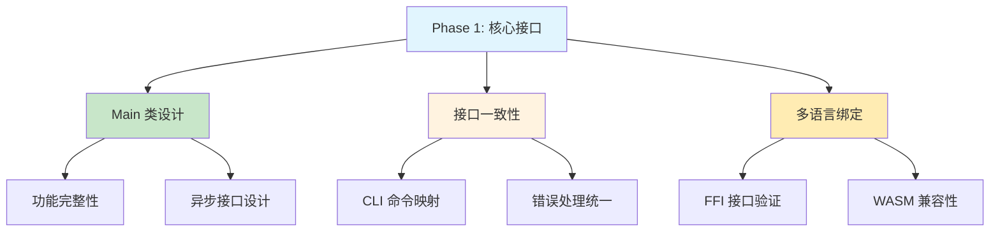

**阶段二：核心组件验证**

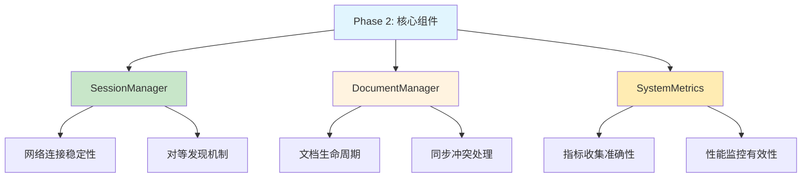

### 6.2. 关键验证指标

**系统性能基准**：

| 指标类型 | 目标值 | 验证场景 | 验证方法 |
|----------|--------|----------|----------|
| **接口响应** | < 50ms | Main 接口调用 | 基准测试 + 压力测试 |
| **网络同步** | < 100ms | 实时协作 | 多节点测试 |
| **文档加载** | < 200ms | 大文档打开 | 性能剖析 |
| **内存使用** | < 50MB | 常规使用 | 内存分析工具 |

### 6.3. 验证清单

**Main 接口完整性验证**：
- [ ] **功能覆盖**：所有 CLI 命令都有对应的 Main 方法，接口完整无遗漏
- [ ] **并发支持**：异步接口设计支持高并发场景，无竞态条件
- [ ] **错误处理**：错误处理提供详细信息和建议，用户体验友好
- [ ] **多语言兼容**：FFI 和 WASM 绑定的兼容性验证通过

**会话管理稳定性验证**：
- [ ] **连接管理**：Zenoh 网络会话的连接建立、维护和释放正确
- [ ] **节点发现**：对等节点发现机制在各种网络环境下正常工作
- [ ] **容错能力**：网络分区和重连恢复机制有效，自动故障恢复
- [ ] **安全机制**：加密传输和身份认证机制正确实现

**文档管理正确性验证**：
- [ ] **生命周期**：文档打开、编辑、保存、关闭的完整生命周期管理
- [ ] **实时同步**：多用户实时协作同步和冲突解决机制准确
- [ ] **缓存策略**：多级缓存的命中率和失效策略满足性能要求
- [ ] **资源管理**：内存使用和资源释放合理，无内存泄漏

**解析器准确性验证**：
- [ ] **语法解析**：.elf 语法解析完全正确，覆盖所有语法特性
- [ ] **错误处理**：解析错误的定位和提示信息用户友好
- [ ] **性能表现**：Tree-sitter 集成性能良好，大文档解析流畅
- [ ] **扩展支持**：各种块类型的解析支持完整，支持自定义扩展

**系统指标可观察性验证**：
- [ ] **指标完整性**：关键性能指标收集覆盖所有重要操作
- [ ] **分析价值**：错误统计和趋势分析对系统优化有帮助
- [ ] **实时性**：指标数据的准确性和实时性满足监控需求
- [ ] **告警机制**：监控和告警机制有效，及时发现和响应问题

### 6.4. 实施优先级

**基础层（Foundation Layer）**：
- Main 接口的基础功能和异步设计：提供系统统一入口和生命周期管理
- SessionManager 的网络连接和同步机制：建立分布式协作的底层网络能力
- DocumentManager 的核心文档管理功能：实现文档的基本 CRUD 和状态管理
- *说明：这一层构成 ELFI 核心引擎的基础架构，为所有上层功能提供基本服务*

**功能层（Feature Layer）**：
- 基于网络层的解析器准确性和性能：在稳定网络基础上实现高效的 .elf 文件解析
- 基于 Main 接口的系统指标收集和监控：利用统一接口实现系统状态的可观测性
- 基于核心功能的错误处理和用户体验优化：在稳定核心上构建友好的错误处理机制
- *说明：这一层在基础设施稳定后构建，提供核心引擎的完整业务功能*

**增强层（Enhancement Layer）**：
- 基于功能层的高级缓存策略和性能优化：在稳定功能基础上进一步提升系统性能
- 基于成熟架构的扩展性支持和插件机制：允许第三方扩展核心引擎功能
- 基于完整功能的高级监控和分析功能：提供深入的系统分析和诊断能力
- *说明：这一层提供高级特性和性能优化，依赖于底层架构的成熟度*

这个核心模块实现策略确保了 ELFI 系统具备稳定性、高性能和良好的可扩展性，为上层的 Weave 和 Tangle 模块提供了坚实的基础架构支撑。通过分阶段验证和明确的性能基准，我们可以系统性地构建一个可靠的文学化编程平台。