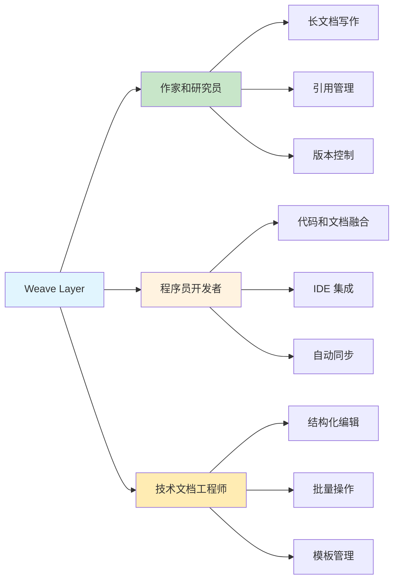
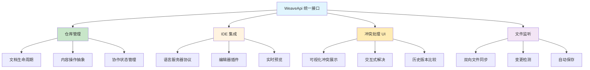
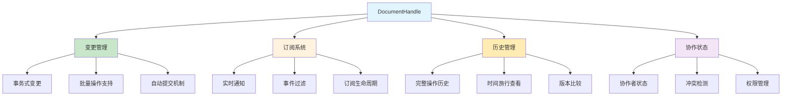
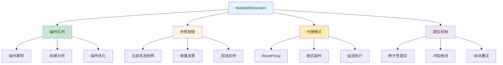
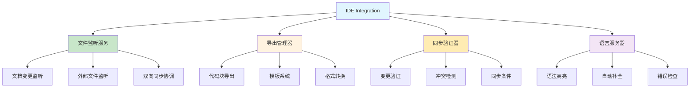
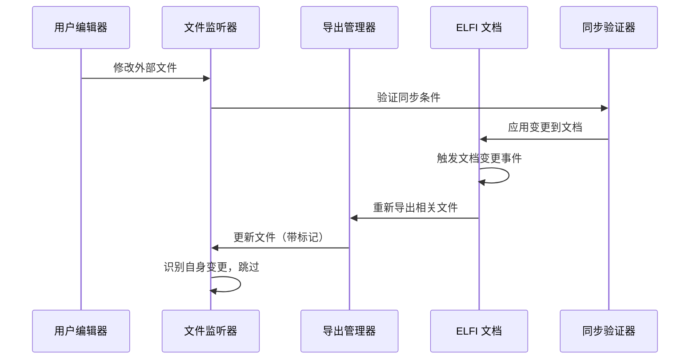
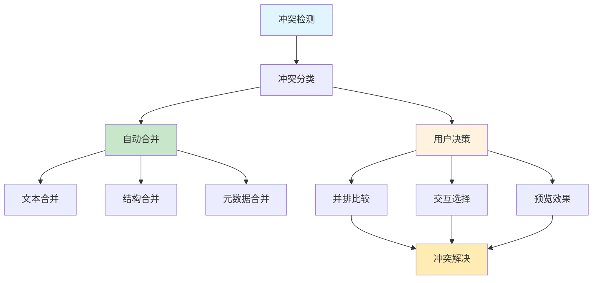
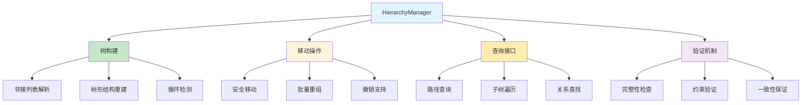
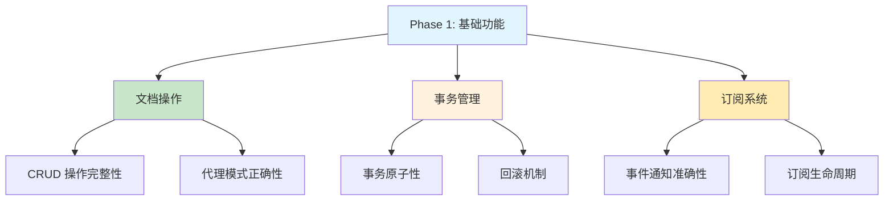
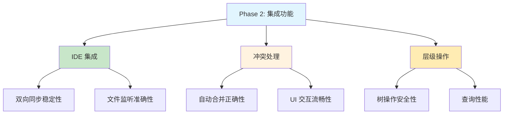

# Weave 层实现策略

本文档阐述 Weave 层的实现策略，专注于内容创作工作流、IDE 集成策略、文件监听机制和协作体验设计。Weave 层为文档的主要贡献者提供简洁的高级 API，封装底层 CRDT 和网络复杂性。

## 1. Weave 层设计理念

### 1.1. 设计理念和用户定位

**目标用户群体分析**：

Weave 层服务于文档内容的**主要创作者**，设计决策围绕他们的核心需求：



**核心设计原则**：
- **直觉化操作**：类似传统文档编辑器的操作体验
- **无感知协作**：底层 CRDT 同步对用户透明
- **IDE 原生集成**：与开发者工作流无缝结合
- **优雅的冲突处理**：通过 UI 引导而非技术细节解决冲突

### 1.2. 仓库模型抽象策略

**设计理念**：采用仓库模型将 CRDT 复杂性抽象为简单的文档操作接口



**核心接口设计策略**（详细实现见 API 文档）：
```rust
// Weave 层统一接口抽象
interface WeaveOperations {
    // 仓库级操作
    async fn create_repository(config: RepositoryConfig) -> Repository;
    async fn open_repository(path: &str) -> Repository;
    
    // 文档级操作
    async fn create_document(repo: &Repository, name: &str) -> DocumentHandle;
    async fn edit_document(handle: &DocumentHandle, operations: Vec<EditOperation>) -> ();
    
    // 协作操作
    async fn share_document(handle: &DocumentHandle, users: Vec<UserId>) -> ();
    async fn resolve_conflict(conflict: &Conflict, resolution: ConflictResolution) -> ();
}

### 1.3. 文档句柄设计策略

**面向对象的文档操作接口设计**：



**关键设计策略**：

| 设计方面 | 实现策略 | 技术考量 | 用户体验 |
|----------|----------|----------|----------|
| **变更管理** | 事务式回调模式 | 原子性保证 + 错误回滚 | 一致性体验，避免部分更新 |
| **订阅机制** | 观察者模式 + 事件过滤 | 弱引用 + 异步通知 | 实时响应，性能可控 |
| **历史查看** | 不可变快照 + 惰性加载 | 时间旅行查询优化 | 版本浏览流畅 |
| **协作感知** | 状态广播 + 冲突预警 | 实时状态同步 | 协作透明度高 |

**核心接口设计**（详细实现见 API 文档）：
```rust
// 文档句柄操作接口
interface DocumentOperations {
    // 事务式变更
    async fn change<F, R>(callback: F) -> Result<R> where F: FnOnce(&mut MutableDocument) -> R;
    
    // 订阅系统
    async fn subscribe(callback: DocumentCallback) -> SubscriptionId;
    async fn unsubscribe(subscription_id: SubscriptionId) -> ();
    
    // 历史和版本
    async fn get_history() -> HistoryGraph;
    async fn view_at(version: &[ChangeHash]) -> ImmutableDocument;
    
    // 协作状态
    async fn get_collaborators() -> Vec<CollaboratorInfo>;
    async fn get_conflicts() -> Vec<ConflictInfo>;
}
```

### 1.4. 可变文档代理策略

**事务式编辑模式设计**：



**编辑操作抽象策略**：

| 操作类型 | 设计策略 | 代理模式 | 性能考量 |
|----------|----------|----------|----------|
| **块操作** | 代理对象 + 延迟执行 | BlockProxy 链式调用 | 批量操作优化 |
| **内容编辑** | 差分计算 + 增量更新 | ContentProxy 实时预览 | 大文档流式处理 |
| **结构重组** | 依赖分析 + 安全重排 | StructureProxy 约束检查 | 操作合并和去重 |
| **元数据修改** | 模式验证 + 类型安全 | MetadataProxy 智能补全 | 缓存和验证优化 |

**核心设计原则**：
- **延迟执行**：所有操作在 `commit()` 时才真正执行，支持回滚
- **操作优化**：自动合并相邻操作，减少网络传输
- **类型安全**：编译时保证操作的正确性
- **用户友好**：提供直观的 API，隐藏 CRDT 复杂性

**核心接口设计**（详细实现见 API 文档）：
```rust
// 可变文档编辑接口
interface MutableDocumentOperations {
    // 块级操作
    fn add_block(block_type: BlockType, name: Option<String>) -> BlockProxy;
    fn delete_block(block_id: &Uuid) -> ();
    fn move_block(block_id: &Uuid, target_parent: Option<&Uuid>) -> ();
    
    // 内容操作
    fn edit_content(block_id: &Uuid, content: Content) -> ContentProxy;
    fn batch_edit(operations: Vec<EditOperation>) -> ();
    
    // 事务管理
    async fn commit() -> Result<Vec<ChangeHash>>;
    fn rollback() -> ();
    fn preview() -> DocumentSnapshot;
}
        Ok(())
    }
    
    /// 获取区块代理进行编辑
    pub fn get_block(&mut self, block_id: &uuid::Uuid) -> Result<BlockProxy, WeaveError> {
        // 检查区块是否存在
        if !self.snapshot.has_block(block_id) {
            return Err(WeaveError::BlockNotFound(*block_id));
        }
        
        Ok(BlockProxy::existing(*block_id, &mut self.pending_operations))
    }
    
    /// 移动区块到新的父级下
    pub fn move_block(&mut self, block_id: &uuid::Uuid, new_parent: Option<uuid::Uuid>) -> Result<(), WeaveError> {
        let operation = DocumentOperation::MoveBlock {
            id: *block_id,
            new_parent,
        };
        
        self.pending_operations.push(operation);
        Ok(())
    }
    
    /// 提交所有变更
    pub(crate) async fn commit(self) -> Result<(), WeaveError> {
        for operation in self.pending_operations {
            match operation {
                DocumentOperation::AddBlock { id, block_type, name, position } => {
                    self.main.add_block(&self.document_uri, block_type, name).await?;
                }
                DocumentOperation::DeleteBlock { id } => {
                    self.main.delete_block(&self.document_uri, &id.to_string()).await?;
                }
                DocumentOperation::MoveBlock { id, new_parent } => {
                    self.main.move_block(
                        &self.document_uri, 
                        &id.to_string(), 
                        new_parent.map(|p| p.to_string())
                    ).await?;
                }
                DocumentOperation::UpdateBlockContent { id, content } => {
                    self.main.update_block_content(&self.document_uri, &id.to_string(), content).await?;
                }
            }
        }
        
        Ok(())
    }
}
```

### 1.5. 区块代理接口

```rust
// core/src/weave/block_proxy.rs
pub struct BlockProxy<'a> {
    block_id: uuid::Uuid,
    pending_operations: &'a mut Vec<DocumentOperation>,
}

impl<'a> BlockProxy<'a> {
    /// 设置区块内容
    pub fn set_content(self, content: BlockContent) -> Self {
        let operation = DocumentOperation::UpdateBlockContent {
            id: self.block_id,
            content,
        };
        self.pending_operations.push(operation);
        self
    }
    
    /// 设置区块名称
    pub fn set_name(self, name: String) -> Self {
        let operation = DocumentOperation::UpdateBlockMetadata {
            id: self.block_id,
            field: "name".to_string(),
            value: serde_json::Value::String(name),
        };
        self.pending_operations.push(operation);
        self
    }
    
    /// 添加标签
    pub fn add_tag(self, tag: String) -> Self {
        let operation = DocumentOperation::AddTag {
            id: self.block_id,
            tag,
        };
        self.pending_operations.push(operation);
        self
    }
    
    /// 设置父级
    pub fn set_parent(self, parent_id: Option<uuid::Uuid>) -> Self {
        let operation = DocumentOperation::UpdateBlockMetadata {
            id: self.block_id,
            field: "parent".to_string(),
            value: match parent_id {
                Some(id) => serde_json::Value::String(id.to_string()),
                None => serde_json::Value::Null,
            },
        };
        self.pending_operations.push(operation);
        self
    }
}
```

## 2. IDE 集成与文件监听策略

### 2.1. IDE 集成架构策略

**IDE 集成系统架构**：



**核心设计策略**：

| 集成方面 | 实现策略 | 技术挑战 | 解决方案 |
|----------|----------|----------|----------|
| **双向同步** | 文件监听 + 增量更新 | 无限循环风险 | 变更来源标记 + 去重 |
| **代码导出** | 模板驱动 + 格式化 | 格式一致性 | 配置化模板 + Prettier 集成 |
| **冲突检测** | 时间戳 + 内容哈希 | 并发修改冲突 | 三路合并 + 用户选择 |
| **性能优化** | 惰性加载 + 缓存 | 大项目响应慢 | 增量解析 + 后台处理 |

**核心接口设计**（详细实现见 API 文档）：
```rust
// IDE 集成统一接口
interface IdeIntegration {
    async fn start_watch_mode(config: WatchConfig) -> WatchHandle;
    async fn export_code_blocks(filter: BlockFilter) -> ExportResult;
    async fn sync_external_changes(changes: Vec<FileChange>) -> SyncResult;
    async fn validate_sync_conditions(conditions: SyncConditions) -> ValidationResult;
}
```

### 2.2. 文件监听策略

**双向同步工作流设计**：



**关键实现策略**：
- **循环检测**：变更来源标记和时间窗口去重
- **增量更新**：只处理实际变更的部分，避免全量重写
- **错误恢复**：同步失败时的回滚和用户通知机制
- **性能优化**：批量处理和延迟写入策略

## 3. 冲突解决 UI 策略

### 3.1. 可视化冲突处理

**用户界面设计策略**：



**冲突处理策略分层**：

| 冲突类型 | 处理策略 | UI 设计 | 用户体验 |
|----------|----------|---------|----------|
| **文本冲突** | 三路合并 + 行级标记 | 并排差异视图 | Git-like 冲突标记 |
| **结构冲突** | 树形比较 + 拖拽操作 | 层级结构可视化 | 直观的拖拽重组 |
| **元数据冲突** | 字段级选择器 | 表单化界面 | 逐字段选择确认 |
| **引用冲突** | 智能提示 + 自动修复 | 引用图谱展示 | 一键修复建议 |

### 3.2. 协作感知设计

**实时协作状态显示**：
- **用户头像**：显示当前活跃的协作者
- **编辑指示器**：实时显示他人正在编辑的区域  
- **冲突预警**：在潜在冲突发生前提示用户
- **版本时间线**：可视化的文档变更历史

## 4. 层级结构操作 API 策略

### 4.1. 树形结构管理

**层级操作抽象设计**：



**关键操作策略**：
- **原子性移动**：确保移动操作的原子性，避免中间状态
- **循环预防**：移动前检测是否会造成循环引用
- **批量优化**：多个层级操作的批量执行和优化
- **性能缓存**：频繁查询的树结构缓存和增量更新

## 5. 实施验证策略

### 5.1. 分阶段验证

**阶段一：核心功能验证**



**阶段二：集成功能验证**



### 5.2. 验证清单

**Weave 接口完整性验证**：
- [ ] **文档操作**：DocumentHandle 提供完整的 CRUD 操作，支持链式调用
- [ ] **事务管理**：MutableDocument 支持原子性提交和回滚机制
- [ ] **订阅机制**：事件通知系统正确处理状态变更和生命周期管理
- [ ] **历史管理**：时间旅行功能和版本比较正确实现

**IDE 集成稳定性验证**：
- [ ] **文件监听**：双向文件监听服务正确处理变更事件，无死循环
- [ ] **代码导出**：模板系统和格式化工具产生一致的代码输出
- [ ] **同步验证**：变更同步条件验证准确，冲突检测及时有效
- [ ] **性能表现**：大项目的监听和同步性能在可接受范围内

**冲突解决有效性验证**：
- [ ] **冲突检测**：自动检测覆盖所有类型的并发编辑冲突
- [ ] **自动合并**：文本和结构的自动合并算法正确且安全
- [ ] **用户界面**：冲突解决 UI 清晰展示差异，交互操作直观
- [ ] **解决流程**：手动冲突解决工作流完整，支持预览和撤销

**层级结构正确性验证**：
- [ ] **树构建**：从邻接列表正确重建层级结构，处理边界情况
- [ ] **移动操作**：块移动操作维护引用完整性，防止循环引用
- [ ] **查询接口**：路径查询和关系查找的准确性和性能
- [ ] **批量操作**：多个层级操作的原子性和一致性保证

### 5.3. 性能基准

**关键性能指标**：

| 操作类型 | 目标值 | 测试场景 | 验证方法 |
|----------|--------|----------|----------|
| **文档编辑** | < 16ms | 单次块操作 | 响应时间测量 |
| **同步延迟** | < 200ms | IDE 双向同步 | 端到端时延 |
| **树重建** | < 100ms | 1000个块的层级 | 算法复杂度分析 |
| **冲突解决** | < 500ms | 复杂冲突处理 | 用户操作流畅度 |

### 5.4. 实施优先级

**基础层（Foundation Layer）**：
- DocumentHandle 和 MutableDocument 的基础操作：建立文档编辑的核心抽象接口
- 事务管理和状态同步的正确性：确保编辑操作的原子性和数据一致性
- 基本的 IDE 文件导出功能：实现与外部编辑器的基础互操作能力
- *说明：这一层构成 Weave 层的核心基础，为内容创作者提供基本的编辑能力*

**功能层（Feature Layer）**：
- 基于基础操作的完整双向文件同步机制：在稳定编辑接口上构建 IDE 集成功能
- 基于事务管理的自动冲突检测和解决算法：利用状态同步能力实现智能协作
- 基于文档操作的层级结构安全操作：在基础接口上构建复杂的结构管理功能
- *说明：这一层在基础编辑能力稳定后构建，提供完整的内容创作工作流*

**增强层（Enhancement Layer）**：
- 基于冲突解决的高级 UI 和用户体验：为协作编辑提供友好的可视化界面
- 基于稳定功能的性能优化和大规模文档支持：提升编辑体验和系统承载能力
- 基于成熟架构的扩展性和自定义配置支持：允许用户定制编辑环境和工作流
- *说明：这一层提供高级特性和用户体验优化，依赖于底层功能的稳定性*

这个 Weave 层实现策略确保了 ELFI 为内容创作者提供直观、高效的编辑体验，同时保持与现有开发工具链的无缝集成。通过分层的冲突处理和智能的 IDE 集成，Weave 层成功地将复杂的分布式协作抽象为简单的文档操作接口。
