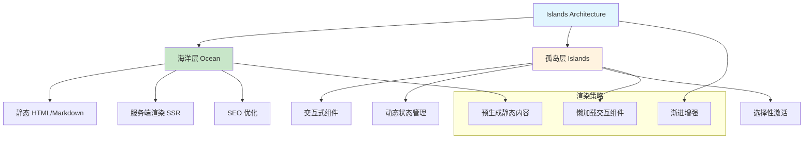
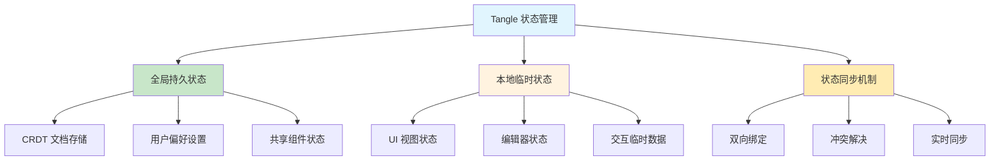
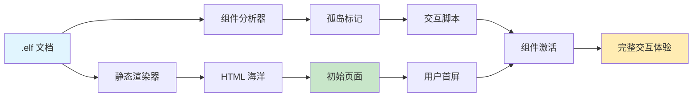
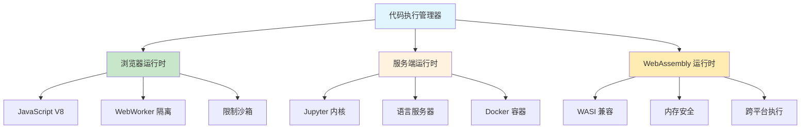
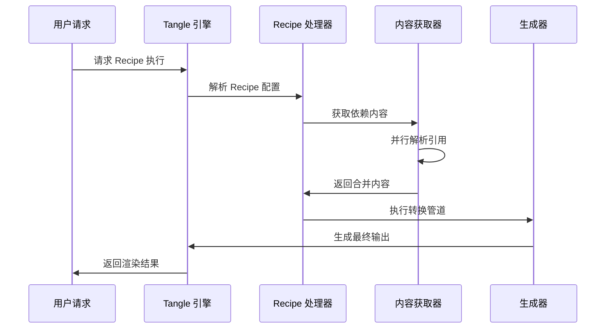
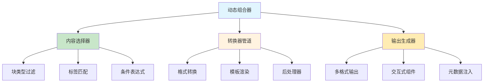
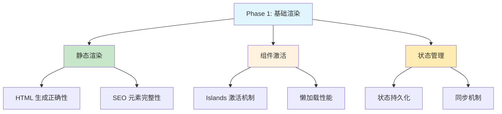
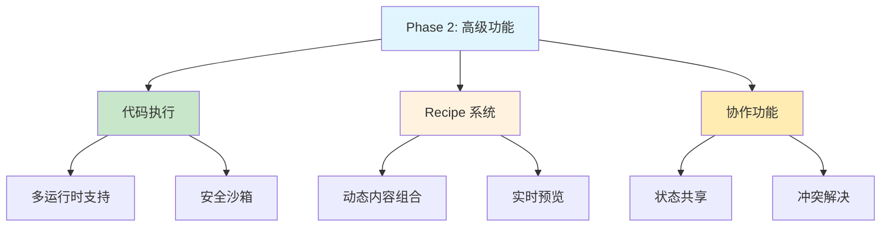

# Tangle 层实现策略

本文档阐述 Tangle 层的实现策略，专注于交互式渲染架构、Islands 模式应用、状态管理策略和运行时执行机制。Tangle 层为文档消费者提供丰富的交互体验。

## 1. 设计理念：Islands Architecture

### 1.1. Islands Architecture 策略设计

**核心设计理念**：平衡性能和交互性，实现最优的用户体验



**双层架构优势分析**：

| 架构层次 | 技术特性 | 性能优势 | 适用场景 |
|----------|----------|----------|----------|
| **海洋 (Ocean)** | 静态 HTML + 预渲染 | 极快首屏 + SEO 友好 | 文档内容、图表展示 |
| **孤岛 (Islands)** | 动态组件 + 状态管理 | 按需加载 + 交互丰富 | 代码执行器、表单控件 |
| **混合模式** | 渐进增强 + 智能缓存 | 最佳用户体验 | 复杂交互式文档 |

### 1.2. 状态管理策略

**分层状态设计架构**：



**状态管理核心策略**：

| 状态类型 | 存储策略 | 同步机制 | 生命周期 |
|----------|----------|----------|----------|
| **全局持久状态** | CRDT 文档 + 加密 | 实时网络同步 | 文档级别 |
| **本地临时状态** | 内存 + 会话存储 | 组件内部管理 | 会话级别 |
| **混合状态** | 智能缓存 + 选择性持久化 | 延迟同步 + 冲突解决 | 配置化 |

**核心接口设计**（详细实现见 API 文档）：
```rust
// Tangle 状态管理统一接口
interface TangleStateManagement {
    // 全局状态操作
    async fn pin_state(component_id: &str, state: ComponentState) -> ();
    async fn unpin_state(component_id: &str) -> ();
    
    // 本地状态操作
    fn set_local_state(key: &str, value: JsonValue) -> ();
    fn get_local_state(key: &str) -> Option<JsonValue>;
    
    // 状态同步
    async fn sync_pinned_state() -> SyncResult;
    fn subscribe_state_changes(callback: StateChangeCallback) -> SubscriptionId;
}
```

## 2. 组件渲染策略

### 2.1. 渐进增强渲染

**渲染管道设计**：



**组件激活策略**：

| 激活时机 | 触发条件 | 技术实现 | 性能考量 |
|----------|----------|----------|----------|
| **立即激活** | 关键交互组件 | 同步加载 | 影响首屏时间 |
| **可见时激活** | Intersection Observer | 懒加载 | 平衡性能和体验 |
| **交互时激活** | 用户首次点击 | 事件驱动 | 最优性能 |
| **预测性激活** | 用户行为分析 | 预加载 | 提升感知性能 |

### 2.2. 代码执行环境策略

**多运行时支持架构**：



**执行策略选择**：
- **客户端执行**：快速响应，适合轻量计算和可视化
- **服务端执行**：安全可靠，适合重型计算和数据处理
- **混合执行**：智能分发，平衡安全性和性能

## 3. Recipe 系统集成策略

### 3.1. 内容转换管道

**Recipe 执行流程设计**：



**关键实现策略**：
- **并行处理**：跨文档引用的并行获取和解析
- **缓存优化**：中间结果缓存和增量更新
- **错误恢复**：部分失败时的优雅降级
- **实时预览**：Recipe 编辑时的实时预览功能

### 3.2. 动态内容组合

**组合策略架构**：



## 4. 实施验证策略

### 4.1. 分阶段验证方法

**阶段一：基础渲染验证**



**阶段二：高级功能验证**



### 4.2. 关键性能指标

**性能基准目标**：

| 指标类型 | 目标值 | 测试场景 | 验证方法 |
|----------|--------|----------|----------|
| **首屏时间** | < 1.5s | 复杂交互文档 | Core Web Vitals |
| **组件激活** | < 200ms | Islands 懒加载 | 用户交互响应 |
| **状态同步** | < 100ms | 多用户协作 | 网络延迟测试 |
| **Recipe 执行** | < 2s | 中等复杂度转换 | 端到端时间 |

### 4.3. 验证清单

**Islands Architecture 验证**：
- [ ] **渐进增强**：页面在禁用 JavaScript 时仍可基础使用
- [ ] **组件激活**：Islands 组件按需激活，无性能阻塞
- [ ] **SEO 支持**：静态内容可被搜索引擎正确索引
- [ ] **可访问性**：符合 WCAG 2.1 AA 标准

**状态管理验证**：
- [ ] **状态持久化**：重要状态正确保存到 CRDT 文档
- [ ] **本地状态**：UI 状态在会话内正确维护
- [ ] **同步机制**：状态变更实时同步，冲突正确解决
- [ ] **性能优化**：状态更新不影响渲染性能

**代码执行验证**：
- [ ] **多运行时**：支持主流编程语言的代码执行
- [ ] **安全沙箱**：代码执行环境安全隔离，无安全风险
- [ ] **错误处理**：执行错误友好展示，不影响页面稳定性
- [ ] **资源管理**：执行资源有限制，防止滥用

**Recipe 系统验证**：
- [ ] **内容组合**：跨文档引用正确解析和组合
- [ ] **转换准确性**：内容转换结果符合预期
- [ ] **实时预览**：Recipe 编辑时预览实时更新
- [ ] **错误恢复**：引用失败时优雅降级

### 4.4. 实施优先级

**基础层（Foundation Layer）**：
- Islands Architecture 基础实现：建立海洋-孤岛渲染模式的核心架构
- 状态管理核心功能：实现全局持久状态和本地临时状态的基础管理
- 基本的组件激活机制：提供孤岛组件的懒加载和选择性激活能力
- *说明：这一层构成 Tangle 层的渲染基础，为文档消费者提供基本的交互能力*

**功能层（Feature Layer）**：
- 基于渲染架构的代码执行环境集成：在稳定渲染基础上集成多运行时代码执行
- 基于状态管理的 Recipe 系统完整实现：利用状态能力实现动态内容组合和转换
- 基于架构基础的协作状态同步：在组件激活机制上构建多用户状态共享
- *说明：这一层在渲染基础稳定后构建，提供完整的交互式文档体验*

**增强层（Enhancement Layer）**：
- 基于稳定功能的性能优化和缓存策略：进一步提升渲染性能和用户体验
- 基于完整渲染的高级 SEO 和可访问性功能：确保文档的搜索友好性和无障碍访问
- 基于成熟架构的扩展性和自定义组件支持：允许开发者创建定制化的交互组件
- *说明：这一层提供高级特性和体验优化，依赖于底层渲染架构的成熟度*

这个 Tangle 层实现策略确保了 ELFI 能够为文档消费者提供现代化的交互体验，同时保持优异的性能和可访问性。通过 Islands Architecture 和智能状态管理，Tangle 层成功地平衡了静态内容的快速加载和动态组件的丰富交互。
