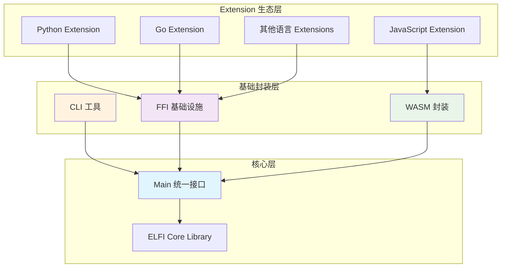
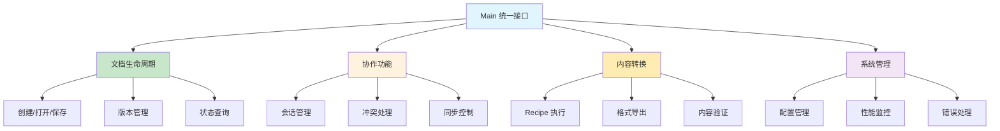
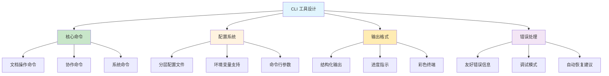
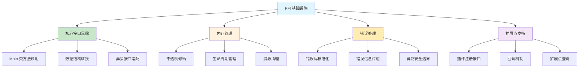
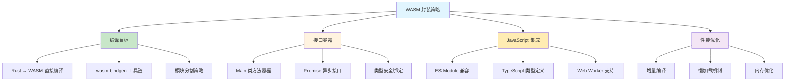

# 多语言封装实现策略

本文档阐述 ELFI 基础封装层的实现策略，包括 CLI 工具、FFI 基础设施和 WebAssembly 封装的技术方案。这些基础封装为 extension 系统和上层语言绑定提供核心支撑。

## 1. 架构概览：基础封装策略

### 1.1. 整体设计理念

ELFI 作为通用编程库，采用**分层封装**架构，基础封装层提供三种核心访问方式，上层具体语言绑定通过 extension 系统实现：



### 1.2. 核心原则

**统一接口抽象**：所有封装层都通过 `Main` 类访问核心功能，确保接口一致性
**最小封装原则**：基础封装层只负责协议转换和基础功能暴露，不包含业务逻辑
**扩展点预留**：为 extension 系统预留充分的扩展接口和定制能力
**并行开发策略**：三种封装方式相互独立，可以并行开发和部署

## 2. Main 类：统一接口抽象

### 2.1. 核心接口设计

**设计目标**：为所有基础封装提供统一、稳定的核心接口



**核心接口抽象**（详细实现见 API 文档）：
```rust
// Main 类核心接口 - 为所有封装层提供统一抽象
interface MainOperations {
    // 文档生命周期管理
    async fn new(config: ElfiConfig) -> Result<Self>;
    async fn open(uri: &str) -> Result<DocumentHandle>;
    async fn save(handle: &DocumentHandle, path: Option<&str>) -> Result<()>;
    
    // 内容转换和导出
    async fn export(uri: &str, recipe: &str, output: &str) -> Result<ExportResult>;
    async fn validate(uri: &str) -> Result<ValidationReport>;
    
    // 协作功能
    async fn start_collaboration(uri: &str, mode: CollaborationMode) -> Result<Session>;
    async fn join_collaboration(session_id: &str) -> Result<Session>;
    
    // 系统管理
    async fn get_status() -> Result<SystemStatus>;
    async fn shutdown() -> Result<()>;
}
```

### 2.2. 扩展点设计

**为 Extension 系统预留的接口**：

| 扩展点类型 | 接口设计 | Extension 用途 | 技术实现 |
|-----------|----------|---------------|----------|
| **自定义块类型** | register_block_type() | 添加新的内容类型 | 插件注册机制 |
| **转换器扩展** | register_transformer() | 自定义内容转换 | 转换器插件 |
| **协议适配器** | register_network_adapter() | 新网络协议支持 | 协议插件 |
| **语言绑定** | get_ffi_interface() | 特定语言的 API | FFI 接口暴露 |

## 3. CLI 工具封装策略

### 3.1. 命令行界面设计

**用户体验导向的设计**：



**核心命令设计策略**：

| 命令类别 | 命令示例 | 设计原则 | Main 类映射 |
|----------|----------|----------|-------------|
| **文档操作** | `elfi new`, `elfi open`, `elfi save` | 简洁直观 | 文档生命周期接口 |
| **内容转换** | `elfi export`, `elfi validate` | 功能明确 | 转换和验证接口 |
| **协作功能** | `elfi collaborate`, `elfi sync` | 状态清晰 | 协作管理接口 |
| **系统管理** | `elfi status`, `elfi config` | 信息丰富 | 系统管理接口 |

### 3.2. 配置管理策略

**多层配置优先级**：

1. **命令行参数**：最高优先级，覆盖所有其他配置
2. **环境变量**：次高优先级，适用于 CI/CD 环境
3. **项目配置文件**：项目特定设置
4. **用户配置文件**：个人偏好设置
5. **系统默认值**：保底配置

## 4. FFI 基础设施策略

### 4.1. C ABI 接口设计

**Extension 系统的基础设施**：



**关键设计策略**：

| 设计方面 | 实现策略 | 安全保证 | Extension 支持 |
|----------|----------|----------|----------------|
| **接口稳定性** | C ABI + 语义版本 | 向后兼容保证 | 稳定的扩展基础 |
| **内存安全** | 不透明句柄 + RAII | 防止内存泄漏 | 安全的资源管理 |
| **错误传播** | 结构化错误码 | 明确错误边界 | 可靠的错误处理 |
| **扩展机制** | 插件注册接口 | 安全的动态加载 | 灵活的功能扩展 |

**核心 FFI 接口**（详细实现见 API 文档）：
```c
// FFI 核心接口 - 为 Extension 系统提供 C ABI
typedef struct ElfiHandle* ElfiHandle;
typedef struct DocumentHandle* DocumentHandle;

// 生命周期管理
ElfiHandle elfi_init(const char* config_path);
int elfi_free(ElfiHandle handle);

// 核心功能接口
int elfi_open(ElfiHandle handle, const char* uri, DocumentHandle* out_doc);
int elfi_export(ElfiHandle handle, const char* source, const char* recipe, const char* output);
int elfi_validate(ElfiHandle handle, const char* uri);

// Extension 系统支持
int elfi_register_extension(ElfiHandle handle, const char* extension_path);
const char* elfi_get_extension_interface(const char* interface_name);
```

## 5. WebAssembly 封装策略

### 5.1. WASM 编译目标

**Web 平台的直接访问方式**：



**WASM 接口设计原则**：

- **直接映射**：直接暴露 Main 类的核心功能，不添加额外抽象层
- **异步友好**：所有操作返回 Promise，符合 JavaScript 异步模式
- **类型安全**：通过 wasm-bindgen 生成类型安全的 TypeScript 定义
- **模块化加载**：支持按需加载，减少初始包大小

### 5.2. Web 平台集成

**核心 WASM 接口**（详细实现见 API 文档）：
```rust
// WASM 接口 - 直接暴露 Main 类功能给 Web 平台
#[wasm_bindgen]
pub struct ElfiWasm {
    main: Main,
}

#[wasm_bindgen]
impl ElfiWasm {
    // 对应 Main 类的核心操作
    #[wasm_bindgen(constructor)]
    pub async fn new(config: Option<JsValue>) -> Result<ElfiWasm, JsValue>;
    
    #[wasm_bindgen]
    pub async fn open(&self, uri: &str) -> Result<JsValue, JsValue>;
    
    #[wasm_bindgen]
    pub async fn export(&self, source: &str, recipe: &str, output: &str) -> Result<JsValue, JsValue>;
    
    #[wasm_bindgen]
    pub async fn validate(&self, uri: &str) -> Result<JsValue, JsValue>;
    
    #[wasm_bindgen]
    pub async fn get_status(&self) -> Result<JsValue, JsValue>;
}
```

**Extension 集成支持**：
- Web 平台的 Extension 可以通过 JavaScript 实现
- 通过 WASM 接口注册自定义块类型和转换器
- 支持 Web Worker 中的后台处理

## 6. 实施层次和依赖关系

### 6.1. 实施层次

**基础层（Foundation Layer）**：
- Main 类统一接口设计：建立所有封装层的核心抽象和生命周期管理
- FFI 基础设施核心框架：实现 C ABI 和内存安全的基础机制
- CLI 工具基本命令结构：提供用户交互的基础命令和配置系统
- *说明：这一层构成基础封装的核心架构，为 Extension 系统提供稳定基础*

**功能层（Feature Layer）**：
- 基于统一接口的完整 CLI 功能：在 Main 类基础上构建完整的命令行工具
- 基于 FFI 框架的 Extension 注册机制：利用 C ABI 实现插件系统的核心能力
- 基于 Rust 编译链的 WASM 封装实现：直接编译 Main 类到 WebAssembly 目标
- *说明：这一层在基础架构稳定后构建，提供完整的基础封装功能*

**增强层（Enhancement Layer）**：
- 基于完整功能的性能优化和缓存策略：提升各封装层的性能和用户体验
- 基于 Extension 机制的社区生态支持：为第三方开发者提供完整的扩展能力
- 基于成熟封装的高级工具和调试支持：提供开发和运维工具链
- *说明：这一层提供高级特性和生态支持，依赖于底层封装架构的成熟度*

### 6.2. 关键技术决策

**并行开发策略**：
- CLI、FFI、WASM 三种封装方式相互独立，可以并行开发
- 各封装层都直接基于 Main 类，不存在相互依赖关系
- Extension 系统主要依赖 FFI 基础设施，但也可通过 WASM 在 Web 平台扩展

**扩展点预留**：
- 所有封装层都预留了 Extension 注册和查询接口
- 为未来的语言绑定和功能扩展提供充分的灵活性
- 保持接口稳定性，支持 Extension 生态的长期发展

## 7. 验证清单

### 7.1. 统一接口验证
- [ ] **Main 类设计**：接口覆盖完整，抽象合理，生命周期管理正确
- [ ] **接口稳定性**：C ABI 兼容，语义版本控制，向后兼容保证
- [ ] **错误处理**：错误传播机制统一，错误信息友好，调试支持充分
- [ ] **扩展点设计**：Extension 接口完整，注册机制安全，查询功能可靠

### 7.2. CLI 工具验证
- [ ] **用户体验**：命令设计直观，参数验证友好，输出格式清晰
- [ ] **配置管理**：多层配置优先级正确，环境变量支持完整
- [ ] **跨平台兼容**：在主流操作系统上运行稳定，路径处理正确
- [ ] **Extension 集成**：支持通过 CLI 管理和使用 Extension

### 7.3. FFI 基础设施验证
- [ ] **内存安全**：无内存泄漏，正确处理所有资源生命周期
- [ ] **接口稳定性**：C ABI 兼容性，跨编译器和平台的一致性
- [ ] **Extension 支持**：插件加载机制安全，注册接口完整
- [ ] **性能要求**：跨语言调用开销在可接受范围内（< 1ms）

### 7.4. WASM 封装验证
- [ ] **编译正确性**：Rust 到 WASM 编译无错误，接口暴露完整
- [ ] **JavaScript 集成**：Promise 异步模式，TypeScript 类型安全
- [ ] **性能表现**：模块加载时间合理，运行时性能满足要求
- [ ] **Web Extension 支持**：Web 平台的 Extension 机制工作正常

基础封装层为 ELFI 作为通用编程库提供了稳定、高效的访问方式。通过 CLI、FFI 和 WASM 三种基础封装，结合 Extension 系统的扩展能力，ELFI 能够支持丰富的语言生态和使用场景，同时保持核心架构的简洁和稳定。