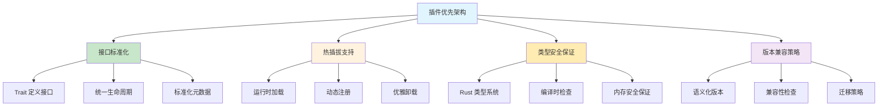
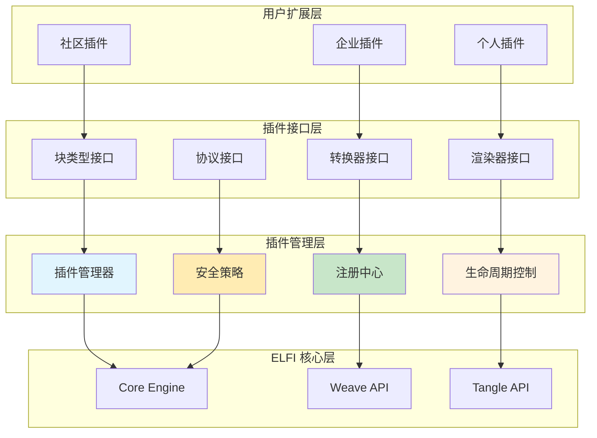
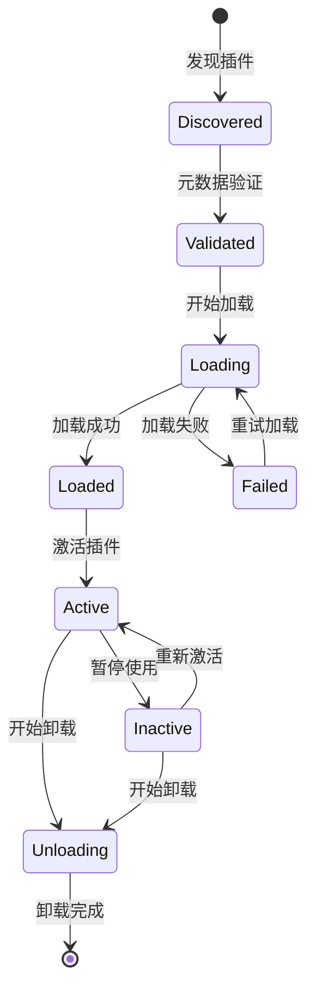
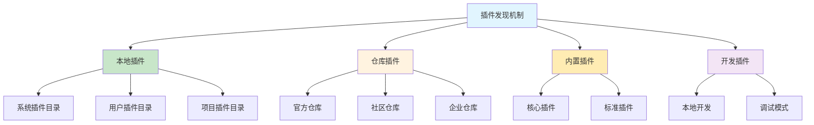
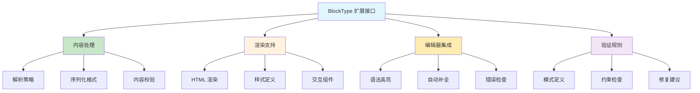
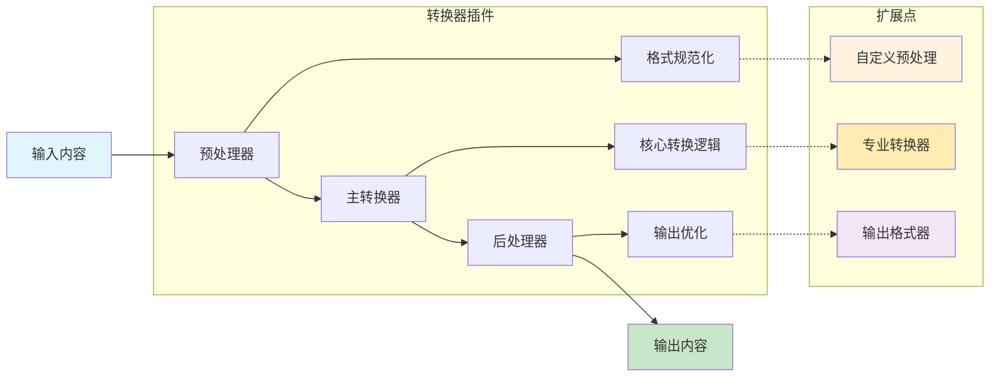
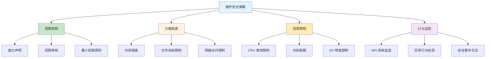
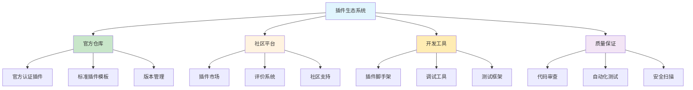
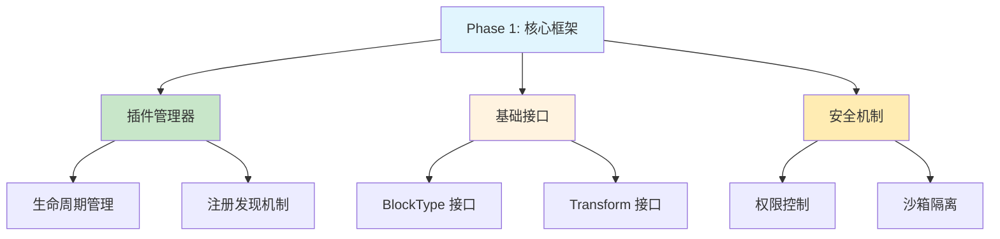
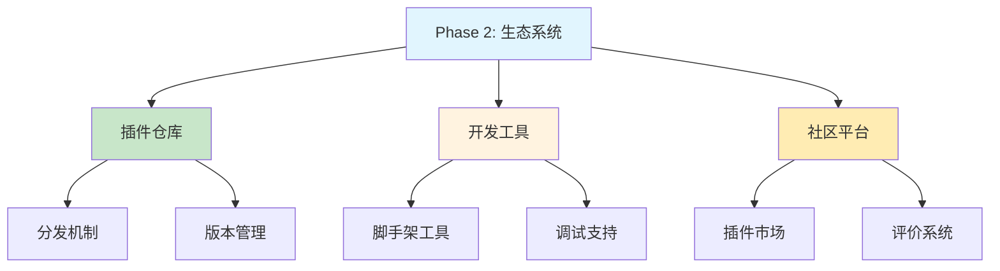

# 插件系统实现策略

本文档阐述 ELFI 插件扩展系统的实现策略，包括插件架构设计、扩展接口定义、安全机制和生态系统管理。

## 1. 设计理念：开放式可扩展架构

### 1.1. 插件优先的设计理念

**核心设计原则**：ELFI 采用**插件优先**的架构设计，核心功能通过标准化接口实现，为第三方扩展提供一级支持



**可扩展性策略分析**：

| 扩展维度 | 设计策略 | 实现机制 | 应用场景 |
|----------|----------|----------|----------|
| **块类型扩展** | Trait 接口 + 注册机制 | BlockType trait | 自定义内容类型 |
| **转换器扩展** | 管道模式 + 插件链 | Transform trait | 专业格式转换 |
| **渲染器扩展** | 主题系统 + 模板 | Renderer trait | 定制输出样式 |
| **协议扩展** | 适配器模式 | NetworkAdapter trait | 新网络协议支持 |

### 1.2. 插件生态系统架构

**分层扩展架构设计**：



## 2. 插件管理器实现策略

### 2.1. 插件生命周期管理策略

**插件状态管理设计**：



**关键管理策略**：

| 生命周期阶段 | 管理策略 | 技术实现 | 错误处理 |
|-------------|----------|----------|----------|
| **发现阶段** | 自动扫描 + 手动注册 | 文件系统监控 | 忽略无效插件 |
| **验证阶段** | 元数据检查 + 依赖分析 | JSON Schema 验证 | 详细错误报告 |
| **加载阶段** | 动态链接 + 初始化 | libloading + 安全沙箱 | 资源清理 |
| **运行阶段** | 状态监控 + 性能追踪 | 健康检查 + 降级策略 | 优雅降级 |

### 2.2. 插件注册与发现机制

**多源插件发现策略**：



**核心管理接口设计**（详细实现见 API 文档）：
```rust
// 插件管理器核心接口抽象
interface PluginManagerOperations {
    // 插件发现和加载
    async fn discover_plugins(source: PluginSource) -> Vec<PluginDescriptor>;
    async fn load_plugin(descriptor: &PluginDescriptor) -> Result<PluginHandle>;
    async fn unload_plugin(handle: PluginHandle) -> Result<()>;
    
    // 插件注册和查询
    fn register_plugin<T: PluginTrait>(plugin: T) -> ();
    fn get_plugins_by_capability(capability: PluginCapability) -> Vec<PluginHandle>;
    
    // 生命周期管理
    async fn activate_plugin(handle: PluginHandle) -> Result<()>;
    async fn deactivate_plugin(handle: PluginHandle) -> Result<()>;
    fn get_plugin_status(handle: PluginHandle) -> PluginStatus;
}
```

## 3. 扩展接口定义策略

### 3.1. 块类型扩展接口

**自定义块类型支持策略**：



**扩展策略设计**：

| 扩展方面 | 实现策略 | 接口设计 | 集成难度 |
|----------|----------|----------|----------|
| **内容解析** | 自定义解析器 + 标准输出 | parse() -> Content | 中等 |
| **渲染输出** | 模板系统 + CSS 样式 | render() -> Html | 简单 |
| **编辑器支持** | Language Server Protocol | language_features() | 复杂 |
| **验证逻辑** | 规则引擎 + 自定义验证器 | validate() -> Errors | 中等 |

**核心接口定义**（详细实现见 API 文档）：
```rust
// 自定义块类型接口抽象
trait CustomBlockType {
    // 块类型标识
    fn type_name() -> &'static str;
    fn display_name() -> &'static str;
    fn description() -> &'static str;
    
    // 内容处理
    fn parse_content(raw: &str) -> Result<BlockContent>;
    fn serialize_content(content: &BlockContent) -> String;
    
    // 渲染支持
    fn render_html(content: &BlockContent) -> Html;
    fn render_preview(content: &BlockContent) -> PreviewHtml;
    
    // 编辑器集成
    fn get_syntax_highlighting() -> SyntaxDefinition;
    fn get_completion_items(context: &EditContext) -> Vec<CompletionItem>;
    
    // 验证规则
    fn validate_content(content: &BlockContent) -> ValidationResult;
    fn suggest_fixes(errors: &[ValidationError]) -> Vec<Fix>;
}
```

### 3.2. 转换器扩展接口

**内容转换管道策略**：



### 3.3. 渲染器扩展接口

**主题和渲染定制策略**：

- **模板引擎集成**：支持 Handlebars/Tera 等模板系统
- **样式系统**：CSS-in-JS 和预处理器支持
- **组件库**：可复用的 UI 组件和布局
- **主题管理**：动态主题切换和自定义样式

## 4. 安全和沙箱机制策略

### 4.1. 插件安全策略

**多层安全防护设计**：



**安全策略实施要点**：

| 安全层面 | 防护策略 | 技术实现 | 监控机制 |
|----------|----------|----------|----------|
| **权限控制** | 声明式权限 + 动态检查 | Capability-based security | 权限使用审计 |
| **内存安全** | Rust 安全特性 + 边界检查 | 类型系统 + 运行时检查 | 内存泄漏检测 |
| **资源限制** | Cgroup + 配额管理 | 系统级资源控制 | 资源使用监控 |
| **行为分析** | 异常检测 + 模式识别 | 机器学习 + 规则引擎 | 实时告警系统 |

### 4.2. 沙箱运行环境

**隔离执行策略**：
- **进程隔离**：每个插件在独立进程中运行
- **文件系统隔离**：限制插件的文件访问范围
- **网络隔离**：控制插件的网络访问权限
- **资源监控**：实时监控插件的资源使用情况

## 5. 插件生态系统管理

### 5.1. 插件仓库和分发策略

**生态系统构建策略**：



### 5.2. 版本兼容性管理

**向后兼容策略**：
- **语义化版本**：遵循 SemVer 规范进行版本管理
- **API 稳定性**：保证公开接口的向后兼容性
- **渐进式迁移**：提供平滑的版本升级路径
- **兼容性测试**：自动化的兼容性验证流程

### 5.3. 插件开发支持

**开发者工具链**：
- **脚手架工具**：快速创建插件项目模板
- **开发文档**：详细的 API 文档和最佳实践
- **调试支持**：插件开发的调试和性能分析工具
- **社区支持**：开发者论坛和技术支持渠道

## 6. 实施验证策略

### 6.1. 分阶段验证方法

**阶段一：核心框架验证**



**阶段二：生态系统验证**



### 6.2. 验证清单

**核心框架验证**：
- [ ] **插件管理器**：插件加载、卸载和状态管理功能完整
- [ ] **接口设计**：扩展接口提供足够的灵活性和功能覆盖
- [ ] **安全机制**：权限控制和沙箱隔离有效防护恶意插件
- [ ] **性能影响**：插件系统对核心性能影响在可接受范围内

**扩展接口验证**：
- [ ] **BlockType 扩展**：自定义块类型的完整生命周期支持
- [ ] **Transform 扩展**：转换器插件的管道集成和错误处理
- [ ] **Renderer 扩展**：渲染器插件的主题系统和样式定制
- [ ] **Protocol 扩展**：网络协议扩展的适配器模式实现

**安全策略验证**：
- [ ] **权限控制**：细粒度权限管理和运行时权限检查
- [ ] **沙箱隔离**：进程、文件系统和网络的有效隔离
- [ ] **资源限制**：CPU、内存和 I/O 资源的配额管理
- [ ] **行为监控**：异常行为检测和安全事件响应

**生态系统验证**：
- [ ] **仓库系统**：插件发布、发现和安装流程完整
- [ ] **开发工具**：脚手架、调试和测试工具功能完整
- [ ] **版本管理**：语义化版本和兼容性检查机制
- [ ] **社区平台**：插件市场、评价和支持系统运行正常

### 6.3. 性能基准

**插件系统性能指标**：

| 性能指标 | 目标值 | 测试场景 | 验证方法 |
|----------|--------|----------|----------|
| **插件加载时间** | < 500ms | 标准插件加载 | 启动时间测量 |
| **运行时开销** | < 5% | 插件密集使用 | CPU 和内存分析 |
| **安全检查延迟** | < 10ms | 权限验证 | 微基准测试 |
| **插件通信延迟** | < 1ms | 跨插件调用 | IPC 性能测试 |

### 6.4. 实施优先级

**基础层（Foundation Layer）**：
- 插件管理器基础架构：建立插件加载、卸载和生命周期管理的核心框架
- BlockType 和 Transform 扩展接口：提供最重要的内容类型和转换扩展能力
- 基础安全和权限控制机制：确保插件系统的安全运行和权限隔离
- *说明：这一层构成插件系统的核心基础，为第三方扩展提供安全可靠的运行环境*

**功能层（Feature Layer）**：
- 基于安全机制的完整沙箱和资源限制：在权限控制基础上构建全面的安全隔离
- 基于管理器的 Renderer 和 Protocol 扩展接口：利用成熟的管理框架支持更多扩展类型
- 基于安全基础的插件仓库和分发系统：在可信环境下构建插件生态的流通机制
- *说明：这一层在基础框架稳定后构建，提供完整的插件生态系统功能*

**增强层（Enhancement Layer）**：
- 基于完整安全的高级监控和异常检测：提供深度的插件行为分析和安全防护
- 基于生态系统的开发工具链和社区平台：为插件开发者提供完整的开发和分发支持
- 基于成熟架构的性能优化和扩展性增强：进一步提升插件系统的性能和承载能力
- *说明：这一层提供高级特性和生态支持，依赖于底层插件架构的成熟度*

插件扩展系统确保了 ELFI 具备强大的可扩展性，能够适应不断变化的用户需求和技术发展。通过标准化的接口设计、完善的安全机制和健全的生态系统，ELFI 可以构建一个繁荣的插件生态，为用户提供丰富的功能扩展和定制选项。