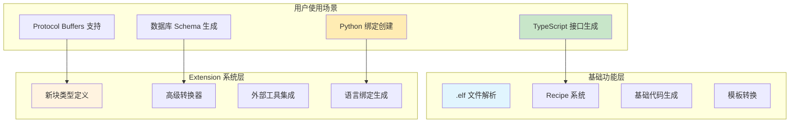
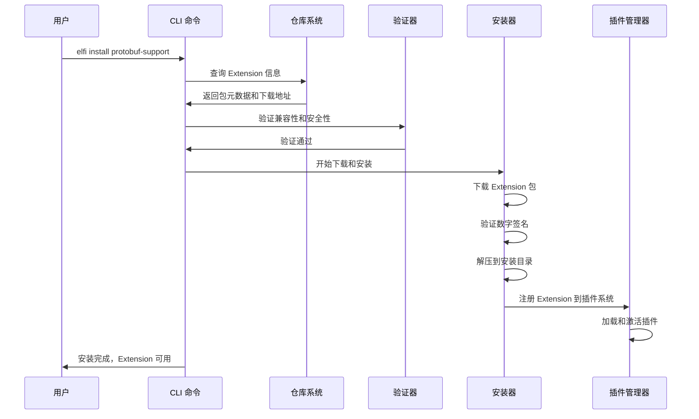
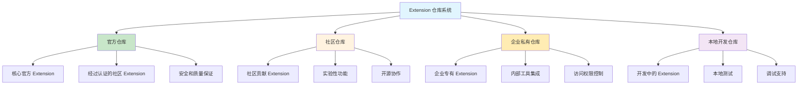
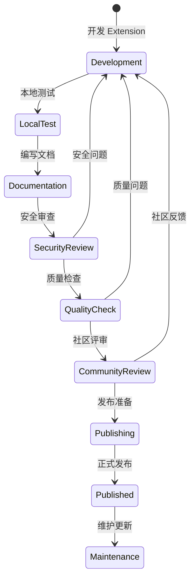
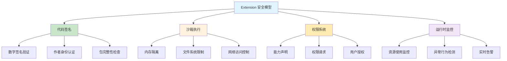

# Extension 安装机制：`elfi install` 命令系统

本文档详细阐述 `elfi install` 命令的实现策略，包括 Extension 包管理、安装流程、安全验证和生态系统集成。这与基础的代码生成功能相互补充，为 ELFI 提供强大的扩展能力。

## 1. 设计理念：Extension vs 基础功能

### 1.1. 功能边界定义

**基础代码生成** vs **Extension 系统**的明确区分：



**核心设计原则**：

| 功能类型 | 基础代码生成 | Extension 系统 |
|----------|-------------|---------------|
| **实现方式** | .elf 文件 + Recipe | `elfi install` + 插件动态加载 |
| **扩展能力** | 配置驱动的模板转换 | 可编程的核心功能扩展 |
| **安装需求** | 零依赖，开箱即用 | 需要安装和管理外部 Extension |
| **适用场景** | 标准代码生成任务 | 复杂的领域特定功能 |
| **开发复杂度** | 简单的 YAML 配置 | 完整的 Rust 插件开发 |

### 1.2. Extension 系统价值

Extension 系统在基础功能上提供的核心价值：

- **功能扩展**：添加 ELFI 核心不支持的新块类型、转换器、渲染器
- **生态集成**：与现有工具链和开发环境的深度集成
- **领域专业化**：针对特定领域（如区块链、机器学习）的专业功能
- **社区贡献**：允许社区开发者贡献专业插件

## 2. `elfi install` 命令设计

### 2.1. 命令接口设计

**核心命令结构**：

```bash
# 基本安装命令
elfi install <extension-name>              # 从官方仓库安装
elfi install <author>/<extension-name>     # 指定作者安装
elfi install <git-url>                     # 从 Git 仓库安装
elfi install <local-path>                  # 本地路径安装

# 高级安装选项
elfi install <extension> --version 1.2.3   # 指定版本
elfi install <extension> --global          # 全局安装
elfi install <extension> --dev             # 开发模式安装
elfi install <extension> --force           # 强制重新安装

# 管理命令
elfi list                                  # 列出已安装的 Extension
elfi update <extension>                    # 更新 Extension
elfi remove <extension>                    # 卸载 Extension
elfi search <keyword>                      # 搜索 Extension

# 开发命令
elfi publish                               # 发布 Extension
elfi pack                                  # 打包 Extension
elfi init-extension                        # 创建新的 Extension 项目
```

### 2.2. Extension 包格式规范

**Extension 包结构**：

```
my-extension/
├── extension.toml          # Extension 元数据
├── src/
│   ├── lib.rs             # 主要实现代码
│   ├── block_types.rs     # 自定义块类型
│   ├── transformers.rs    # 转换器实现
│   └── renderers.rs       # 渲染器实现
├── templates/             # 模板文件
│   ├── code-gen.hbs
│   └── docs.md.hbs
├── tests/                 # 测试文件
├── docs/                  # 文档
├── examples/              # 示例
└── Cargo.toml            # Rust 项目配置
```

**extension.toml 元数据格式**：

```toml
[extension]
name = "protobuf-support"
version = "1.0.0"
description = "Protocol Buffers support for ELFI"
authors = ["community@elfi.dev"]
license = "MIT"
repository = "https://github.com/elfi-extensions/protobuf-support"
documentation = "https://docs.elfi.dev/extensions/protobuf-support"

# ELFI 兼容性
[compatibility]
elfi_version = ">=1.0.0, <2.0.0"
api_version = "1.0"

# Extension 能力声明
[capabilities]
block_types = ["proto_message", "proto_service", "proto_enum"]
transformers = ["protobuf_compiler", "grpc_generator"]
renderers = ["proto_docs"]
network_protocols = []

# 依赖声明
[dependencies]
protobuf = "3.0"
tonic = "0.8"

# 安全和权限
[permissions]
file_system = ["read", "write"]  # 文件系统权限
network = ["http", "grpc"]       # 网络访问权限
external_commands = ["protoc"]   # 外部命令执行

# 安装配置
[installation]
platforms = ["linux", "macos", "windows"]
architectures = ["x86_64", "aarch64"]
system_dependencies = ["protoc >= 3.15.0"]

# Extension 配置
[configuration]
default_proto_path = "./proto"
default_output_path = "./generated"
protoc_plugins = ["grpc", "grpc-web"]
```

### 2.3. 安装流程设计

**完整安装工作流**：



## 3. Extension 仓库系统

### 3.1. 多层仓库架构

**仓库层次结构**：



**仓库配置管理**：

```toml
# ~/.elfi/config.toml
[repositories]
# 官方仓库 - 默认启用
official = { url = "https://extensions.elfi.dev", priority = 10, enabled = true }

# 社区仓库
community = { url = "https://community.elfi.dev", priority = 5, enabled = true }

# 企业仓库 - 需要认证
enterprise = { url = "https://internal.company.com/elfi", priority = 8, enabled = true, auth = "token" }

# 本地开发仓库
local-dev = { path = "./dev-extensions", priority = 1, enabled = true }

[auth]
enterprise = { token = "your-enterprise-token" }
```

### 3.2. Extension 发布流程

**发布到官方仓库的流程**：



**发布命令和工作流**：

```bash
# Extension 开发者工作流
elfi init-extension my-awesome-extension    # 创建新项目
cd my-awesome-extension

# 开发和测试
elfi test                                  # 运行测试
elfi lint                                  # 代码检查
elfi pack                                  # 本地打包

# 发布准备
elfi validate-extension                    # 验证 Extension 合规性
elfi generate-docs                         # 生成文档

# 发布到仓库
elfi publish --repository official        # 发布到官方仓库
elfi publish --repository community       # 发布到社区仓库
elfi publish --private --repository enterprise  # 发布到企业仓库
```

## 4. 安全和权限管理

### 4.1. Extension 安全模型

**多层安全防护策略**：



**权限声明和验证**：

```toml
# extension.toml 中的权限声明
[permissions]
# 文件系统权限
file_system = [
    "read:./input/**",      # 只能读取输入目录
    "write:./output/**",    # 只能写入输出目录
]

# 网络权限
network = [
    "https://api.example.com/**",  # 特定 API 访问
    "grpc://localhost:50051",      # 本地 gRPC 服务
]

# 外部命令权限
external_commands = [
    "protoc --version",            # 允许执行特定命令
    "git status",                  # Git 状态查询
]

# 系统资源限制
[resource_limits]
max_memory = "100MB"               # 内存使用限制
max_cpu_time = "30s"               # CPU 时间限制
max_file_size = "10MB"             # 单文件大小限制
```

### 4.2. 用户授权和管理

**权限管理界面**：

```bash
# 查看 Extension 权限
elfi permissions protobuf-support
# Extension: protobuf-support
# 请求权限:
#   - 文件系统: 读取 ./proto/**, 写入 ./generated/**
#   - 网络访问: https://googleapis.com/proto/**
#   - 外部命令: protoc, grpc_tools_node_protoc
# 状态: 已授权
# 授权时间: 2024-01-15T10:30:00Z

# 管理权限
elfi permissions grant protobuf-support    # 授权
elfi permissions revoke protobuf-support   # 撤销权限
elfi permissions review                    # 审查所有权限
```

## 5. Extension 开发支持

### 5.1. 开发工具链

**Extension 开发脚手架**：

```bash
# 创建新的 Extension 项目
elfi init-extension --template basic my-extension
elfi init-extension --template transformer my-transformer
elfi init-extension --template renderer my-renderer
elfi init-extension --template full-featured my-advanced-extension
```

**生成的项目结构**：

```rust
// src/lib.rs - Extension 主入口
use elfi_extension::{Extension, ExtensionContext, Result};

pub struct MyExtension;

#[elfi_extension::extension]
impl Extension for MyExtension {
    fn name(&self) -> &'static str {
        "my-extension"
    }
    
    fn version(&self) -> &'static str {
        "1.0.0"
    }
    
    async fn initialize(&mut self, context: &mut ExtensionContext) -> Result<()> {
        // 注册自定义块类型
        context.register_block_type("my_custom_type", Box::new(MyCustomBlockType))?;
        
        // 注册转换器
        context.register_transformer("my_transformer", Box::new(MyTransformer))?;
        
        Ok(())
    }
    
    async fn shutdown(&mut self) -> Result<()> {
        // 清理资源
        Ok(())
    }
}

// 自定义块类型实现
struct MyCustomBlockType;

impl BlockType for MyCustomBlockType {
    fn type_name(&self) -> &str {
        "my_custom_type"
    }
    
    fn parse_content(&self, content: &str) -> Result<BlockContent> {
        // 解析逻辑
        Ok(BlockContent::new(content))
    }
    
    fn render_html(&self, content: &BlockContent) -> String {
        // 渲染逻辑
        format!("<div class='my-custom'>{}</div>", content.as_str())
    }
}
```

### 5.2. 调试和测试支持

**开发模式安装**：

```bash
# 开发模式安装 - 支持热重载
elfi install ./my-extension --dev

# 调试模式运行
elfi --debug --extension-log debug run my-command

# 测试 Extension
cd my-extension
elfi test-extension
elfi test-extension --integration
```

## 6. 实际使用示例

### 6.1. Protocol Buffers Extension

**安装和使用**：

```bash
# 安装 Protocol Buffers 支持
elfi install protobuf-support

# 现在可以在 .elf 文件中使用新的块类型
```

```elf
---
id: proto-definition
type: proto_message  # Extension 提供的新类型
name: user-proto
attributes:
  package: com.example.user
  version: "v1"
---
syntax = "proto3";

package com.example.user;

message User {
  string id = 1;
  string username = 2;
  string email = 3;
  UserProfile profile = 4;
}

message UserProfile {
  string first_name = 1;
  string last_name = 2;
  repeated string tags = 3;
}

---
id: proto-service
type: proto_service  # Extension 提供的服务类型
name: user-service
attributes:
  package: com.example.user
---
service UserService {
  rpc GetUser(GetUserRequest) returns (User);
  rpc CreateUser(CreateUserRequest) returns (User);
  rpc UpdateUser(UpdateUserRequest) returns (User);
  rpc DeleteUser(DeleteUserRequest) returns (Empty);
}

---
id: proto-generator
type: recipe
name: protobuf-codegen
---
name: "protobuf-code-generator"
version: "1.0.0"

selector:
  types: ["proto_message", "proto_service"]  # 选择 Extension 定义的类型

transform:
  - type: "protobuf_compiler"  # Extension 提供的转换器
    action: "generate_code"
    config:
      languages: ["typescript", "python", "go"]
      output_format: "modules"
      grpc_support: true

output:
  format: "multi"
  typescript: "./generated/ts/"
  python: "./generated/py/"
  go: "./generated/go/"
```

**执行代码生成**：

```bash
# 使用 Extension 增强的功能生成代码
elfi export user-api.elf protobuf-codegen ./output/

# Extension 会生成多种语言的代码和 gRPC 客户端
# ./output/ts/user_pb.ts, user_grpc_web_pb.ts
# ./output/py/user_pb2.py, user_pb2_grpc.py  
# ./output/go/user.pb.go, user_grpc.pb.go
```

### 6.2. 数据库 Schema Extension

**安装和配置**：

```bash
# 安装数据库 Schema 支持
elfi install database-schema

# 配置数据库连接
elfi config set database.default_url "postgresql://localhost:5432/mydb"
```

**在 .elf 文件中定义数据库模型**：

```elf
---
id: user-model
type: database_model  # Extension 提供的类型
name: user-table
attributes:
  table_name: "users"
  database: "postgresql"
---
table users {
  id uuid primary key default gen_random_uuid(),
  username varchar(50) unique not null,
  email varchar(255) unique not null,
  password_hash varchar(255) not null,
  created_at timestamp default now(),
  updated_at timestamp default now()
}

index idx_users_email on users(email);
index idx_users_username on users(username);

---
id: migration-recipe
type: recipe
name: database-migration
---
name: "database-migration-generator"

selector:
  types: ["database_model"]

transform:
  - type: "schema_differ"  # Extension 提供的转换器
    action: "generate_migration"
    config:
      migration_type: "incremental"
      
output:
  format: "sql"
  filename: "{{timestamp}}_{{table_name}}_migration.sql"
```

**生成迁移文件**：

```bash
# 生成数据库迁移
elfi migrate generate user-schema.elf

# 应用迁移
elfi migrate apply
```

## 7. 实施优先级和验证

### 7.1. 实施层次

**基础层（Foundation Layer）**：
- Extension 包格式和元数据规范：建立标准化的 Extension 打包和描述格式
- 基础的 `elfi install` 命令实现：提供从仓库下载、安装和管理 Extension 的核心能力
- Extension 注册到插件系统的接口：确保 Extension 能够正确集成到 ELFI 核心功能
- *说明：这一层建立 Extension 生态的基础设施，为第三方开发者提供标准化的扩展机制*

**功能层（Feature Layer）**：
- 基于基础设施的完整仓库系统：在安装机制基础上构建官方、社区、企业多层仓库
- 基于注册接口的安全权限管理：利用插件集成能力实现细粒度的权限控制和沙箱隔离
- 基于包管理的开发工具链：提供 Extension 开发、测试、发布的完整工具支持
- *说明：这一层在基础设施稳定后构建，提供完整的 Extension 生态系统功能*

**增强层（Enhancement Layer）**：
- 基于权限系统的高级安全监控：提供运行时行为分析和异常检测能力
- 基于仓库系统的社区平台集成：构建 Extension 市场、评价、支持等生态服务
- 基于成熟工具链的性能优化和扩展性增强：提升 Extension 加载性能和系统承载能力
- *说明：这一层提供高级特性和生态支持，依赖于底层 Extension 架构的成熟度*

### 7.2. 验证清单

**安装机制验证**：
- [ ] **命令接口**：`elfi install` 命令支持多种安装方式和参数选项
- [ ] **包格式**：Extension 包格式规范明确，元数据验证完整
- [ ] **安装流程**：下载、验证、安装、注册的完整流程正常工作
- [ ] **错误处理**：安装失败时的错误信息清晰，回滚机制可靠

**仓库系统验证**：
- [ ] **多层仓库**：支持官方、社区、企业、本地多种仓库类型
- [ ] **仓库配置**：仓库优先级、认证、启用状态配置正确工作
- [ ] **包索引**：Extension 搜索、查询、版本管理功能完整
- [ ] **发布流程**：Extension 发布、审核、分发机制运行正常

**安全机制验证**：
- [ ] **权限控制**：Extension 权限声明、验证、执行限制有效
- [ ] **数字签名**：Extension 包签名验证和作者认证机制可靠
- [ ] **沙箱隔离**：Extension 运行时隔离和资源限制正常工作
- [ ] **监控告警**：异常行为检测和安全事件响应及时有效

**开发支持验证**：
- [ ] **脚手架工具**：Extension 项目创建、模板生成功能完整
- [ ] **调试支持**：开发模式安装、热重载、日志调试功能正常
- [ ] **测试框架**：Extension 单元测试、集成测试工具可用
- [ ] **文档工具**：API 文档生成、示例创建、发布准备工具完整

Extension 安装机制为 ELFI 构建了强大的生态扩展能力。通过标准化的包格式、安全的安装流程和完善的开发支持，Extension 系统与基础的代码生成功能形成完美互补，使 ELFI 能够适应各种复杂的使用场景和专业需求。