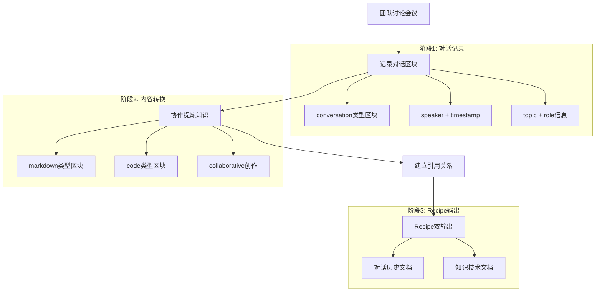

# 用例场景 02: 对话即文档 (Conversation as Document)

本用例展示如何将团队协作对话转换为结构化的技术文档，同时保留完整的讨论历史和决策追溯能力。

- **核心目标**: 演示 `elfi` 如何处理复杂的内容转换流程：从原始对话记录，通过协作提炼，最终生成两种格式的文档输出（完整对话历史 + 结构化知识文档）。

## 📁 关联的示例文件

**[conversation.elf](./conversation.elf)** - 完整的对话转文档示例

这个文件展示了一个真实的API设计讨论场景，包含：
- **对话区块** (`type: conversation`): 记录Alice、Bob、Charlie的技术讨论
- **知识区块** (`type: markdown`): 从对话中提炼的设计决策文档  
- **代码区块** (`type: code`): 讨论产生的JWT认证实现
- **链接区块** (`type: link`): 建立对话与知识的可追溯关系
- **Recipe配置**: 定义两种输出格式的转换规则

## 工作原理

### 三阶段转换流程



### 1. 对话记录阶段

团队成员在会议中使用 `conversation` 类型的区块记录实时讨论：

```yaml
---
id: <uuid>
type: conversation  # 用户定义的区块类型
name: alice-opens-discussion
metadata:
  speaker: "Alice"
  timestamp: "2024-01-15T14:00:00Z"
  topic: "API认证方案"
  role: "Product Manager"
---
大家好！今天我们需要为新的用户管理API设计认证方案...
```

### 2. 内容转换阶段

基于对话内容，团队协作创建知识区块，提炼关键决策：

```yaml
---
id: <uuid>
type: markdown
name: api-design-decision
metadata:
  derived_from: ["alice-opens-discussion", "bob-suggests-jwt", "charlie-security-concerns"]
  contributors: ["Alice", "Bob", "Charlie"]
---
# API认证方案设计决策

基于团队技术讨论，我们选择**JWT认证方案**...
```

### 3. Recipe双输出阶段

通过两个不同的Recipe配置，生成针对不同需求的文档：

- **对话历史Recipe**: 保留完整时间线和发言者信息
- **知识提取Recipe**: 生成结构化的技术决策文档

## 使用流程演示

### 步骤1: 记录团队讨论

```bash
# 开始API设计讨论会议
elfi open elf://my-project/api-discussion

# Alice记录开场问题
elfi add block --type conversation --name alice-question
# 编辑内容：记录产品需求和技术问题

# Bob记录技术建议  
elfi add block --type conversation --name bob-jwt-suggestion
# 编辑内容：JWT方案的技术细节

# Charlie记录安全考虑
elfi add block --type conversation --name charlie-security
# 编辑内容：安全要求和防护措施

# Alice记录最终决策
elfi add block --type conversation --name alice-decision
# 编辑内容：确定的技术方案和实施计划
```

### 步骤2: 协作提炼知识

```bash
# 创建设计决策文档
elfi add block --type markdown --name design-decision
# 编辑内容：基于对话整理的技术决策

# 添加实现代码
elfi add block --type code --name jwt-implementation  
# 编辑内容：Bob讨论中提到的JWT实现

# 建立追溯关系
elfi link design-decision alice-question,bob-jwt-suggestion,charlie-security,alice-decision --type derived_from
elfi link jwt-implementation design-decision --type implements
```

### 步骤3: 生成双格式输出

```bash
# 生成完整对话历史
elfi export --recipe conversation-history ./conversation-log.md
# 输出：带时间线的完整会议记录

# 生成技术决策文档  
elfi export --recipe knowledge-extract ./api-design.md
# 输出：结构化的技术文档，包含决策、代码和追溯信息
```

## 输出示例对比

### 对话历史文档 (conversation-log.md)

```markdown
# API Authentication Design Discussion - 对话记录

**会议信息**:
- 日期: 2024-01-15
- 参与者: Alice, Bob, Charlie
- 类型: 技术设计讨论

## 对话时间线

## 2024-01-15T14:00:00Z - Alice (Product Manager)

**话题**: API认证方案

大家好！今天我们需要为新的用户管理API设计认证方案。目前我们有以下需求：
1. 支持Web端和移动端应用...

---

## 2024-01-15T14:05:00Z - Bob (Backend Developer)

**话题**: JWT认证方案

我建议使用JWT (JSON Web Token) 方案，理由如下：
**优势：**
- 无状态设计，服务器无需存储session...

---
```

### 技术决策文档 (api-design.md)

```markdown
# API认证方案技术文档

> 本文档基于2024-01-15的团队技术讨论
> 参与者: Alice, Bob, Charlie

## 技术决策

### 核心架构
- **算法**：RS256 (RSA + SHA256)
- **Token类型**：Access Token + Refresh Token双token机制...

### 代码实现

**文件**: `jwt-implementation.python`
**作者**: Bob
**说明**: JWT认证服务的基础实现

```python
class JWTAuthService:
    def __init__(self, private_key_path: str, public_key_path: str):
        # JWT认证服务实现...
```

## 决策追溯

本文档中的所有技术决策都可以追溯到原始讨论：
- **api-design-decision** ← alice-opens-discussion (产品需求来源)
- **api-design-decision** ← bob-suggests-jwt (技术方案来源)...
```

## 核心优势

### 1. 完整性保障
- **传统方式**: 会议记录常常遗漏细节，决策缺乏上下文
- **elfi方式**: 保留完整对话过程，包含每个发言的时间和角色信息

### 2. 知识双重价值
- **对话历史**: 提供决策的完整背景和讨论过程
- **结构化文档**: 便于后续查阅和实施的技术文档
- **同一份源数据**: 避免重复维护和内容不一致

### 3. 可追溯性
- **每个决策点**: 都可以追溯到具体的讨论和发言者
- **代码实现**: 与原始需求和设计讨论直接关联
- **变更历史**: 自动记录所有修改和协作过程

### 4. 协作透明
- **实时协作**: 多人可同时编辑和完善知识区块
- **CRDT支持**: 自动处理并发编辑冲突
- **角色明确**: 保留每个贡献者的身份和角色信息

### 5. 格式灵活
- **Recipe系统**: 支持自定义输出格式和模板
- **多种用途**: 同一份对话可生成会议纪要、技术规范、培训材料等
- **模板复用**: Recipe配置可在不同项目间复制使用

## 应用场景

### 适用场景
- **技术设计讨论**: API设计、架构决策、技术选型
- **产品需求会议**: 功能规划、用户故事梳理
- **代码审查会议**: 设计模式讨论、性能优化方案
- **事故复盘**: 问题分析、解决方案、改进措施
- **知识分享**: 技术分享会、培训记录

### 不适用场景
- **纯社交对话**: 缺乏技术或决策内容的日常聊天
- **保密讨论**: 需要严格保密且不适合记录的内容
- **实时性要求极高**: 需要毫秒级响应的在线协作

## 与传统工具对比

| 方面 | 传统会议记录 | 文档工具 (Notion/Confluence) | elfi 对话即文档 |
|------|-------------|------------------------------|----------------|
| **信息完整性** | 依赖记录者，容易遗漏 | 事后整理，主观性强 | 实时记录，完整保留 |
| **决策追溯** | 难以关联具体讨论 | 人工维护链接 | 自动建立引用关系 |
| **内容协作** | 单人编辑，传阅审核 | 多人编辑，版本混乱 | CRDT并发，冲突自动合并 |
| **格式输出** | 固定格式，难以复用 | 模板有限，格式固化 | Recipe系统，无限扩展 |
| **历史版本** | 覆盖更新，历史丢失 | 版本记录，但查看困难 | 事件溯源，完整历史 |
| **跨项目复用** | 复制粘贴，容易过时 | 复制模板，手动更新 | Recipe复用，内容自动更新 |

## 最佳实践建议

### 对话记录技巧
1. **及时记录**: 在讨论进行时实时添加conversation区块
2. **角色明确**: 准确记录每个发言者的角色和职责
3. **主题聚焦**: 每个对话区块围绕一个明确的话题
4. **时间戳准确**: 确保时间戳能正确反映讨论顺序

### 知识提炼原则  
1. **等讨论结束**: 避免在讨论进行中过早下结论
2. **协作提炼**: 鼓励所有参与者共同完善知识区块
3. **引用明确**: 明确标注知识来源于哪些具体对话
4. **结构清晰**: 使用标准的文档结构，便于后续查阅

### Recipe配置建议
1. **双Recipe标准**: 始终配置对话历史和知识提取两种Recipe
2. **模板一致**: 在项目内保持一致的输出模板和格式
3. **元数据丰富**: 充分利用元数据信息，增强文档可读性
4. **错误处理**: 配置合适的错误处理策略，确保稳定输出

## 技术实现要点

### 区块类型设计
- `conversation`: 用户定义，非系统内置类型
- `metadata`: 包含speaker、timestamp、topic等关键信息
- `derived_from`: 在知识区块中明确标注信息来源

### Recipe系统应用
- **选择器**: 分别处理conversation和knowledge类型的区块
- **模板引擎**: 支持Handlebars语法的内容格式化
- **排序机制**: 按时间戳排序对话，按逻辑结构组织知识

### 链接关系管理
- **derived_from**: 知识区块引用原始对话
- **implements**: 代码区块实现设计决策
- **depends_on**: 建立区块间的依赖关系

这个用例充分展示了 `elfi` 在处理复杂内容转换和多格式输出方面的强大能力，为团队协作和知识管理提供了全新的解决方案。