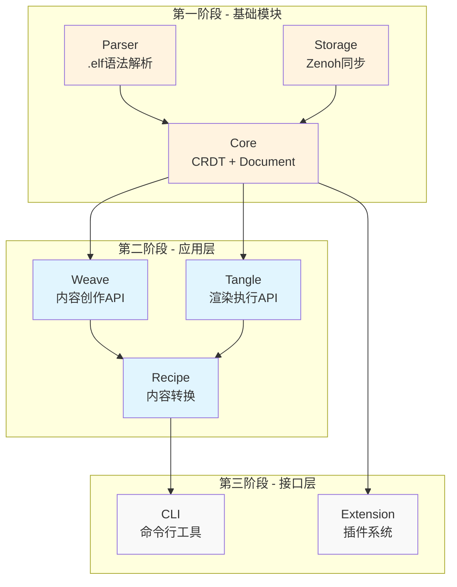

# 1. ELFI 总体实现规划

**关联文件**: [02-sop.md](./02-sop.md), [03-dependencies.md](./03-dependencies.md)

## 背景信息获取指南

### 核心文档查看顺序
1. **[实现总览](../docs/src/implementations/00-overview.md)** - 架构和技术栈
2. **[数据建模](../docs/src/designs/01-data_modeling.md)** - CRDT和事件溯源设计
3. **[.elf文件格式](../docs/src/implementations/01-elf_spec.md)** - 文件语法规范
4. **[用例概览](../docs/src/usecases/00-overview.md)** - 三大核心场景

### 开发指导文档
- **通用开发指南**: [CONTRIBUTING.md](../CONTRIBUTING.md)
- **环境配置**: [DEVELOPMENT.md](../DEVELOPMENT.md)
- **项目上下文**: [CLAUDE.md](../CLAUDE.md)

## 模块并行开发策略



## 模块职责边界

### Core模块 (core)
**负责**:
- CRDT数据结构管理
- 文档生命周期管理
- 会话管理(Session)
- 基础CRUD操作

**接口导出**:
```rust
pub struct Main {
    pub async fn open(uri: &str) -> Result<DocumentHandle>;
    pub async fn add_block(doc_uri: &str, block_type: BlockType) -> Result<String>;
    pub async fn sync(doc_uri: &str) -> Result<SyncResult>;
}
```

### Parser模块 (parser)
**负责**:
- .elf文件解析
- Block结构验证
- Relations语法解析

**接口导出**:
```rust
pub fn parse_elf_file(content: &str) -> Result<Document>;
pub fn parse_relations(content: &str) -> Result<Vec<Relation>>;
```

### Storage模块 (storage)
**负责**:
- Zenoh网络通信
- 本地存储管理
- 同步策略实现

**接口导出**:
```rust
pub struct StorageManager {
    pub async fn sync_document(doc: &Document) -> Result<()>;
    pub async fn subscribe_changes(callback: impl Fn(Change)) -> Result<()>;
}
```

### Weave模块 (weave)
**负责**:
- 内容创作API
- 关系管理
- IDE集成

**接口导出**:
```rust
pub struct WeaveAPI {
    pub async fn create_block(doc_uri: &str, content: &str) -> Result<String>;
    pub async fn link_blocks(from: &str, to: &str, rel_type: &str) -> Result<()>;
}
```

### Tangle模块 (tangle)
**负责**:
- 渲染执行
- Islands架构
- Recipe系统

**接口导出**:
```rust
pub struct TangleAPI {
    pub async fn render_document(doc_uri: &str, format: &str) -> Result<String>;
    pub async fn execute_recipe(recipe_name: &str) -> Result<ExportResult>;
}
```

## 避免开发冲突的规则

### 1. 接口约定优先
- 每个模块必须先定义并导出Interface trait
- 未实现的依赖必须抛出`NotImplemented` error
- 禁止在模块内部实现其他模块的功能

### 2. Mock数据策略
```rust
// 正确方式：使用其他模块的Interface
use elfi_storage::StorageInterface;

impl WeaveAPI {
    fn new(storage: Box<dyn StorageInterface>) -> Self {
        // 如果storage模块未实现，会在运行时报错
    }
}

// 错误方式：自己实现存储逻辑
impl WeaveAPI {
    fn save_to_file() { /* 不允许 */ }
}
```

### 3. 数据结构共享
- 核心数据结构定义在`elfi-types` crate中
- 所有模块导入相同的类型定义
- 避免重复定义相似结构

### 4. 测试依赖管理
```rust
#[cfg(test)]
mod tests {
    use elfi_storage::MockStorage;  // 使用官方Mock
    
    #[test]
    fn test_with_real_interface() {
        let storage = MockStorage::new();
        // 测试真实的模块交互
    }
}
```

## 开发顺序建议

### 阶段1: 基础设施 (并行)
1.a **types**: 定义所有核心数据结构 → [04-phase1-a-types.md](./04-phase1-a-types.md)
1.b **parser**: 实现.elf文件解析 → [04-phase1-b-parser.md](./04-phase1-b-parser.md)
1.c **core**: 实现CRDT和文档管理 → [04-phase1-c-core.md](./04-phase1-c-core.md)

### 阶段2: 存储同步 (串行)
2.a **storage**: 实现Zenoh网络层 → [05-phase2-a-storage.md](./05-phase2-a-storage.md)
2.b **Core + Storage**: 集成测试

### 阶段3: 应用层 (并行)
3.a **weave**: 内容创作API → [06-phase3-a-weave.md](./06-phase3-a-weave.md)
3.b **tangle**: 渲染执行API → [06-phase3-b-tangle.md](./06-phase3-b-tangle.md)
3.c **recipe**: Recipe系统 → [06-phase3-c-recipe.md](./06-phase3-c-recipe.md)

### 阶段4: 用户接口 (串行)
4.a **cli**: 命令行工具 → [07-phase4-a-cli.md](./07-phase4-a-cli.md)
4.b **extension**: 插件系统 → [07-phase4-b-extension.md](./07-phase4-b-extension.md)

## 集成测试策略

基于三大核心用例:

### 1. 对话即文档测试
- 多用户并发编辑
- CRDT冲突自动解决
- 实时同步验证

### 2. 自举开发测试  
- Recipe代码导出
- 文件监听双向同步
- IDE集成工作流

### 3. 文档即App测试
- 跨文档引用解析
- 动态内容组合
- Islands架构渲染

## 质量保证

### 单元测试要求
- 每个公共API必须有测试
- 覆盖率 > 80%
- 包含边界条件测试

### 集成测试要求
- 每个用例的端到端测试
- 性能基准测试
- 错误恢复测试

### 文档同步要求
- 实现完成后更新对应的implementations文档
- API变更同步更新CLAUDE.md
- 新功能必须在命令速查表中体现